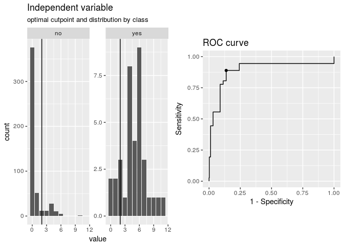
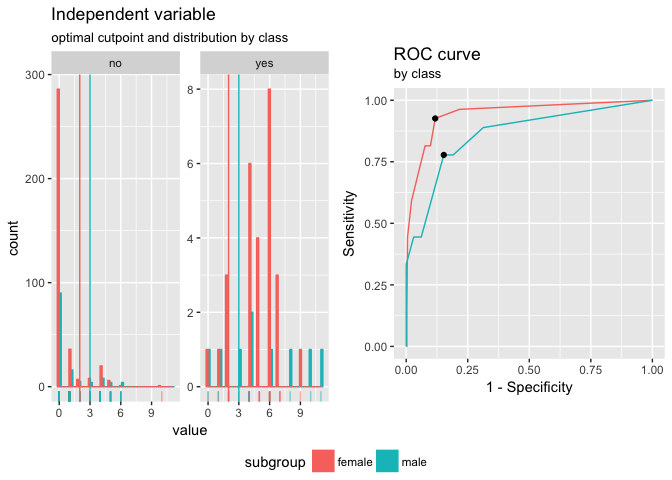
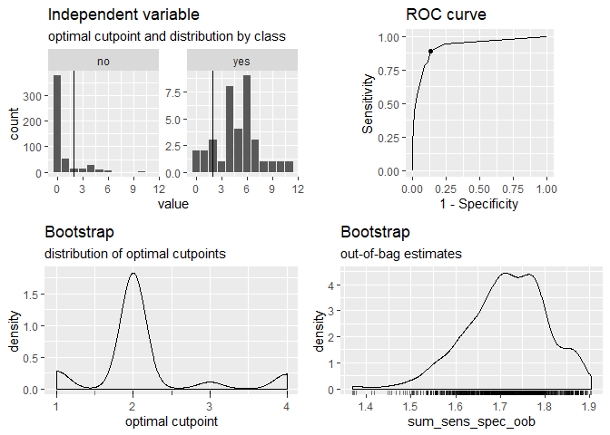
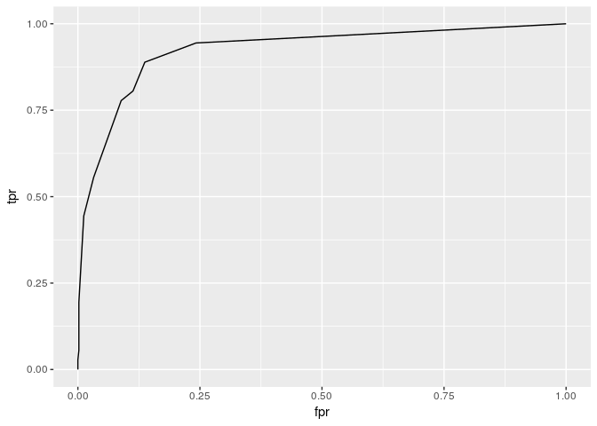
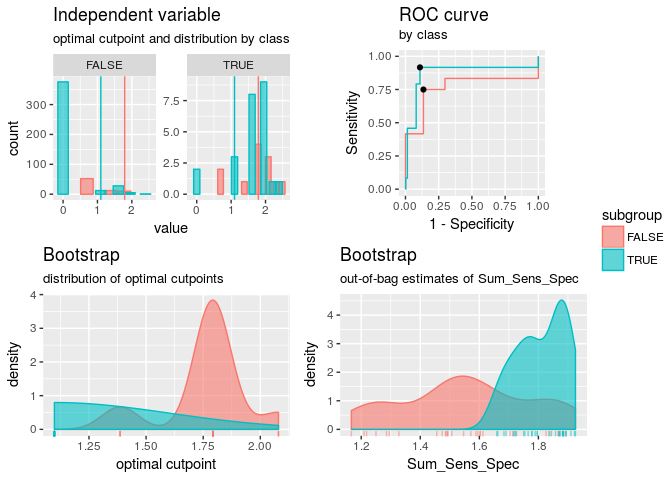
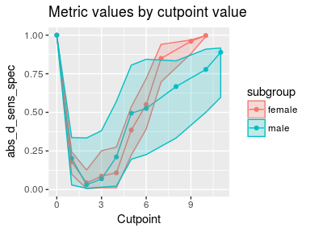
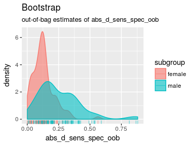
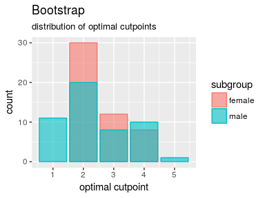

<!-- README.md is generated from README.Rmd. Please edit that file -->
cutpointr
---------

[](https://travis-ci.org/Thie1e/cutpointr) [](https://ci.appveyor.com/project/Thie1e/cutpointr) [](http://www.repostatus.org/#active) [](https://codecov.io/github/thie1e/cutpointr)

The cutpointr package is an R package for tidy calculation of "optimal" cutpoints. It supports several methods for calculating cutpoints and includes several metrics that can be maximized or minimized by selecting a cutpoint. Additionally, cutpointr can automatically bootstrap the variability of the optimal cutpoints and return out-of-bag estimates of various metrics.

Installation
------------

``` r
devtools::install_github("thie1e/cutpointr")
```

Features
--------

-   Calculation of "optimal" cutpoints in binary classification tasks
-   Tidy output, integrates well with functions from the tidyverse
-   Bootstrapping for simulating the cutpoint variability and for getting out-of-bag estimates of various metrics (as a form of cross validation)
-   Multiple methods for calculating cutpoints
-   Multiple metrics can be chosen for maximization / minimization
-   Standard/Nonstandard evaluation of the function arguments

Calculating cutpoints
---------------------

The included methods for calculating cutpoints are:

-   `maximize_metric`: Maximize the metric function
-   `minimize_metric`: Minimize the metric function
-   `maximize_loess_metric`: Maximize the metric function after LOESS smoothing
-   `minimize_loess_metric`: Minimize the metric function after LOESS smoothing
-   `maximize_boot_metric`: Maximize the metric function as a mean of the optimal cutpoints in bootstrapped samples
-   `minimize_boot_metric`: Minimize the metric function as a mean of the optimal cutpoints in bootstrapped samples
-   `oc_manual`: Specify the cutoff value manually
-   `oc_mean`: Use the sample mean as the "optimal" cutpoint
-   `oc_median`: Use the sample median as the "optimal" cutpoint
-   `oc_youden_kernel`: Maximize the Youden-Index after kernel smoothing the distributions of the two classes
-   `oc_youden_normal`: Maximize the Youden-Index parametrically assuming normally distributed data in both classes
-   `oc_OptimalCutpoints`: A tidy wrapper for optimal.cutpoints from the OptimalCutpoints package. Supply an additional `oc_metric` argument with the method choice corresponding to a method from the OptimalCutpoints package

The included metrics to be used with the minimization and maximization methods are:

-   `accuracy`: Fraction correctly classified
-   `abs_d_sens_spec`: The absolute difference of sensitivity and specificity
-   `abs_d_ppvnpv`: The absolute difference between positive predictive value (PPV) and negative predictive value (NPV)
-   `cohens_kappa`: Cohen's Kappa
-   `sum_sens_spec`: sensitivity + specificity
-   `sum_ppvnpv`: The sum of positive predictive value (PPV) and negative predictive value (NPV)
-   `prod_sens_spec`: sensitivity \* specificity
-   `prod_ppvnpv`: The product of positive predictive value (PPV) and negative predictive value (NPV)
-   `youden`: Youden- or J-Index = sensitivity + specificity - 1
-   `odds_ratio`: (Diagnostic) odds ratio
-   `risk_ratio`: risk ratio (relative risk)
-   `p_chisquared`: The p-value of a chi-squared test on the confusion matrix
-   `cost_misclassification`: The sum of the misclassification cost of false positives and false negatives. Additional arguments: cost\_fp, cost\_fn
-   `total_utility`: The total utility of true / false positives / negatives. Additional arguments: utility\_tp, utility\_tn, cost\_fp, cost\_fn

cutpointr makes use of nonstandard evaluation for higher usability and to allow for easy transformation of the variables. The inputs to the arguments `method` and `metric` are functions so that user-defined functions can easily be supplied instead of the built in ones.

Applications
------------

To showcase the functionality, we'll use the included `suicide` data set.

``` r
library(cutpointr)
data(suicide)
head(suicide)
#>   age gender dsi suicide
#> 1  29 female   1      no
#> 2  26   male   0      no
#> 3  26 female   0      no
#> 4  27 female   0      no
#> 5  28 female   0      no
#> 6  53   male   2      no
opt_cut <- cutpointr(suicide, dsi, suicide)
#> Assuming yes as the positive class
#> Assuming the positive class has higher x values
opt_cut
#>   direction optimal_cutpoint          method Sum_Sens_Spec  accuracy
#>       <chr>            <dbl>           <chr>         <dbl>     <dbl>
#> 1        >=                2 maximize_metric      1.751792 0.8646617
#>   sensitivity specificity       AUC pos_class neg_class prevalence outcome
#>         <dbl>       <dbl>     <dbl>    <fctr>    <fctr>      <dbl>   <chr>
#> 1   0.8888889   0.8629032 0.9237791       yes        no 0.06766917 suicide
#>   predictor               data              roc_curve
#>       <chr>             <list>                 <list>
#> 1       dsi <tibble [532 x 2]> <data.frame [13 x 10]>
```

Alternatively, instead of supplying a data frame the raw vectors of the predictor and outcome can be given as `x` and `class`:

``` r
cutpointr(x = suicide$dsi, class = suicide$suicide)
#> Assuming yes as the positive class
#> Assuming the positive class has higher x values
#>   direction optimal_cutpoint          method Sum_Sens_Spec  accuracy
#>       <chr>            <dbl>           <chr>         <dbl>     <dbl>
#> 1        >=                2 maximize_metric      1.751792 0.8646617
#>   sensitivity specificity       AUC pos_class neg_class prevalence outcome
#>         <dbl>       <dbl>     <dbl>    <fctr>    <fctr>      <dbl>   <chr>
#> 1   0.8888889   0.8629032 0.9237791       yes        no 0.06766917   class
#>   predictor               data              roc_curve
#>       <chr>             <list>                 <list>
#> 1         x <tibble [532 x 2]> <data.frame [13 x 10]>
```

cutpointr makes assumptions about the direction of the dependency between class and x, if `direction` and / or `pos_class` or `neg_class` are not specified. The same result can be achieved by manually defining `direction` and the positive / negative classes which is slightly faster:

``` r
opt_cut <- cutpointr(suicide, dsi, suicide, direction = ">=", pos_class = "yes",
                     neg_class = "no", method = maximize_metric, metric = youden)
opt_cut
#>   direction optimal_cutpoint          method Youden_Index  accuracy
#>       <chr>            <dbl>           <chr>        <dbl>     <dbl>
#> 1        >=                2 maximize_metric    0.7517921 0.8646617
#>   sensitivity specificity       AUC pos_class neg_class prevalence outcome
#>         <dbl>       <dbl>     <dbl>     <chr>     <chr>      <dbl>   <chr>
#> 1   0.8888889   0.8629032 0.9237791       yes        no 0.06766917 suicide
#>   predictor               data              roc_curve
#>       <chr>             <list>                 <list>
#> 1       dsi <tibble [532 x 2]> <data.frame [13 x 10]>
```

`opt_cut` is a tidy data frame that returns the input data in a nested tibble. Methods for summarizing and plotting the data and results are included:

``` r
summary(opt_cut)
#> Method: maximize_metric 
#> Predictor: dsi 
#> Outcome: suicide 
#> Direction: >= 
#> 
#>  
#> --------------------------------------------------------------------------- 
#>  optimal_cutpoint Youden_Index accuracy sensitivity specificity    AUC
#>                 2       0.7518   0.8647      0.8889      0.8629 0.9238
#>  n_pos n_neg
#>     36   496
#> 
#>           observation
#> prediction yes  no
#>        yes  32  68
#>        no    4 428
#> 
#> Predictor summary: 
#>       Min.    1st Qu.     Median       Mean    3rd Qu.       Max. 
#>  0.0000000  0.0000000  0.0000000  0.9210526  1.0000000 11.0000000 
#>         SD 
#>  1.8527143 
#> 
#> Predictor summary per class: 
#>     Min. 1st Qu. Median      Mean 3rd Qu. Max       SD
#> no     0       0      0 0.6330645       0  10 1.412225
#> yes    0       4      5 4.8888889       6  11 2.549821
plot(opt_cut)
```



Predictions for new data can be made using `predict`:

``` r
predict(opt_cut, newdata = data.frame(dsi = 0:5))
#> [1] "no"  "no"  "yes" "yes" "yes" "yes"
```

### Separate subgroups

Cutpoints can be separately estimated on a subgroup, gender in this case:

``` r
opt_cut <- cutpointr(suicide, dsi, suicide, gender)
#> Assuming yes as the positive class
#> Assuming the positive class has higher x values
opt_cut
#>   subgroup direction optimal_cutpoint          method Sum_Sens_Spec
#>      <chr>     <chr>            <dbl>           <chr>         <dbl>
#> 1   female        >=                2 maximize_metric      1.808118
#> 2     male        >=                3 maximize_metric      1.625106
#>    accuracy sensitivity specificity       AUC pos_class neg_class
#>       <dbl>       <dbl>       <dbl>     <dbl>    <fctr>    <fctr>
#> 1 0.8852041   0.9259259   0.8821918 0.9446474       yes        no
#> 2 0.8428571   0.7777778   0.8473282 0.8617472       yes        no
#>   prevalence outcome predictor grouping               data
#>        <dbl>   <chr>     <chr>    <chr>             <list>
#> 1 0.06887755 suicide       dsi   gender <tibble [392 x 2]>
#> 2 0.06428571 suicide       dsi   gender <tibble [140 x 2]>
#>                roc_curve
#>                   <list>
#> 1 <data.frame [11 x 10]>
#> 2 <data.frame [11 x 10]>
summary(opt_cut)
#> Method: maximize_metric 
#> Predictor: dsi 
#> Outcome: suicide 
#> Direction: >= 
#> Subgroups: female, male 
#> 
#> female 
#> --------------------------------------------------------------------------- 
#>  optimal_cutpoint Sum_Sens_Spec accuracy sensitivity specificity    AUC
#>                 2        1.8081   0.8852      0.9259      0.8822 0.9446
#>  n_pos n_neg
#>     27   365
#> 
#>           observation
#> prediction yes  no
#>        yes  25  43
#>        no    2 322
#> 
#> Predictor summary: 
#>       Min.    1st Qu.     Median       Mean    3rd Qu.       Max. 
#>  0.0000000  0.0000000  0.0000000  0.8392857  1.0000000 10.0000000 
#>         SD 
#>  1.7451980 
#> 
#> Predictor summary per class: 
#>     Min. 1st Qu. Median      Mean 3rd Qu. Max       SD
#> no     0       0      0 0.5479452       0  10 1.318102
#> yes    0       4      5 4.7777778       6   9 2.044379
#> 
#> male 
#> --------------------------------------------------------------------------- 
#>  optimal_cutpoint Sum_Sens_Spec accuracy sensitivity specificity    AUC
#>                 3        1.6251   0.8429      0.7778      0.8473 0.8617
#>  n_pos n_neg
#>      9   131
#> 
#>           observation
#> prediction yes  no
#>        yes   7  20
#>        no    2 111
#> 
#> Predictor summary: 
#>      Min.   1st Qu.    Median      Mean   3rd Qu.      Max.        SD 
#>  0.000000  0.000000  0.000000  1.150000  1.000000 11.000000  2.115122 
#> 
#> Predictor summary per class: 
#>     Min. 1st Qu. Median     Mean 3rd Qu. Max       SD
#> no     0       0      0 0.870229       1   6 1.628576
#> yes    0       3      4 5.222222       8  11 3.833333
plot(opt_cut)
```



### Bootstrapping

If `boot_runs` is larger zero, cutpointr will carry out the usual cutpoint calculation on the full sample, just as before, and additionally on `boot_runs` bootstrap samples.

``` r
set.seed(12)
opt_cut <- cutpointr(suicide, dsi, suicide, boot_runs = 200)
#> Assuming yes as the positive class
#> Assuming the positive class has higher x values
opt_cut
#>   direction optimal_cutpoint          method Sum_Sens_Spec  accuracy
#>       <chr>            <dbl>           <chr>         <dbl>     <dbl>
#> 1        >=                2 maximize_metric      1.751792 0.8646617
#>   sensitivity specificity       AUC pos_class neg_class prevalence outcome
#>         <dbl>       <dbl>     <dbl>    <fctr>    <fctr>      <dbl>   <chr>
#> 1   0.8888889   0.8629032 0.9237791       yes        no 0.06766917 suicide
#>   predictor               data              roc_curve                boot
#>       <chr>             <list>                 <list>              <list>
#> 1       dsi <tibble [532 x 2]> <data.frame [13 x 10]> <tibble [200 x 23]>
```

The returned object has the additional column `boot` which is a nested tibble that includes the cutpoints per bootstrap sample along with the metric calculated using the function in `metric` and a number of additional metrics. The values in the second column that are calculated using the function in `metric` represent out-of-bag results. The other default metrics are suffixed by `_b` to indicate in-bag results or `_oob` to indicate out-of-bag results:

``` r
opt_cut$boot
#> [[1]]
#> # A tibble: 200 x 23
#>    optimal_cutpoint     AUC_b   AUC_oob Sum_Sens_Spec_b Sum_Sens_Spec_oob
#>               <dbl>     <dbl>     <dbl>           <dbl>             <dbl>
#>  1                4 0.9410520 0.8996004        1.788890          1.595405
#>  2                2 0.9104877 0.9270016        1.709278          1.802198
#>  3                2 0.9617125 0.8795120        1.814424          1.678810
#>  4                3 0.9460784 0.9064764        1.762580          1.619565
#>  5                2 0.9404417 0.8946746        1.793445          1.695069
#>  6                4 0.9399126 0.9323399        1.823205          1.561418
#>  7                2 0.9167187 0.9176587        1.746250          1.729365
#>  8                2 0.8621470 0.9252170        1.628543          1.757695
#>  9                3 0.9704513 0.8460339        1.820121          1.476381
#> 10                1 0.9122400 0.9203368        1.707939          1.667962
#> # ... with 190 more rows, and 18 more variables: Accuracy_b <dbl>,
#> #   Accuracy_oob <dbl>, Sensitivity_b <dbl>, Sensitivity_oob <dbl>,
#> #   Specificity_b <dbl>, Specificity_oob <dbl>, Kappa_b <dbl>,
#> #   Kappa_oob <dbl>, TP_b <dbl>, FP_b <dbl>, TN_b <int>, FN_b <int>,
#> #   TP_oob <dbl>, FP_oob <dbl>, TN_oob <int>, FN_oob <int>,
#> #   roc_curve_b <list>, roc_curve_oob <list>
```

The summary and plots include additional elements:

``` r
summary(opt_cut)
#> Method: maximize_metric 
#> Predictor: dsi 
#> Outcome: suicide 
#> Direction: >= 
#> Nr. of bootstraps: 200 
#> 
#>  
#> --------------------------------------------------------------------------- 
#>  optimal_cutpoint Sum_Sens_Spec accuracy sensitivity specificity    AUC
#>                 2        1.7518   0.8647      0.8889      0.8629 0.9238
#>  n_pos n_neg
#>     36   496
#> 
#>           observation
#> prediction yes  no
#>        yes  32  68
#>        no    4 428
#> 
#> Predictor summary: 
#>       Min.    1st Qu.     Median       Mean    3rd Qu.       Max. 
#>  0.0000000  0.0000000  0.0000000  0.9210526  1.0000000 11.0000000 
#>         SD 
#>  1.8527143 
#> 
#> Predictor summary per class: 
#>     Min. 1st Qu. Median      Mean 3rd Qu. Max       SD
#> no     0       0      0 0.6330645       0  10 1.412225
#> yes    0       4      5 4.8888889       6  11 2.549821
#> 
#> Bootstrap summary: 
#>                     Min. 1st Qu. Median   Mean 3rd Qu.    Max     SD
#> optimal_cutpoint  1.0000  2.0000 2.0000 2.1250  2.0000 4.0000 0.7084
#> AUC_b             0.8329  0.9121 0.9277 0.9267  0.9444 0.9724 0.0242
#> AUC_oob           0.8132  0.8960 0.9191 0.9185  0.9459 0.9819 0.0339
#> Sum_Sens_Spec_b   1.6262  1.7312 1.7652 1.7637  1.8007 1.8842 0.0501
#> Sum_Sens_Spec_oob 1.4270  1.6517 1.7071 1.7085  1.7660 1.8977 0.0909
#> Accuracy_b        0.7500  0.8534 0.8684 0.8631  0.8816 0.9286 0.0349
#> Accuracy_oob      0.7200  0.8427 0.8622 0.8550  0.8775 0.9091 0.0370
#> Sensitivity_b     0.7647  0.8662 0.9048 0.9035  0.9355 1.0000 0.0480
#> Sensitivity_oob   0.5000  0.8000 0.8667 0.8535  0.9231 1.0000 0.0995
#> Specificity_b     0.7333  0.8504 0.8652 0.8603  0.8796 0.9339 0.0383
plot(opt_cut)
```



If a subgroup is given, the bootstrapping is carried out separately for every subgroup:

``` r
set.seed(12)
opt_cut <- cutpointr(suicide, dsi, suicide, gender, boot_runs = 200)
#> Assuming yes as the positive class
#> Assuming the positive class has higher x values
#> Multiple optimal cutpoints found, returning minimum of: 6, 3
#> Warning in .f(.x[[i]], .y[[i]], ...): 6 Missing values in bootstrap, maybe
#> due to sampling of only one class
opt_cut
#>   subgroup direction optimal_cutpoint          method Sum_Sens_Spec
#>      <chr>     <chr>            <dbl>           <chr>         <dbl>
#> 1   female        >=                2 maximize_metric      1.808118
#> 2     male        >=                3 maximize_metric      1.625106
#>    accuracy sensitivity specificity       AUC pos_class neg_class
#>       <dbl>       <dbl>       <dbl>     <dbl>    <fctr>    <fctr>
#> 1 0.8852041   0.9259259   0.8821918 0.9446474       yes        no
#> 2 0.8428571   0.7777778   0.8473282 0.8617472       yes        no
#>   prevalence outcome predictor grouping               data
#>        <dbl>   <chr>     <chr>    <chr>             <list>
#> 1 0.06887755 suicide       dsi   gender <tibble [392 x 2]>
#> 2 0.06428571 suicide       dsi   gender <tibble [140 x 2]>
#>                roc_curve                boot
#>                   <list>              <list>
#> 1 <data.frame [11 x 10]> <tibble [200 x 23]>
#> 2 <data.frame [11 x 10]> <tibble [200 x 23]>
summary(opt_cut)
#> Method: maximize_metric 
#> Predictor: dsi 
#> Outcome: suicide 
#> Direction: >= 
#> Subgroups: female, male 
#> Nr. of bootstraps: 200 
#> 
#> female 
#> --------------------------------------------------------------------------- 
#>  optimal_cutpoint Sum_Sens_Spec accuracy sensitivity specificity    AUC
#>                 2        1.8081   0.8852      0.9259      0.8822 0.9446
#>  n_pos n_neg
#>     27   365
#> 
#>           observation
#> prediction yes  no
#>        yes  25  43
#>        no    2 322
#> 
#> Predictor summary: 
#>       Min.    1st Qu.     Median       Mean    3rd Qu.       Max. 
#>  0.0000000  0.0000000  0.0000000  0.8392857  1.0000000 10.0000000 
#>         SD 
#>  1.7451980 
#> 
#> Predictor summary per class: 
#>     Min. 1st Qu. Median      Mean 3rd Qu. Max       SD
#> no     0       0      0 0.5479452       0  10 1.318102
#> yes    0       4      5 4.7777778       6   9 2.044379
#> 
#> Bootstrap summary: 
#>                     Min. 1st Qu. Median   Mean 3rd Qu.    Max     SD
#> optimal_cutpoint  1.0000  2.0000 2.0000 2.1700  2.0000 4.0000 0.7237
#> AUC_b             0.8448  0.9275 0.9425 0.9417  0.9592 0.9865 0.0243
#> AUC_oob           0.8676  0.9239 0.9574 0.9484  0.9717 0.9981 0.0294
#> Sum_Sens_Spec_b   1.6504  1.7721 1.8128 1.8114  1.8510 1.9383 0.0537
#> Sum_Sens_Spec_oob 1.4259  1.7331 1.7842 1.7794  1.8555 1.9248 0.0928
#> Accuracy_b        0.7628  0.8750 0.8878 0.8845  0.9005 0.9490 0.0310
#> Accuracy_oob      0.7643  0.8676 0.8836 0.8799  0.8976 0.9338 0.0294
#> Sensitivity_b     0.7308  0.8947 0.9375 0.9302  0.9643 1.0000 0.0505
#> Sensitivity_oob   0.5000  0.8571 0.9091 0.9009  1.0000 1.0000 0.1037
#> Specificity_b     0.7473  0.8729 0.8851 0.8812  0.8969 0.9539 0.0336
#> 
#> male 
#> --------------------------------------------------------------------------- 
#>  optimal_cutpoint Sum_Sens_Spec accuracy sensitivity specificity    AUC
#>                 3        1.6251   0.8429      0.7778      0.8473 0.8617
#>  n_pos n_neg
#>      9   131
#> 
#>           observation
#> prediction yes  no
#>        yes   7  20
#>        no    2 111
#> 
#> Predictor summary: 
#>      Min.   1st Qu.    Median      Mean   3rd Qu.      Max.        SD 
#>  0.000000  0.000000  0.000000  1.150000  1.000000 11.000000  2.115122 
#> 
#> Predictor summary per class: 
#>     Min. 1st Qu. Median     Mean 3rd Qu. Max       SD
#> no     0       0      0 0.870229       1   6 1.628576
#> yes    0       3      4 5.222222       8  11 3.833333
#> 
#> Bootstrap summary: 
#>                     Min. 1st Qu. Median   Mean 3rd Qu.    Max     SD
#> optimal_cutpoint  1.0000  2.5000 3.0000 3.0200  4.0000 8.0000 1.4698
#> AUC_b             0.5570  0.8183 0.8656 0.8569  0.9080 1.0000 0.0723
#> AUC_oob           0.2909  0.8096 0.9008 0.8695  0.9498 1.0000 0.1153
#> Sum_Sens_Spec_b   1.1544  1.5775 1.6624 1.6586  1.7367 2.0000 0.1257
#> Sum_Sens_Spec_oob 0.5818  1.3307 1.4936 1.4704  1.6590 1.9412 0.2661
#> Accuracy_b        0.5857  0.7821 0.8500 0.8265  0.8714 1.0000 0.0793
#> Accuracy_oob      0.5714  0.7692 0.8348 0.8126  0.8685 0.9423 0.0830
#> Sensitivity_b     0.5000  0.7500 0.8333 0.8323  0.9167 1.0000 0.1266
#> Sensitivity_oob   0.0000  0.5000 0.6667 0.6465  1.0000 1.0000 0.3073
#> Specificity_b     0.5682  0.7780 0.8488 0.8263  0.8779 1.0000 0.0870
plot(opt_cut)
#> Warning: Removed 2 rows containing non-finite values (stat_density).
```


### Parallelized bootstrapping

Using `foreach` and `doRNG` the bootstrapping can easily be parallelized. The `doRNG` package is being used to make the bootstrap sampling reproducible. It may be preferable for long running tasks to specify `direction` and `pos_class` and / or `neg_class` manually to speed up `cutpointr`.

``` r
if (suppressPackageStartupMessages(require(doSNOW) & require(doRNG))) {
  cl <- makeCluster(2) # 2 cores
  registerDoSNOW(cl)
  registerDoRNG(12) # Reproducible parallel loops using doRNG
  opt_cut <- cutpointr(suicide, dsi, suicide, gender, pos_class = "yes",
                 direction = ">=", boot_runs = 200, allowParallel = TRUE)
  stopCluster(cl)
  opt_cut
}
#> 
#> Attaching package: 'parallel'
#> The following objects are masked from 'package:snow':
#> 
#>     clusterApply, clusterApplyLB, clusterCall, clusterEvalQ,
#>     clusterExport, clusterMap, clusterSplit, makeCluster,
#>     parApply, parCapply, parLapply, parRapply, parSapply,
#>     splitIndices, stopCluster
#> Warning in .f(.x[[i]], .y[[i]], ...): 6 Missing values in bootstrap, maybe
#> due to sampling of only one class
#>   subgroup direction optimal_cutpoint          method Sum_Sens_Spec
#>      <chr>     <chr>            <dbl>           <chr>         <dbl>
#> 1   female        >=                2 maximize_metric      1.808118
#> 2     male        >=                3 maximize_metric      1.625106
#>    accuracy sensitivity specificity       AUC pos_class neg_class
#>       <dbl>       <dbl>       <dbl>     <dbl>     <chr>    <fctr>
#> 1 0.8852041   0.9259259   0.8821918 0.9446474       yes        no
#> 2 0.8428571   0.7777778   0.8473282 0.8617472       yes        no
#>   prevalence outcome predictor grouping               data
#>        <dbl>   <chr>     <chr>    <chr>             <list>
#> 1 0.06887755 suicide       dsi   gender <tibble [392 x 2]>
#> 2 0.06428571 suicide       dsi   gender <tibble [140 x 2]>
#>                roc_curve                boot
#>                   <list>              <list>
#> 1 <data.frame [11 x 10]> <tibble [200 x 23]>
#> 2 <data.frame [11 x 10]> <tibble [200 x 23]>
```

### LOESS smoothing for selecting a cutpoint

When using `maximize_metric` and `minimize_metric` the optimal cutpoint is selected by searching the maximum or minimum of the metric function. For example, we would like to optimize the misclassification cost. Since false negatives (a suicide attempt was not anticipated) the minimum of this function is selected as the 'optimal' cutpoint:

``` r
opt_cut <- cutpointr(suicide, dsi, suicide, gender, method = minimize_metric,
                     metric = misclassification_cost, cost_fp = 1, cost_fn = 10)
#> Assuming yes as the positive class
#> Assuming the positive class has higher x values
opt_cut
#>   subgroup direction optimal_cutpoint          method
#>      <chr>     <chr>            <dbl>           <chr>
#> 1   female        >=                2 minimize_metric
#> 2     male        >=                3 minimize_metric
#>   misclassification_cost  accuracy sensitivity specificity       AUC
#>                    <dbl>     <dbl>       <dbl>       <dbl>     <dbl>
#> 1                     63 0.8852041   0.9259259   0.8821918 0.9446474
#> 2                     40 0.8428571   0.7777778   0.8473282 0.8617472
#>   pos_class neg_class prevalence outcome predictor grouping
#>      <fctr>    <fctr>      <dbl>   <chr>     <chr>    <chr>
#> 1       yes        no 0.06887755 suicide       dsi   gender
#> 2       yes        no 0.06428571 suicide       dsi   gender
#>                 data              roc_curve
#>               <list>                 <list>
#> 1 <tibble [392 x 2]> <data.frame [11 x 10]>
#> 2 <tibble [140 x 2]> <data.frame [11 x 10]>
```

``` r
plot_metric(opt_cut)
```


As this 'optimal' cutpoint may depend on minor differences between the possible cutoffs, a smoothed version of the function of metric values by cutpoint value might be desired, especially in small samples. The `minimize_loess_metric` and `maximize_loess_metric` functions can be used to smooth the function so that the 'optimal' cutpoint is selected based on the smoothed metric values. Options to modify the smoothing, which is based on `loess.as` from the `fANCOVA` package, include:

-   `criterion`: the criterion for automatic smoothing parameter selection: "aicc" denotes bias-corrected AIC criterion, "gcv" denotes generalized cross-validation.
-   `degree`: the degree of the local polynomials to be used. It can be 0, 1 or 2.
-   `family`: if "gaussian" fitting is by least-squares, and if "symmetric" a re-descending M estimator is used with Tukey's biweight function.
-   `user.span`: the user-defined parameter which controls the degree of smoothing.

Using the values for the LOESS smoothing of `criterion = "aicc"`, `degree = 2`, `family = "symmetric"`, and `user.span = 0.7` we get the following smoothed versions of the above metrics:

``` r
opt_cut <- cutpointr(suicide, dsi, suicide, gender, 
                     method = minimize_loess_metric,
                     criterion = "aicc", family = "symmetric", 
                     degree = 2, user.span = 0.7,
                     metric = misclassification_cost, cost_fp = 1, cost_fn = 10)
#> Assuming yes as the positive class
#> Assuming the positive class has higher x values
#> fANCOVA 0.5-1 loaded
opt_cut
#>   subgroup direction optimal_cutpoint                method
#>      <chr>     <chr>            <dbl>                 <chr>
#> 1   female        >=                3 minimize_loess_metric
#> 2     male        >=                3 minimize_loess_metric
#>   misclassification_cost  accuracy sensitivity specificity       AUC
#>                    <dbl>     <dbl>       <dbl>       <dbl>     <dbl>
#> 1               76.65028 0.8954082   0.8148148   0.9013699 0.9446474
#> 2               40.00000 0.8428571   0.7777778   0.8473282 0.8617472
#>   pos_class neg_class prevalence outcome predictor grouping
#>      <fctr>    <fctr>      <dbl>   <chr>     <chr>    <chr>
#> 1       yes        no 0.06887755 suicide       dsi   gender
#> 2       yes        no 0.06428571 suicide       dsi   gender
#>                 data              roc_curve
#>               <list>                 <list>
#> 1 <tibble [392 x 2]> <data.frame [11 x 11]>
#> 2 <tibble [140 x 2]> <data.frame [11 x 11]>
```

``` r
plot_metric(opt_cut)
```



The 'optimal' cutpoint for the female subgroup changes to 3. Note that there are no reliable rules for selecting the 'best' smoothing parameters. Notably, the LOESS smoothing is sensitive to the number of unique cutpoints. A large number of unique cutpoints generally leads to a more volatile curve of metric values by cutpoint value, even after smoothing.

The unsmoothed metric values are returned in `opt_cut$roc_curve` in the column `m_unsmoothed`.

### Manual and mean / median cutpoints

Using the `oc_manual` function the "optimal" cutpoint will not be determined based on, for example, a metric but it is instead set manually using the `cutpoint` argument. This is useful for supplying cutpoints that were found in the literature or in other external sources.

The `oc_manual` function could also be used to set the cutpoint to the sample mean using `cutpoint = mean(data$x)`. However, this may introduce a bias into the bootstrapping validation procedure, since the actual mean of the population is not known and thus it should be automatically determined in every resample. To do so, the `oc_mean` and `oc_median` functions can be used.

``` r
set.seed(100)
opt_cut_manual <- cutpointr(suicide, dsi, suicide, method = oc_manual, 
                       cutpoint = mean(suicide$dsi), boot_runs = 10)
#> Assuming yes as the positive class
#> Assuming the positive class has higher x values
set.seed(100)
opt_cut_mean <- cutpointr(suicide, dsi, suicide, method = oc_mean, boot_runs = 200)
#> Assuming yes as the positive class
#> Assuming the positive class has higher x values
```

### Midpoints

Sometimes it can be favourable to use the mean of the 'optimal' cutpoint and the next highest or next lowest possible cutpoint. Assume the following small data set:

``` r
sparse_dat <- data.frame(outcome = c("neg", "neg", "neg", 
                                     "pos", "pos", "pos", "pos"),
                         pred    = c(1, 2, 3, 
                                     8, 11, 11, 12))
```

Since the distance of the optimal cutpoint (8) to the next lowest observation (3) is rather large we arrive at a range of possible cutpoints that all maximize the metric. In the case of this kind of sparseness it might for example be desirable to classify a new obsevation with a predictor value of 4 as belonging to the negative class. When `use_midpoints` is set to `TRUE` the mean of the optimal cutpoint and the next lowest observation is returned as the optimal cutpoint if direction is `>=`. The mean of the optimal cutpoint and the next highest observation is returned as the optimal cutpoint if `direction = "<="`.

``` r
opt_cut <- cutpointr(sparse_dat, x = pred, class = outcome, 
                     use_midpoints = TRUE)
#> Assuming pos as the positive class
#> Assuming the positive class has higher x values
plot_x(opt_cut)
```



Nonstandard evaluation and transforming variables
-------------------------------------------------

The arguments to `cutpointr` do not need to be enclosed in quotes. This is possible thanks to nonstandard evaluation of the arguments, which are evaluated in `data`. Alternatively, the arguments *can* be enclosed in quotes. In that case, transforming the data within the function call is not possible and `method` and `metric` functions that are enclosed in quotes are only looked up within the cutpointr package. As an example of a transformation of the `x`, `class` and `subgroup` variable consider:

``` r
set.seed(12)
opt_cut <- cutpointr(suicide, log(dsi + 1), suicide == "yes",
    subgroup = dsi %% 2 == 0, boot_runs = 30)
#> Assuming TRUE as the positive class
#> Assuming the positive class has higher x values
opt_cut
#>   subgroup direction optimal_cutpoint          method Sum_Sens_Spec
#>      <chr>     <chr>            <dbl>           <chr>         <dbl>
#> 1    FALSE        >=         1.791759 maximize_metric      1.614865
#> 2     TRUE        >=         1.098612 maximize_metric      1.807662
#>    accuracy sensitivity specificity       AUC pos_class neg_class
#>       <dbl>       <dbl>       <dbl>     <dbl>     <lgl>     <lgl>
#> 1 0.8488372   0.7500000   0.8648649 0.8513514      TRUE     FALSE
#> 2 0.8923767   0.9166667   0.8909953 0.9228870      TRUE     FALSE
#>   prevalence                outcome    predictor    grouping
#>        <dbl>                  <chr>        <chr>       <chr>
#> 1 0.13953488 "suicide == \\"yes\\"" log(dsi + 1) dsi%%2 == 0
#> 2 0.05381166 "suicide == \\"yes\\"" log(dsi + 1) dsi%%2 == 0
#>                 data             roc_curve               boot
#>               <list>                <list>             <list>
#> 1  <tibble [86 x 2]> <data.frame [7 x 10]> <tibble [30 x 23]>
#> 2 <tibble [446 x 2]> <data.frame [7 x 10]> <tibble [30 x 23]>
summary(opt_cut)
#> Method: maximize_metric 
#> Predictor: log(dsi + 1) 
#> Outcome: suicide == "yes" 
#> Direction: >= 
#> Subgroups: FALSE, TRUE 
#> Nr. of bootstraps: 30 
#> 
#> FALSE 
#> --------------------------------------------------------------------------- 
#>  optimal_cutpoint Sum_Sens_Spec accuracy sensitivity specificity    AUC
#>            1.7918        1.6149   0.8488        0.75      0.8649 0.8514
#>  n_pos n_neg
#>     12    74
#> 
#>           observation
#> prediction TRUE FALSE
#>      TRUE     9    10
#>      FALSE    3    64
#> 
#> Predictor summary: 
#>      Min.   1st Qu.    Median      Mean   3rd Qu.      Max.        SD 
#> 0.6931472 0.6931472 0.6931472 1.0646770 1.3862944 2.4849066 0.5183497 
#> 
#> Predictor summary per class: 
#>            Min.   1st Qu.    Median      Mean  3rd Qu.      Max        SD
#> FALSE 0.6931472 0.6931472 0.6931472 0.9540105 1.386294 1.791759 0.4187268
#> TRUE  0.6931472 1.6903932 1.7917595 1.7471202 2.079442 2.484907 0.5676160
#> 
#> Bootstrap summary: 
#>                     Min. 1st Qu. Median   Mean 3rd Qu.    Max     SD
#> optimal_cutpoint  1.3863  1.7918 1.7918 1.7665  1.7918 2.0794 0.1749
#> AUC_b             0.7388  0.8161 0.8467 0.8553  0.9015 0.9697 0.0566
#> AUC_oob           0.5833  0.8196 0.8638 0.8575  0.9323 0.9954 0.1020
#> Sum_Sens_Spec_b   1.4199  1.5491 1.6448 1.6380  1.6958 1.8816 0.1074
#> Sum_Sens_Spec_oob 1.1667  1.4605 1.5590 1.5529  1.7109 1.8929 0.2168
#> Accuracy_b        0.7326  0.8140 0.8430 0.8453  0.8721 0.9651 0.0562
#> Accuracy_oob      0.6897  0.8080 0.8485 0.8287  0.8716 0.9062 0.0633
#> Sensitivity_b     0.6000  0.6887 0.7778 0.7805  0.8583 1.0000 0.1095
#> Sensitivity_oob   0.1667  0.6000 0.7500 0.6978  0.8333 1.0000 0.2446
#> Specificity_b     0.7101  0.8219 0.8672 0.8575  0.8827 1.0000 0.0692
#> 
#> TRUE 
#> --------------------------------------------------------------------------- 
#>  optimal_cutpoint Sum_Sens_Spec accuracy sensitivity specificity    AUC
#>            1.0986        1.8077   0.8924      0.9167       0.891 0.9229
#>  n_pos n_neg
#>     24   422
#> 
#>           observation
#> prediction TRUE FALSE
#>      TRUE    22    46
#>      FALSE    2   376
#> 
#> Predictor summary: 
#>      Min.   1st Qu.    Median      Mean   3rd Qu.      Max.        SD 
#> 0.0000000 0.0000000 0.0000000 0.2436204 0.0000000 2.3978953 0.5887021 
#> 
#> Predictor summary per class: 
#>       Min.  1st Qu.   Median      Mean 3rd Qu.      Max        SD
#> FALSE    0 0.000000 0.000000 0.1667655 0.00000 2.397895 0.4872681
#> TRUE     0 1.609438 1.609438 1.5949855 1.94591 2.397895 0.5877176
#> 
#> Bootstrap summary: 
#>                     Min. 1st Qu. Median   Mean 3rd Qu.    Max     SD
#> optimal_cutpoint  1.0986  1.0986 1.0986 1.0986  1.0986 1.0986 0.0000
#> AUC_b             0.8519  0.8960 0.9225 0.9213  0.9512 0.9843 0.0354
#> AUC_oob           0.8365  0.8966 0.9347 0.9267  0.9694 0.9904 0.0496
#> Sum_Sens_Spec_b   1.6815  1.7608 1.8140 1.8090  1.8631 1.9272 0.0663
#> Sum_Sens_Spec_oob 1.6591  1.7510 1.8163 1.8098  1.8826 1.9255 0.0826
#> Accuracy_b        0.8700  0.8857 0.9013 0.8987  0.9098 0.9305 0.0162
#> Accuracy_oob      0.8393  0.8787 0.8879 0.8860  0.8953 0.9310 0.0221
#> Sensitivity_b     0.7857  0.8518 0.9259 0.9110  0.9652 1.0000 0.0672
#> Sensitivity_oob   0.7500  0.8595 0.9583 0.9259  1.0000 1.0000 0.0824
#> Specificity_b     0.8726  0.8834 0.8983 0.8980  0.9127 0.9272 0.0173
plot(opt_cut)
```


``` r
predict(opt_cut, newdata = data.frame(dsi = 0:5))
#> [1] FALSE FALSE  TRUE FALSE  TRUE  TRUE
```

Functions that use nonstandard evaluation are usually not suitable for programming with. The use of nonstandard evaluation often leads to scoping problems and subsequent obvious as well as possibly subtle errors. Similar to tidyverse functions, cutpointr offers a variant that uses standard evaluation which is suffixed by `_`. Thus, `cutpointr_` is suitable for programming with. It gives the same results as `cutpointr`, of course, but does not support transforming variables as above.

``` r
identical(cutpointr(suicide, dsi, suicide), cutpointr_(suicide, "dsi", "suicide"))
#> Assuming yes as the positive class
#> Assuming the positive class has higher x values
#> Assuming yes as the positive class
#> Assuming the positive class has higher x values
#> [1] TRUE
```

cutpointr in the tidyverse
--------------------------

Since cutpointr outputs a tidy data frame and `data` is the first argument, it can be conveniently used in conjunction with various functions from the "tidyverse".

``` r
opt_cut <- cutpointr(suicide, dsi, suicide)
#> Assuming yes as the positive class
#> Assuming the positive class has higher x values
class(opt_cut) # the result is also a data.frame
#> [1] "cutpointr"  "tbl_df"     "tbl"        "data.frame"

suppressMessages(library(dplyr))
suppressMessages(library(tidyr))
suppressMessages(library(purrr))
suppressMessages(library(ggplot2))
suicide %>%
    group_by(gender) %>%
    nest() %>%
    mutate(cutmod1 = map(data, function(x) cutpointr(x, dsi, suicide,
                                                     metric = accuracy)),
           cutmod2 = map(data, function(x) cutpointr(x, dsi, suicide,
                                                     metric = sum_sens_spec)))
#> Assuming yes as the positive class
#> Assuming the positive class has higher x values
#> Assuming yes as the positive class
#> Assuming the positive class has higher x values
#> Assuming yes as the positive class
#> Assuming the positive class has higher x values
#> Assuming yes as the positive class
#> Assuming the positive class has higher x values
#> # A tibble: 2 x 4
#>   gender               data           cutmod1           cutmod2
#>   <fctr>             <list>            <list>            <list>
#> 1 female <tibble [392 x 3]> <tibble [1 x 15]> <tibble [1 x 15]>
#> 2   male <tibble [140 x 3]> <tibble [1 x 15]> <tibble [1 x 15]>
```

### AUC and optimal cutpoint for multiple variables

Alternatively we can use the standard evaluation version in `cutpointr_` to loop over column names. In this case, we would like to determine the optimal cutpoint along with the AUC of multiple variables in a data set.

If `direction` and / or `pos_class` and `neg_class` are unspecified, these parameters will automatically be determined by cutpointr so that the AUC values for all variables will be &gt; 0.5.

``` r
dat <- iris %>% 
    dplyr::filter(Species %in% c("setosa", "virginica"))

purrr::map_df(colnames(dat)[1:4], function(coln) {
    cutpointr_(dat, x = coln, class = "Species", 
               pos_class = "setosa", use_midpoints = T) %>% 
        mutate(variable = coln)
}) %>% 
    dplyr::select(variable, direction, optimal_cutpoint, AUC)
#> Assuming the positive class has lower x values
#> Multiple optimal cutpoints found, returning minimum of: 5.5, 5.7
#> Assuming the positive class has higher x values
#> Assuming the positive class has lower x values
#> Assuming the positive class has lower x values
#> # A tibble: 4 x 4
#>       variable direction optimal_cutpoint    AUC
#>          <chr>     <chr>            <dbl>  <dbl>
#> 1 Sepal.Length        <=             5.55 0.9846
#> 2  Sepal.Width        >=             3.35 0.8344
#> 3 Petal.Length        <=             3.20 1.0000
#> 4  Petal.Width        <=             1.00 1.0000
```

To make this task more convenient, the built-in `multi_cutpointr` function can be used to achieve the same result.

``` r
multi_cutpointr(dat, class = "Species", pos_class = "setosa", 
                use_midpoints = TRUE, silent = TRUE) %>% 
    dplyr::select(variable, direction, optimal_cutpoint, AUC)
#>       variable direction optimal_cutpoint    AUC
#>          <chr>     <chr>            <dbl>  <dbl>
#> 1 Sepal.Length        <=             5.55 0.9846
#> 2  Sepal.Width        >=             3.35 0.8344
#> 3 Petal.Length        <=             3.20 1.0000
#> 4  Petal.Width        <=             1.00 1.0000
```

### Accessing `data`, `roc_curve`, and `boot`

The object returned by `cutpointr` is of the classes `cutpointr`, `tbl_df`, `tbl`, and `data.frame`. Thus, it can be handled like a usual tibble. The columns `data`, `roc_curve`, and `boot` are nested tibbles, which means that these are list columns whose elements are tibbles. They can either be accessed using `[` or by using functions from the tidyverse.

``` r
# Extracting the bootstrap results
set.seed(123)
opt_cut <- cutpointr(suicide, dsi, suicide, boot_runs = 30)
#> Assuming yes as the positive class
#> Assuming the positive class has higher x values
# Using base R
summary(opt_cut$boot[[1]]$optimal_cutpoint)
#>    Min. 1st Qu.  Median    Mean 3rd Qu.    Max. 
#>    1.00    1.25    2.00    2.10    2.00    4.00
# Using dplyr
opt_cut %>% select(boot) %>% unnest %>% select(optimal_cutpoint) %>% summary
#>  optimal_cutpoint
#>  Min.   :1.00    
#>  1st Qu.:1.25    
#>  Median :2.00    
#>  Mean   :2.10    
#>  3rd Qu.:2.00    
#>  Max.   :4.00
```

If subgroups were given, there will be one row per subgroup and the function that accesses the data should be mapped to every row or the data should be grouped by subgroup.

``` r
set.seed(123)
opt_cut <- cutpointr(suicide, dsi, suicide, gender, boot_runs = 30)
#> Assuming yes as the positive class
#> Assuming the positive class has higher x values
#> Warning in .f(.x[[i]], .y[[i]], ...): 3 Missing values in bootstrap, maybe
#> due to sampling of only one class
opt_cut %>% 
    select(subgroup, boot) %>%
    unnest %>%
    group_by(subgroup) %>%
    summarise(m = mean(optimal_cutpoint))
#> # A tibble: 2 x 2
#>   subgroup        m
#>      <chr>    <dbl>
#> 1   female 2.166667
#> 2     male 2.866667
opt_cut %>%
    select(subgroup, boot) %>% 
    mutate(summary_b = map(boot, function(x) {
        data.frame(min = min(x$optimal_cutpoint),
                   mean = mean(x$optimal_cutpoint),
                   max = max(x$optimal_cutpoint))
    })) %>% 
    select(-boot) %>%
    unnest
#> # A tibble: 2 x 4
#>   subgroup   min     mean   max
#>      <chr> <dbl>    <dbl> <dbl>
#> 1   female     1 2.166667     4
#> 2     male     1 2.866667     6
```

Plotting
--------

cutpointr includes several convenience functions for plotting data from a `cutpointr` object. These include:

-   `plot_cut_boot`: Plot the bootstrapped distribution of optimal cutpoints
-   `plot_metric`: If `maximize_metric` or `minimize_metric` was used this function plots all possible cutoffs on the x-axis vs. the respective metric values on the y-axis. If bootstrapping was run, a confidence interval based on the bootstrapped distribution of metric values at each cutpoint can be displayed. To display no confidence interval set `conf_lvl = 0`.
-   `plot_metric_boot`: Plot the distribution of out-of-bag metric values
-   `plot_precision_recall`: Plot the precision recall curve
-   `plot_roc`: Plot the ROC curve
-   `plot_x`: Plot the distribution of the predictor variable

``` r
opt_cut <- cutpointr(suicide, dsi, suicide, gender, method = minimize_metric,
                     metric = abs_d_sens_spec, boot_runs = 100)
#> Assuming yes as the positive class
#> Assuming the positive class has higher x values
#> Multiple optimal cutpoints found, returning maximum of: 2, 1
#> Warning in .f(.x[[i]], .y[[i]], ...): 3 Missing values in bootstrap, maybe
#> due to sampling of only one class
opt_cut
#>   subgroup direction optimal_cutpoint          method abs_d_sens_spec
#>      <chr>     <chr>            <dbl>           <chr>           <dbl>
#> 1   female        >=                2 minimize_metric      0.04373415
#> 2     male        >=                2 minimize_metric      0.03138253
#>    accuracy sensitivity specificity       AUC pos_class neg_class
#>       <dbl>       <dbl>       <dbl>     <dbl>    <fctr>    <fctr>
#> 1 0.8852041   0.9259259   0.8821918 0.9446474       yes        no
#> 2 0.8071429   0.7777778   0.8091603 0.8617472       yes        no
#>   prevalence outcome predictor grouping               data
#>        <dbl>   <chr>     <chr>    <chr>             <list>
#> 1 0.06887755 suicide       dsi   gender <tibble [392 x 2]>
#> 2 0.06428571 suicide       dsi   gender <tibble [140 x 2]>
#>                roc_curve                boot
#>                   <list>              <list>
#> 1 <data.frame [11 x 10]> <tibble [100 x 23]>
#> 2 <data.frame [11 x 10]> <tibble [100 x 23]>
plot_cut_boot(opt_cut)
```


``` r
plot_metric(opt_cut, conf_lvl = 0.9)
```



``` r
plot_metric_boot(opt_cut)
#> Warning: Removed 1 rows containing non-finite values (stat_density).
```



``` r
plot_precision_recall(opt_cut)
```


``` r
plot_roc(opt_cut)
```


``` r
plot_x(opt_cut)
```


All plot functions, except for the standard plot method, return `ggplot` objects than can be further modified. For example, changing labels, title, and the theme can be achieved this way:

``` r
p <- plot_x(opt_cut)
p + ggtitle("Distribution of dsi") + theme_minimal() + xlab("Depression score")
```



### Manual plotting

Since cutpointr returns a tidy data frame with the supplied data, bootstrap results and the ROC curve in nested tibbles these data can coveniently be plotted manually. This offers additional ways of tweaking these plots as well as the possibility to plot results that are not included in `plot`, `plot_metric`, `plot_cut_boot`, `plot_metric_boot` or `plot_roc`. The relevant nested tibbles are in the columns `data`, `roc_curve` and `boot`. The following is an example of accessing and plotting the grouped data.

``` r
set.seed(123) # Some missing values expected
opt_cut <- cutpointr(suicide, dsi, suicide, gender, boot_runs = 100)
#> Assuming yes as the positive class
#> Assuming the positive class has higher x values
#> Warning in .f(.x[[i]], .y[[i]], ...): 6 Missing values in bootstrap, maybe
#> due to sampling of only one class
head(opt_cut$data)
#> [[1]]
#> # A tibble: 392 x 2
#>      dsi suicide
#>    <dbl>  <fctr>
#>  1     1      no
#>  2     0      no
#>  3     0      no
#>  4     0      no
#>  5     0      no
#>  6     0      no
#>  7     0      no
#>  8     1      no
#>  9     0      no
#> 10     0      no
#> # ... with 382 more rows
#> 
#> [[2]]
#> # A tibble: 140 x 2
#>      dsi suicide
#>    <dbl>  <fctr>
#>  1     0      no
#>  2     2      no
#>  3     1      no
#>  4     0      no
#>  5     0      no
#>  6     0      no
#>  7     1      no
#>  8     0      no
#>  9     0      no
#> 10     0      no
#> # ... with 130 more rows

opt_cut %>% 
    select(data, subgroup) %>% 
    unnest %>% 
    ggplot(aes(x = suicide, y = dsi)) + 
    geom_boxplot(alpha = 0.3) + facet_grid(~subgroup)
```


### ROC curve only

When running `cutpointr` a ROC curve is by default returned in the column `roc_curve`. This ROC curve can be plotted using `plot_roc`. Alternatively, if only the ROC curve is desired and no cutpoint needs to be calculated, the ROC curve can be plotted using the `roc` function and, for example, **ggplot2**. Note that the `roc` function, unlike `cutpointr`, does not determine `direction`, `pos_class` or `neg_class` automatically and does not support nonstandard evaluation, so the function arguments have to be enclosed in quotation marks.

``` r
roc(data = suicide, x = "dsi", class = "suicide", 
    pos_class = "yes", neg_class = "no") %>% 
    ggplot(aes(x = fpr, y = tpr)) + geom_line() + geom_point()
```


User-defined method and metric functions
----------------------------------------

User defined functions can be supplied to method. To define a new method function, create a function that may take as input(s):

-   `data`: A data frame or tbl\_df
-   `x`: (character) The name of the predictor or independent variable
-   `class`: (character) The name of the class or dependent variable
-   `metric_func`: A function for calculating a metric, e.g. accuracy. Note that the method function does not necessarily have to accept this argument
-   `pos_class`: The positive class
-   `neg_class`: The negative class
-   `direction`: "&gt;=" if the positive class has higher x values, "&lt;=" otherwise
-   `...`: Further arguments that are passed to `metric` or that can be captured inside of `method`

The function should return a data frame or tbl\_df with one row, the column "optimal\_cutpoint", and an optinal column with an arbitraty name with the metric value at the optimal cutpoint.

For example, a function for choosing the cutpoint as the mean of the independent variable could look like this:

``` r
mean_cut <- function(data, x, ...) {
    oc <- mean(unlist(data[, x]))
    return(data.frame(optimal_cutpoint = oc))
}
```

Since no metric is returned, `Sum_Sens_Spec`, the sum of sensitivity and specificity, is returned as the extra metric column in addition to accuracy, sensitivity and specificity.

Some `method` functions that make use of the additional arguments (that are captured by `...` in `mean_cut`) are already included in cutpointr, see the list at the top. Since these functions are arguments to `cutpointr` their code can be accessed by simply typing their name, e.g.:

``` r
oc_youden_normal
#> function(data, x, class, pos_class = NULL, neg_class = NULL,
#>                              direction, ...) {
#>     stopifnot(is.character(x))
#>     stopifnot(is.character(class))
#>     iv <- unlist(data[, x])
#>     if (any_inf(iv)) stop("Only finite values allowed in oc_youden_normal")
#>     cla <- unlist(data[, class])
#>     if (direction %in% c(">", ">=")) {
#>         patients <- iv[cla == pos_class]
#>         controls <- iv[cla == neg_class]
#>     } else if (direction %in% c("<", "<=")) {
#>         patients <- iv[cla == neg_class]
#>         controls <- iv[cla == pos_class]
#>     }
#>     m_h <- mean(controls)
#>     sd_h <- stats::sd(controls)
#>     m_d <- mean(patients)
#>     sd_d <- stats::sd(patients)
#>     if (sd_h == sd_d) {
#>         c <- (m_h+m_d)/2
#>     } else if (any(sd_h == 0, sd_d == 0)) {
#>         # if sd_h = 0 and/or sd_d = 0 the cutoff would be NaN
#>         c <- (m_h+m_d)/2
#>     } else {
#>         c <- ((m_d*sd_h^2 - m_h*sd_d^2) - sd_h*sd_d*(sqrt((m_h-m_d)^2 + (sd_h^2-sd_d^2) * log(sd_h^2/sd_d^2)))) /
#>             (sd_h^2-sd_d^2)
#>     }
#> 
#>     # Extremely high or low cutoffs can result if m_d < m_h and direction = ">="
#>     if (c < min(c(controls, patients))) {
#>         warning(paste("Cutpoint", c, "was restricted to range of independent variable"))
#>         c <- min(c(controls, patients))
#>     } else if (c > max(c(controls, patients))) {
#>         warning(paste("Cutpoint", c, "was restricted to range of independent variable"))
#>         c <- max(c(controls, patients))
#>     }
#>     return(data.frame(optimal_cutpoint = c))
#> }
#> <environment: namespace:cutpointr>
```

User defined **metric functions** can be used as well. They are mainly useful in conjunction with `method = maximize_metric` or `method = minimize_metric`. In case of a different `method` function `metric` will only be used as the main out-of-bag metric when plotting the result. The `metric` function should accept the following inputs as vectors:

-   `tp`: Vector of true positives
-   `fp`: Vector of false positives
-   `tn`: Vector of true negatives
-   `fn`: Vector of false negatives
-   `...`: Further arguments

The function should return a **matrix with one column** and the inputs (`tp`, `fp`, `tn`, and `fn`) are **vectors**. If the column is named, the name will be included in the output and plots. Avoid using names that are identical to the column names that are by default returned by cutpointr. The code of the included metric functions can be accessed by simply typing their name.

For example, this is the `accuracy` metric function:

``` r
misclassification_cost
#> function(tp, fp, tn, fn, cost_fp = 1, cost_fn = 1, ...) {
#>     misclassification_cost <- cost_fp * fp + cost_fn * fn
#>     misclassification_cost <- matrix(misclassification_cost, ncol = 1)
#>     colnames(misclassification_cost) <- "misclassification_cost"
#>     return(misclassification_cost)
#> }
#> <environment: namespace:cutpointr>
```

Benchmarks
----------

To offer a comparison to established solutions, `cutpointr` will be benchmarked against `optimal.cutpoints` from the `OptimalCutpoints` package and a custom function that relies on functions from the `ROCR` package. By generating data of different sizes the benchmarks will offer a comparison of the scalability of the different solutions.

Using `prediction` and `performance` from the `ROCR` package, we can write a function for computing the cutpoint that maximizes the sum of sensitivity and specificity:

``` r
# Return cutpoint that maximizes the sum of sensitivity and specificiy
# ROCR package
rocr_sensspec <- function(x, class) {
    pred <- ROCR::prediction(x, class)
    perf <- ROCR::performance(pred, "sens", "spec")
    sens <- slot(perf, "y.values")[[1]]
    spec <- slot(perf, "x.values")[[1]]
    cut <- slot(perf, "alpha.values")[[1]]
    cut[which.max(sens + spec)]
}

# pROC package
proc_sensspec <- function(x, class, 
                          levels = c("no", "yes"), algo = 2) {
    r <- pROC::roc(class, x, algorithm = algo)
    sens <- r$sensitivities
    spec <- r$specificities
    cut <- r$thresholds
    cut[which.max(sens + spec)]
}
```

The benchmarking will be carried out using the `microbenchmark` package and generated data. The values of the `x` variable are drawn from a normal distribution which leads to a lot more unique values than were encountered before in the `suicide` data. Accordingly, the search for an optimal cutpoint is much more demanding, depending on the size of the data.

Benchmarks are run for sample sizes of 100, 500, 1000, 10000, 50000 and 100000. For low sample sizes cutpointr is slower than the other solutions. While this should be of low practical importance, cutpointr scales more favorably than the other solutions. For sample sizes &gt; 100000 cutpointr is a little faster than the simple function based on `ROCR`. Both of these solutions are generally faster than `OptimalCutpoints` with the exception of small samples. `OptimalCutpoints` had to be excluded from benchmarks with more than 10000 observations due to its high memory requirements.

``` r
library(OptimalCutpoints)
# n <- 100
# set.seed(123)
# dat <- data.frame(x = rnorm(n), y = sample(c(0:1), size = n, replace = TRUE))
# bench_100 <- microbenchmark::microbenchmark(
#     cutpointr(dat, x, y, pos_class = 1, neg_class = 0, 
#               direction = ">=", metric = youden),
#     rocr_sensspec(dat$x, dat$y),
#     proc_sensspec(dat$x, dat$y, algo = 2),
#     optimal.cutpoints(X = "x", status = "y", tag.healthy = 0, methods = "Youden",
#                       data = dat)
# )
# 
# n <- 500
# set.seed(123)
# dat <- data.frame(x = rnorm(n), y = sample(c(0:1), size = n, replace = TRUE))
# bench_500 <- microbenchmark::microbenchmark(
#     cutpointr(dat, x, y, pos_class = 1, neg_class = 0,
#               direction = ">=", metric = youden),
#     rocr_sensspec(dat$x, dat$y),
#     proc_sensspec(dat$x, dat$y, algo = 2),
#     optimal.cutpoints(X = "x", status = "y", tag.healthy = 0, methods = "Youden",
#                       data = dat)
# )

n <- 1000
set.seed(123)
dat <- data.frame(x = rnorm(n), y = sample(c(0:1), size = n, replace = TRUE))
bench_1000 <- microbenchmark::microbenchmark(
    cutpointr(dat, x, y, pos_class = 1, neg_class = 0,
              direction = ">=", metric = youden),
    rocr_sensspec(dat$x, dat$y),
    proc_sensspec(dat$x, dat$y, algo = 2),
    optimal.cutpoints(X = "x", status = "y", tag.healthy = 0, methods = "Youden",
                      data = dat)
)

n <- 10000
set.seed(123)
dat <- data.frame(x = rnorm(n), y = sample(c(0:1), size = n, replace = TRUE))
bench_10000 <- microbenchmark::microbenchmark(
    cutpointr(dat, x, y, pos_class = 1, neg_class = 0,
              direction = ">=", metric = youden),
    rocr_sensspec(dat$x, dat$y),
    optimal.cutpoints(X = "x", status = "y", tag.healthy = 0, methods = "Youden",
                      data = dat),
    proc_sensspec(dat$x, dat$y, algo = 2),
    times = 10
)

n <- 50000
set.seed(123)
dat <- data.frame(x = rnorm(n), y = sample(c(0:1), size = n, replace = TRUE))
bench_50000 <- microbenchmark::microbenchmark(
    cutpointr(dat, x, y, pos_class = 1, neg_class = 0,
              direction = ">=", metric = youden),
    rocr_sensspec(dat$x, dat$y),
    proc_sensspec(dat$x, dat$y, algo = 2),
    times = 50
)

n <- 1e5
set.seed(123)
dat <- data.frame(x = rnorm(n), y = sample(c(0:1), size = n, replace = TRUE))
bench_1e5 <- microbenchmark::microbenchmark(
    cutpointr(dat, x, y, pos_class = 1, neg_class = 0,
              direction = ">=", metric = youden),
    rocr_sensspec(dat$x, dat$y),
    proc_sensspec(dat$x, dat$y, algo = 2),
    times = 20
)

n <- 1e6
set.seed(123)
dat <- data.frame(x = rnorm(n), y = sample(c(0:1), size = n, replace = TRUE))
bench_1e6 <- microbenchmark::microbenchmark(
    cutpointr(dat, x, y, pos_class = 1, neg_class = 0,
              direction = ">=", metric = youden),
    rocr_sensspec(dat$x, dat$y),
    times = 15
)

n <- 1e7
set.seed(123)
dat <- data.frame(x = rnorm(n), y = sample(c(0:1), size = n, replace = TRUE))
bench_1e7 <- microbenchmark::microbenchmark(
    cutpointr(dat, x, y, pos_class = 1, neg_class = 0,
              direction = ">=", metric = youden),
    rocr_sensspec(dat$x, dat$y),
    times = 3, unit = "ms"
)

results <- rbind(
    # data.frame(time = summary(bench_100)$median,
    #            solution = summary(bench_100)$expr, 
    #            n = 100),
    # data.frame(time = summary(bench_500)$median,
    #            solution = summary(bench_500)$expr, 
    #            n = 500),
    data.frame(time = summary(bench_1000)$median,
               solution = summary(bench_1000)$expr, 
               n = 1000),
    data.frame(time = summary(bench_10000)$median,
               solution = summary(bench_10000)$expr, 
               n = 10000),
    data.frame(time = summary(bench_50000)$median,
               solution = summary(bench_50000)$expr, 
               n = 50000),
    data.frame(time = summary(bench_1e5)$median,
               solution = summary(bench_1e5)$expr, 
               n = 1e5),
    data.frame(time = summary(bench_1e6)$median,
               solution = summary(bench_1e6)$expr, 
               n = 1e6),
    data.frame(time = summary(bench_1e7)$median,
               solution = summary(bench_1e7)$expr, 
               n = 1e7)
)
results$solution <- as.character(results$solution)
results$solution[grep(pattern = "cutpointr", x = results$solution)] <- "cutpointr"
results$solution[grep(pattern = "rocr", x = results$solution)] <- "ROCR"
results$solution[grep(pattern = "optimal", x = results$solution)] <- "OptimalCutpoints"
results$solution[grep(pattern = "proc", x = results$solution)] <- "pROC"

ggplot(results, aes(x = n, y = time, col = solution, shape = solution)) +
    geom_point(size = 3) + geom_line() +
    scale_y_log10() + scale_x_log10() + 
    ggtitle("Benchmark results", "n = 1000, 10000, 50000, 1e5, 1e6, 1e7") +
    ylab("Median time (milliseconds, log scale)") + xlab("n (log scale)")
```


