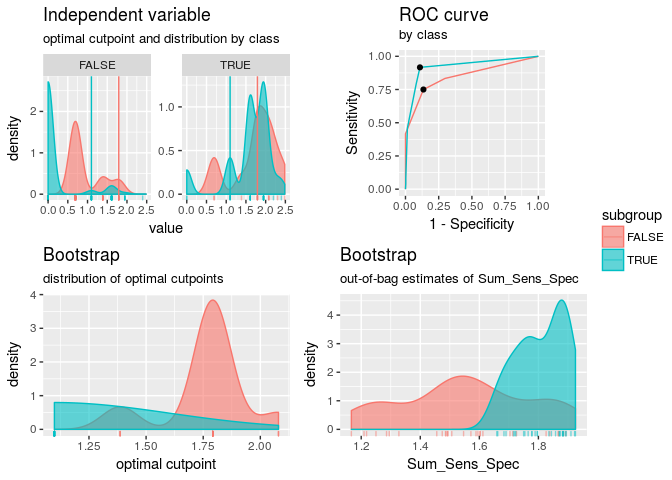
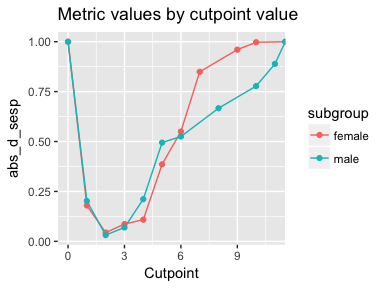
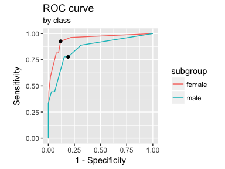
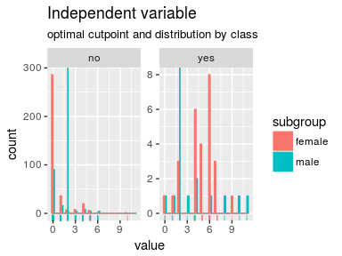
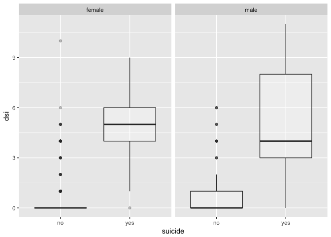

<!-- README.md is generated from README.Rmd. Please edit that file -->
cutpointr
---------

[](https://travis-ci.org/Thie1e/cutpointr) [](https://ci.appveyor.com/project/Thie1e/cutpointr) [](http://www.repostatus.org/#active) [](https://codecov.io/github/thie1e/cutpointr)

**cutpointr** is an R package for tidy calculation of "optimal" cutpoints. It supports several methods for calculating cutpoints and includes several metrics that can be maximized or minimized by selecting a cutpoint. Additionally, **cutpointr** can automatically bootstrap the variability of the optimal cutpoints and return out-of-bag estimates of various metrics.

Installation
------------

``` r
devtools::install_github("thie1e/cutpointr")
```

Features
--------

-   Calculation of "optimal" cutpoints in binary classification tasks
-   Tidy output, integrates well with functions from the tidyverse
-   Bootstrapping for simulating the cutpoint variability and for getting out-of-bag estimates of various metrics (as a form of cross validation)
-   Multiple methods for calculating cutpoints
-   Multiple metrics can be chosen for maximization / minimization
-   Standard/Nonstandard evaluation of the function arguments

Calculating cutpoints
---------------------

The included methods for calculating cutpoints are:

-   `maximize_metric`: Maximize the metric function
-   `minimize_metric`: Minimize the metric function
-   `oc_manual`: Specify the cutoff value manually
-   `oc_youden_kernel`: Maximize the Youden-Index after kernel smoothing the distributions of the two classes
-   `oc_youden_normal`: Maximize the Youden-Index parametrically assuming normally distributed data in both classes
-   `oc_OptimalCutpoints`: A tidy wrapper for optimal.cutpoints from the OptimalCutpoints package. Supply an additional `oc_metric` argument with the method choice corresponding to a method from the OptimalCutpoints package

The included metrics to be used with `minimize_metric` and `maximize_metric` are:

-   `accuracy`: Fraction correctly classified
-   `abs_d_sesp`: The absolute difference of sensitivity and specificity
-   `kappa`: Cohen's Kappa
-   `sum_sens_spec`: sensitivity + specificity
-   `youden`: Youden- or J-Index = sensitivity + specificity - 1
-   `odds_ratio`: (Diagnostic) odds ratio

**cutpointr** makes use of nonstandard evaluation for higher usability and to allow for easy transformation of the variables. The inputs to the arguments `method` and `metric` are functions so that user-defined functions can easily be supplied instead of the built in ones.

Applications
------------

To showcase the functionality, we'll use the included `suicide` data set.

``` r
library(cutpointr)
data(suicide)
head(suicide)
#>   age gender dsi suicide
#> 1  29 female   1      no
#> 2  26   male   0      no
#> 3  26 female   0      no
#> 4  27 female   0      no
#> 5  28 female   0      no
#> 6  53   male   2      no
opt_cut <- cutpointr(suicide, dsi, suicide)
#> Assuming yes as the positive class
#> Assuming the positive class has higher x values
opt_cut
#> # A tibble: 1 × 15
#>   direction optimal_cutpoint          method Sum_Sens_Spec  accuracy
#>       <chr>            <dbl>           <chr>         <dbl>     <dbl>
#> 1        >=                2 maximize_metric      1.751792 0.8646617
#>   sensitivity specificity       AUC pos_class neg_class prevalence outcome
#>         <dbl>       <dbl>     <dbl>    <fctr>    <fctr>      <dbl>   <chr>
#> 1   0.8888889   0.8629032 0.9237791       yes        no 0.06766917 suicide
#>   predictor               data          roc_curve
#>       <chr>             <list>             <list>
#> 1       dsi <tibble [532 × 2]> <tibble [13 × 10]>
```

**cutpointr** makes assumptions about the direction of the dependency between class and x, if `direction` and / or `pos_class` or `neg_class` are not specified. The same result can be achieved by manually defining `direction` and the positive / negative classes which is slightly faster:

``` r
opt_cut <- cutpointr(suicide, dsi, suicide, direction = ">=", pos_class = "yes",
                     neg_class = "no", method = maximize_metric, metric = youden)
opt_cut
#> # A tibble: 1 × 15
#>   direction optimal_cutpoint          method Youden_Index  accuracy
#>       <chr>            <dbl>           <chr>        <dbl>     <dbl>
#> 1        >=                2 maximize_metric    0.7517921 0.8646617
#>   sensitivity specificity       AUC pos_class neg_class prevalence outcome
#>         <dbl>       <dbl>     <dbl>     <chr>     <chr>      <dbl>   <chr>
#> 1   0.8888889   0.8629032 0.9237791       yes        no 0.06766917 suicide
#>   predictor               data          roc_curve
#>       <chr>             <list>             <list>
#> 1       dsi <tibble [532 × 2]> <tibble [13 × 10]>
```

`opt_cut` is a tidy data frame that returns the input data in a nested tibble. Methods for summarizing and plotting the data and results are included:

``` r
summary(opt_cut)
#> Method: maximize_metric 
#> Predictor: dsi 
#> Outcome: suicide 
#> Direction: >= 
#> 
#>  
#> --------------------------------------------------------------------------- 
#>  optimal_cutpoint Youden_Index accuracy sensitivity specificity    AUC
#>                 2       0.7518   0.8647      0.8889      0.8629 0.9238
#>  n_pos n_neg
#>     36   496
#> 
#>           observation
#> prediction yes  no
#>        yes  32  68
#>        no    4 428
#> 
#> Predictor summary: 
#>      Min.   1st Qu.    Median      Mean   3rd Qu.      Max.        SD 
#>  0.000000  0.000000  0.000000  0.921100  1.000000 11.000000  1.852714
plot(opt_cut)
```


Predictions for new data can be made using `predict`:

``` r
predict(opt_cut, newdata = data.frame(dsi = 0:5))
#> [1] "no"  "no"  "yes" "yes" "yes" "yes"
```

### Separate subgroups

Cutpoints can be separately estimated on a subgroup, gender in this case:

``` r
opt_cut <- cutpointr(suicide, dsi, suicide, gender)
#> Assuming yes as the positive class
#> Assuming the positive class has higher x values
opt_cut
#> # A tibble: 2 × 17
#>   subgroup direction optimal_cutpoint          method Sum_Sens_Spec
#>      <chr>     <chr>            <dbl>           <chr>         <dbl>
#> 1   female        >=                2 maximize_metric      1.808118
#> 2     male        >=                3 maximize_metric      1.625106
#>    accuracy sensitivity specificity       AUC pos_class neg_class
#>       <dbl>       <dbl>       <dbl>     <dbl>    <fctr>    <fctr>
#> 1 0.8852041   0.9259259   0.8821918 0.9446474       yes        no
#> 2 0.8428571   0.7777778   0.8473282 0.8617472       yes        no
#>   prevalence outcome predictor grouping               data
#>        <dbl>   <chr>     <chr>    <chr>             <list>
#> 1 0.06887755 suicide       dsi   gender <tibble [392 × 2]>
#> 2 0.06428571 suicide       dsi   gender <tibble [140 × 2]>
#>            roc_curve
#>               <list>
#> 1 <tibble [11 × 10]>
#> 2 <tibble [11 × 10]>
summary(opt_cut)
#> Method: maximize_metric 
#> Predictor: dsi 
#> Outcome: suicide 
#> Direction: >= 
#> Subgroups: female, male 
#> 
#> female 
#> --------------------------------------------------------------------------- 
#>  optimal_cutpoint Sum_Sens_Spec accuracy sensitivity specificity    AUC
#>                 2        1.8081   0.8852      0.9259      0.8822 0.9446
#>  n_pos n_neg
#>     27   365
#> 
#>           observation
#> prediction yes  no
#>        yes  25  43
#>        no    2 322
#> 
#> Predictor summary: 
#>      Min.   1st Qu.    Median      Mean   3rd Qu.      Max.        SD 
#>  0.000000  0.000000  0.000000  0.839300  1.000000 10.000000  1.745198 
#> 
#> male 
#> --------------------------------------------------------------------------- 
#>  optimal_cutpoint Sum_Sens_Spec accuracy sensitivity specificity    AUC
#>                 3        1.6251   0.8429      0.7778      0.8473 0.8617
#>  n_pos n_neg
#>      9   131
#> 
#>           observation
#> prediction yes  no
#>        yes   7  20
#>        no    2 111
#> 
#> Predictor summary: 
#>      Min.   1st Qu.    Median      Mean   3rd Qu.      Max.        SD 
#>  0.000000  0.000000  0.000000  1.150000  1.000000 11.000000  2.115122
plot(opt_cut)
```


### Bootstrapping

If `boot_runs` is larger zero, **cutpointr** will carry out the usual cutpoint calculation on the full sample, just as before, and additionally on `boot_runs` bootstrap samples.

``` r
set.seed(12)
opt_cut <- cutpointr(suicide, dsi, suicide, boot_runs = 200)
#> Assuming yes as the positive class
#> Assuming the positive class has higher x values
opt_cut
#> # A tibble: 1 × 16
#>   direction optimal_cutpoint          method Sum_Sens_Spec  accuracy
#>       <chr>            <dbl>           <chr>         <dbl>     <dbl>
#> 1        >=                2 maximize_metric      1.751792 0.8646617
#>   sensitivity specificity       AUC pos_class neg_class prevalence outcome
#>         <dbl>       <dbl>     <dbl>    <fctr>    <fctr>      <dbl>   <chr>
#> 1   0.8888889   0.8629032 0.9237791       yes        no 0.06766917 suicide
#>   predictor               data          roc_curve                boot
#>       <chr>             <list>             <list>              <list>
#> 1       dsi <tibble [532 × 2]> <tibble [13 × 10]> <tibble [200 × 18]>
```

The returned object has the additional column `boot` which is a nested tibble that includes the cutpoints per bootstrap sample along with the metric calculated using the function in `metric` and a number of additional metrics. The values in the second column that are calculated using the function in `metric` represent out-of-bag results. The other default metrics are suffixed by `_b` to indicate in-bag results or `_oob` to indicate out-of-bag results:

``` r
opt_cut$boot
#> [[1]]
#> # A tibble: 200 × 18
#>    optimal_cutpoint Sum_Sens_Spec Accuracy_b Accuracy_oob Sensitivity_b
#> *             <dbl>         <dbl>      <dbl>        <dbl>         <dbl>
#> 1                 4      1.595405  0.9229323    0.8601036     0.8604651
#> 2                 2      1.802198  0.8571429    0.8775510     0.8518519
#> 3                 2      1.678810  0.8552632    0.8620690     0.9655172
#> 4                 3      1.619565  0.9060150    0.8622449     0.8529412
#> 5                 2      1.695069  0.8909774    0.8315217     0.9032258
#> 6                 4      1.561418  0.9285714    0.8578431     0.8918919
#> 7                 2      1.729365  0.8439850    0.8711340     0.9062500
#> 8                 2      1.757695  0.8308271    0.8974359     0.7948718
#> 9                 3      1.476381  0.8815789    0.8743719     0.9428571
#> 10                1      1.667962  0.7819549    0.7609756     0.9354839
#> # ... with 190 more rows, and 13 more variables: Sensitivity_oob <dbl>,
#> #   Specificity_b <dbl>, Specificity_oob <dbl>, Kappa_b <dbl>,
#> #   Kappa_oob <dbl>, TP_b <dbl>, FP_b <dbl>, TN_b <dbl>, FN_b <dbl>,
#> #   TP_oob <dbl>, FP_oob <dbl>, TN_oob <dbl>, FN_oob <dbl>
```

The summary and plots include additional elements:

``` r
summary(opt_cut)
#> Method: maximize_metric 
#> Predictor: dsi 
#> Outcome: suicide 
#> Direction: >= 
#> Nr. of bootstraps: 10 
#> 
#>  
#> --------------------------------------------------------------------------- 
#>  optimal_cutpoint Sum_Sens_Spec accuracy sensitivity specificity    AUC
#>                 2        1.7518   0.8647      0.8889      0.8629 0.9238
#>  n_pos n_neg
#>     36   496
#> 
#>           observation
#> prediction yes  no
#>        yes  32  68
#>        no    4 428
#> 
#> Predictor summary: 
#>      Min.   1st Qu.    Median      Mean   3rd Qu.      Max.        SD 
#>  0.000000  0.000000  0.000000  0.921100  1.000000 11.000000  1.852714 
#> 
#> Bootstrap summary: 
#>                    Min. 1st Qu. Median   Mean 3rd Qu.    Max     SD
#> optimal_cutpoint 1.0000  2.0000 2.0000 2.1250  2.0000 4.0000 0.7084
#> Sum_Sens_Spec    1.4270  1.6520 1.7070 1.7090  1.7660 1.8980 0.0909
#> Accuracy_b       0.7500  0.8534 0.8684 0.8631  0.8816 0.9286 0.0349
#> Accuracy_oob     0.7200  0.8427 0.8622 0.8550  0.8775 0.9091 0.0370
#> Sensitivity_b    0.7647  0.8662 0.9048 0.9035  0.9355 1.0000 0.0480
#> Sensitivity_oob  0.5000  0.8000 0.8667 0.8535  0.9231 1.0000 0.0995
#> Specificity_b    0.7333  0.8504 0.8652 0.8603  0.8796 0.9339 0.0383
#> Specificity_oob  0.7059  0.8424 0.8631 0.8550  0.8781 0.9389 0.0421
#> Kappa_b          0.1964  0.3745 0.4181 0.4169  0.4697 0.6383 0.0757
#> Kappa_oob        0.1692  0.3333 0.3958 0.3864  0.4448 0.6400 0.0789
plot(opt_cut)
```


If a subgroup is given, the bootstrapping is carried out separately for every subgroup:

``` r
set.seed(12)
opt_cut <- cutpointr(suicide, dsi, suicide, gender, boot_runs = 200)
#> Assuming yes as the positive class
#> Assuming the positive class has higher x values
#> Warning in optimize_metric(data = data, x = x, class = class, metric_func =
#> metric_func, : Multiple optimal cutpoints found, returning minimum of: 6, 3
#> Warning in .f(.x[[i]], ...): 4 Missing values in bootstrap, maybe due to
#> sampling of only one class
opt_cut
#> # A tibble: 2 × 18
#>   subgroup direction optimal_cutpoint          method Sum_Sens_Spec
#>      <chr>     <chr>            <dbl>           <chr>         <dbl>
#> 1   female        >=                2 maximize_metric      1.808118
#> 2     male        >=                3 maximize_metric      1.625106
#>    accuracy sensitivity specificity       AUC pos_class neg_class
#>       <dbl>       <dbl>       <dbl>     <dbl>    <fctr>    <fctr>
#> 1 0.8852041   0.9259259   0.8821918 0.9446474       yes        no
#> 2 0.8428571   0.7777778   0.8473282 0.8617472       yes        no
#>   prevalence outcome predictor grouping               data
#>        <dbl>   <chr>     <chr>    <chr>             <list>
#> 1 0.06887755 suicide       dsi   gender <tibble [392 × 2]>
#> 2 0.06428571 suicide       dsi   gender <tibble [140 × 2]>
#>            roc_curve                boot
#>               <list>              <list>
#> 1 <tibble [11 × 10]> <tibble [200 × 18]>
#> 2 <tibble [11 × 10]> <tibble [200 × 18]>
summary(opt_cut)
#> Method: maximize_metric 
#> Predictor: dsi 
#> Outcome: suicide 
#> Direction: >= 
#> Subgroups: female, male 
#> Nr. of bootstraps: 10 
#> 
#> female 
#> --------------------------------------------------------------------------- 
#>  optimal_cutpoint Sum_Sens_Spec accuracy sensitivity specificity    AUC
#>                 2        1.8081   0.8852      0.9259      0.8822 0.9446
#>  n_pos n_neg
#>     27   365
#> 
#>           observation
#> prediction yes  no
#>        yes  25  43
#>        no    2 322
#> 
#> Predictor summary: 
#>      Min.   1st Qu.    Median      Mean   3rd Qu.      Max.        SD 
#>  0.000000  0.000000  0.000000  0.839300  1.000000 10.000000  1.745198 
#> 
#> Bootstrap summary: 
#>                    Min. 1st Qu. Median   Mean 3rd Qu.    Max     SD
#> optimal_cutpoint 1.0000  2.0000 2.0000 2.1700  2.0000 4.0000 0.7237
#> Sum_Sens_Spec    1.4260  1.7330 1.7840 1.7790  1.8550 1.9250 0.0928
#> Accuracy_b       0.7628  0.8750 0.8878 0.8845  0.9005 0.9490 0.0310
#> Accuracy_oob     0.7643  0.8676 0.8836 0.8799  0.8976 0.9338 0.0294
#> Sensitivity_b    0.7308  0.8947 0.9375 0.9302  0.9643 1.0000 0.0505
#> Sensitivity_oob  0.5000  0.8571 0.9091 0.9009  1.0000 1.0000 0.1037
#> Specificity_b    0.7473  0.8729 0.8851 0.8812  0.8969 0.9539 0.0336
#> Specificity_oob  0.7388  0.8638 0.8806 0.8786  0.8978 0.9556 0.0352
#> Kappa_b          0.1675  0.4369 0.4755 0.4760  0.5286 0.7078 0.0834
#> Kappa_oob        0.2394  0.4049 0.4744 0.4575  0.5105 0.6768 0.0836
#> 
#> male 
#> --------------------------------------------------------------------------- 
#>  optimal_cutpoint Sum_Sens_Spec accuracy sensitivity specificity    AUC
#>                 3        1.6251   0.8429      0.7778      0.8473 0.8617
#>  n_pos n_neg
#>      9   131
#> 
#>           observation
#> prediction yes  no
#>        yes   7  20
#>        no    2 111
#> 
#> Predictor summary: 
#>      Min.   1st Qu.    Median      Mean   3rd Qu.      Max.        SD 
#>  0.000000  0.000000  0.000000  1.150000  1.000000 11.000000  2.115122 
#> 
#> Bootstrap summary: 
#>                     Min. 1st Qu. Median   Mean 3rd Qu.    Max     SD
#> optimal_cutpoint  1.0000  2.5000 3.0000 3.0200  4.0000 8.0000 1.4698
#> Sum_Sens_Spec     0.5818  1.3310 1.4940 1.4700  1.6590 1.9410 0.2661
#> Accuracy_b        0.5857  0.7821 0.8500 0.8265  0.8714 1.0000 0.0793
#> Accuracy_oob      0.5714  0.7692 0.8348 0.8126  0.8685 0.9423 0.0830
#> Sensitivity_b     0.5000  0.7500 0.8333 0.8323  0.9167 1.0000 0.1266
#> Sensitivity_oob   0.0000  0.5000 0.6667 0.6465  1.0000 1.0000 0.3073
#> Specificity_b     0.5682  0.7780 0.8488 0.8263  0.8779 1.0000 0.0870
#> Specificity_oob   0.5536  0.7645 0.8511 0.8240  0.8936 1.0000 0.1002
#> Kappa_b           0.0239  0.2338 0.3292 0.3426  0.4318 1.0000 0.1491
#> Kappa_oob        -0.0936  0.1364 0.2115 0.2236  0.3096 0.5706 0.1397
plot(opt_cut)
#> Warning: Removed 2 rows containing non-finite values (stat_density).
```


### Parallelized bootstrapping

Using `foreach` and `doRNG` the bootstrapping can easily be parallelized. The `doRNG` package is being used to make the bootstrap sampling reproducible. It may be preferable for long running tasks to specify `direction` and `pos_class` and / or `neg_class` manually to speed up `cutpointr`.

``` r
if (suppressPackageStartupMessages(require(doSNOW) & require(doRNG))) {
  cl <- makeCluster(2) # 2 cores
  registerDoSNOW(cl)
  registerDoRNG(12) # Reproducible parallel loops using doRNG
  opt_cut <- cutpointr(suicide, dsi, suicide, gender, pos_class = "yes",
                 direction = ">=", boot_runs = 200, allowParallel = TRUE)
  stopCluster(cl)
  opt_cut
}
#> 
#> Attaching package: 'parallel'
#> The following objects are masked from 'package:snow':
#> 
#>     clusterApply, clusterApplyLB, clusterCall, clusterEvalQ,
#>     clusterExport, clusterMap, clusterSplit, makeCluster,
#>     parApply, parCapply, parLapply, parRapply, parSapply,
#>     splitIndices, stopCluster
#> Warning in .f(.x[[i]], ...): 16 Missing values in bootstrap, maybe due to
#> sampling of only one class
#> # A tibble: 2 × 18
#>   subgroup direction optimal_cutpoint          method Sum_Sens_Spec
#>      <chr>     <chr>            <dbl>           <chr>         <dbl>
#> 1   female        >=                2 maximize_metric      1.808118
#> 2     male        >=                3 maximize_metric      1.625106
#>    accuracy sensitivity specificity       AUC pos_class neg_class
#>       <dbl>       <dbl>       <dbl>     <dbl>     <chr>    <fctr>
#> 1 0.8852041   0.9259259   0.8821918 0.9446474       yes        no
#> 2 0.8428571   0.7777778   0.8473282 0.8617472       yes        no
#>   prevalence outcome predictor grouping               data
#>        <dbl>   <chr>     <chr>    <chr>             <list>
#> 1 0.06887755 suicide       dsi   gender <tibble [392 × 2]>
#> 2 0.06428571 suicide       dsi   gender <tibble [140 × 2]>
#>            roc_curve                boot
#>               <list>              <list>
#> 1 <tibble [11 × 10]> <tibble [200 × 18]>
#> 2 <tibble [11 × 10]> <tibble [200 × 18]>
```

Nonstandard evaluation
----------------------

The arguments to `cutpointr` do not need to be enclosed in quotes. This is possible thanks to nonstandard evaluation of the arguments, which are evaluated in `data`. Alternatively, the arguments *can* be enclosed in quotes. In that case, transforming the data within the function call is not possible and `method` and `metric` functions that are enclosed in quotes are only looked up within the **cutpointr** package. As an example of a transformation of the `x`, `class` and `subgroup` variable consider:

``` r
identical(cutpointr(suicide, dsi, suicide), cutpointr(suicide, "dsi", "suicide"))
#> Assuming yes as the positive class
#> Assuming the positive class has higher x values
#> Assuming yes as the positive class
#> Assuming the positive class has higher x values
#> [1] TRUE

set.seed(12)
opt_cut <- cutpointr(suicide, log(dsi + 1), suicide == "yes",
    subgroup = dsi %% 2 == 0, boot_runs = 30)
#> Assuming TRUE as the positive class
#> Assuming the positive class has higher x values
opt_cut
#> # A tibble: 2 × 18
#>   subgroup direction optimal_cutpoint          method Sum_Sens_Spec
#>      <chr>     <chr>            <dbl>           <chr>         <dbl>
#> 1    FALSE        >=         1.791759 maximize_metric      1.614865
#> 2     TRUE        >=         1.098612 maximize_metric      1.807662
#>    accuracy sensitivity specificity       AUC pos_class neg_class
#>       <dbl>       <dbl>       <dbl>     <dbl>     <lgl>     <lgl>
#> 1 0.8488372   0.7500000   0.8648649 0.8513514      TRUE     FALSE
#> 2 0.8923767   0.9166667   0.8909953 0.9228870      TRUE     FALSE
#>   prevalence          outcome    predictor    grouping               data
#>        <dbl>            <chr>        <chr>       <chr>             <list>
#> 1 0.13953488 suicide == "yes" log(dsi + 1) dsi%%2 == 0  <tibble [86 × 2]>
#> 2 0.05381166 suicide == "yes" log(dsi + 1) dsi%%2 == 0 <tibble [446 × 2]>
#>           roc_curve               boot
#>              <list>             <list>
#> 1 <tibble [7 × 10]> <tibble [30 × 18]>
#> 2 <tibble [7 × 10]> <tibble [30 × 18]>
summary(opt_cut)
#> Method: maximize_metric 
#> Predictor: log(dsi + 1) 
#> Outcome: suicide == "yes" 
#> Direction: >= 
#> Subgroups: FALSE, TRUE 
#> Nr. of bootstraps: 10 
#> 
#> FALSE 
#> --------------------------------------------------------------------------- 
#>  optimal_cutpoint Sum_Sens_Spec accuracy sensitivity specificity    AUC
#>            1.7918        1.6149   0.8488        0.75      0.8649 0.8514
#>  n_pos n_neg
#>     12    74
#> 
#>           observation
#> prediction TRUE FALSE
#>      TRUE     9    10
#>      FALSE    3    64
#> 
#> Predictor summary: 
#>      Min.   1st Qu.    Median      Mean   3rd Qu.      Max.        SD 
#> 0.6931000 0.6931000 0.6931000 1.0650000 1.3860000 2.4850000 0.5183497 
#> 
#> Bootstrap summary: 
#>                    Min. 1st Qu. Median   Mean 3rd Qu.    Max     SD
#> optimal_cutpoint 1.3860  1.7920 1.7920 1.7660  1.7920 2.0790 0.1749
#> Sum_Sens_Spec    1.1670  1.4610 1.5590 1.5530  1.7110 1.8930 0.2168
#> Accuracy_b       0.7326  0.8140 0.8430 0.8453  0.8721 0.9651 0.0562
#> Accuracy_oob     0.6897  0.8080 0.8485 0.8287  0.8716 0.9062 0.0633
#> Sensitivity_b    0.6000  0.6887 0.7778 0.7805  0.8583 1.0000 0.1095
#> Sensitivity_oob  0.1667  0.6000 0.7500 0.6978  0.8333 1.0000 0.2446
#> Specificity_b    0.7101  0.8219 0.8672 0.8575  0.8827 1.0000 0.0692
#> Specificity_oob  0.6522  0.8226 0.8644 0.8551  0.8929 1.0000 0.0864
#> Kappa_b          0.2352  0.4301 0.5211 0.5128  0.5765 0.7817 0.1334
#> Kappa_oob        0.1696  0.3086 0.4051 0.4194  0.5380 0.6712 0.1480
#> 
#> TRUE 
#> --------------------------------------------------------------------------- 
#>  optimal_cutpoint Sum_Sens_Spec accuracy sensitivity specificity    AUC
#>            1.0986        1.8077   0.8924      0.9167       0.891 0.9229
#>  n_pos n_neg
#>     24   422
#> 
#>           observation
#> prediction TRUE FALSE
#>      TRUE    22    46
#>      FALSE    2   376
#> 
#> Predictor summary: 
#>      Min.   1st Qu.    Median      Mean   3rd Qu.      Max.        SD 
#> 0.0000000 0.0000000 0.0000000 0.2436000 0.0000000 2.3980000 0.5887021 
#> 
#> Bootstrap summary: 
#>                    Min. 1st Qu. Median   Mean 3rd Qu.    Max     SD
#> optimal_cutpoint 1.0990  1.0990 1.0990 1.0990  1.0990 1.0990 0.0000
#> Sum_Sens_Spec    1.6590  1.7510 1.8160 1.8100  1.8830 1.9250 0.0826
#> Accuracy_b       0.8700  0.8857 0.9013 0.8987  0.9098 0.9305 0.0162
#> Accuracy_oob     0.8393  0.8787 0.8879 0.8860  0.8953 0.9310 0.0221
#> Sensitivity_b    0.7857  0.8518 0.9259 0.9110  0.9652 1.0000 0.0672
#> Sensitivity_oob  0.7500  0.8595 0.9583 0.9259  1.0000 1.0000 0.0824
#> Specificity_b    0.8726  0.8834 0.8983 0.8980  0.9127 0.9272 0.0173
#> Specificity_oob  0.8333  0.8756 0.8837 0.8838  0.8938 0.9291 0.0239
#> Kappa_b          0.2948  0.3996 0.4549 0.4481  0.5060 0.5333 0.0658
#> Kappa_oob        0.2709  0.3605 0.3991 0.4138  0.4568 0.6498 0.0877
plot(opt_cut)
```



``` r
predict(opt_cut, newdata = data.frame(dsi = 0:5))
#> [1] FALSE FALSE  TRUE FALSE  TRUE  TRUE
```

cutpointr in the tidyverse
--------------------------

Since `cutpointr` outputs a tidy data frame and `data` is the first argument, it can be conveniently used in conjunction with various functions from the "tidyverse".

``` r
opt_cut <- cutpointr(suicide, dsi, suicide)
#> Assuming yes as the positive class
#> Assuming the positive class has higher x values
class(opt_cut) # the result is also a data.frame
#> [1] "cutpointr"  "tbl_df"     "tbl"        "data.frame"

suppressMessages(library(dplyr))
suppressMessages(library(tidyr))
suppressMessages(library(purrr))
suppressMessages(library(ggplot2))
suicide %>%
    group_by(gender) %>%
    nest() %>%
    mutate(cutmod1 = map(data, function(x) cutpointr(x, dsi, suicide,
                                                     metric = accuracy)),
           cutmod2 = map(data, function(x) cutpointr(x, dsi, suicide,
                                                     metric = sum_sens_spec)))
#> Assuming yes as the positive class
#> Assuming the positive class has higher x values
#> Assuming yes as the positive class
#> Assuming the positive class has higher x values
#> Assuming yes as the positive class
#> Assuming the positive class has higher x values
#> Assuming yes as the positive class
#> Assuming the positive class has higher x values
#> # A tibble: 2 × 4
#>   gender               data           cutmod1           cutmod2
#>   <fctr>             <list>            <list>            <list>
#> 1 female <tibble [392 × 3]> <tibble [1 × 15]> <tibble [1 × 15]>
#> 2   male <tibble [140 × 3]> <tibble [1 × 15]> <tibble [1 × 15]>
```

Plotting
--------

**cutpointr** includes several convenience functions for plotting data from a `cutpointr` object. These include:

-   `plot_cut_boot`: Plot the bootstrapped distribution of optimal cutpoints
-   `plot_metric`: If `maximize_metric` or `minimize_metric` was used this function plots all possible cutoffs on the x-axis vs. the respective metric values on the y-axis
-   `plot_metric_boot`: Plot the distribution of out-of-bag metric values
-   `plot_precision_recall`: Plot the precision recall curve
-   `plot_roc`: Plot the ROC curve
-   `plot_x`: Plot the distribution of the predictor variable

``` r
opt_cut <- cutpointr(suicide, dsi, suicide, gender, method = minimize_metric,
                     metric = abs_d_sesp, boot_runs = 100)
#> Assuming yes as the positive class
#> Assuming the positive class has higher x values
#> Warning in .f(.x[[i]], ...): 4 Missing values in bootstrap, maybe due to
#> sampling of only one class
opt_cut
#> # A tibble: 2 × 18
#>   subgroup direction optimal_cutpoint          method abs_d_sesp  accuracy
#>      <chr>     <chr>            <dbl>           <chr>      <dbl>     <dbl>
#> 1   female        >=                2 minimize_metric 0.04373415 0.8852041
#> 2     male        >=                2 minimize_metric 0.03138253 0.8071429
#>   sensitivity specificity       AUC pos_class neg_class prevalence outcome
#>         <dbl>       <dbl>     <dbl>    <fctr>    <fctr>      <dbl>   <chr>
#> 1   0.9259259   0.8821918 0.9446474       yes        no 0.06887755 suicide
#> 2   0.7777778   0.8091603 0.8617472       yes        no 0.06428571 suicide
#>   predictor grouping               data          roc_curve
#>       <chr>    <chr>             <list>             <list>
#> 1       dsi   gender <tibble [392 × 2]> <tibble [11 × 10]>
#> 2       dsi   gender <tibble [140 × 2]> <tibble [11 × 10]>
#>                  boot
#>                <list>
#> 1 <tibble [100 × 18]>
#> 2 <tibble [100 × 18]>
plot_cut_boot(opt_cut)
```


``` r
plot_metric(opt_cut)
```



``` r
plot_metric_boot(opt_cut)
#> Warning: Removed 2 rows containing non-finite values (stat_density).
```


``` r
plot_precision_recall(opt_cut)
```


``` r
plot_roc(opt_cut)
```



``` r
plot_x(opt_cut)
```



### Manual plotting

Since **cutpointr** returns a tidy data frame with the supplied data, bootstrap results and the ROC curve in nested tibbles these data can coveniently be plotted manually. This offers additional ways of tweaking these plots as well as the possibility to plot results that are not included in `plot`, `plot_metric`, `plot_cut_boot`, `plot_metric_boot` or `plot_roc`. The relevant nested tibbles are in the columns `data`, `roc_curve` and `boot`. The following is an example of accessing and plotting the grouped data.

``` r
set.seed(123) # Some missing values expected
opt_cut <- cutpointr(suicide, dsi, suicide, gender, boot_runs = 100)
#> Assuming yes as the positive class
#> Assuming the positive class has higher x values
#> Warning in .f(.x[[i]], ...): 4 Missing values in bootstrap, maybe due to
#> sampling of only one class
head(opt_cut$data)
#> [[1]]
#> # A tibble: 392 × 2
#>      dsi suicide
#>    <dbl>  <fctr>
#> 1      1      no
#> 2      0      no
#> 3      0      no
#> 4      0      no
#> 5      0      no
#> 6      0      no
#> 7      0      no
#> 8      1      no
#> 9      0      no
#> 10     0      no
#> # ... with 382 more rows
#> 
#> [[2]]
#> # A tibble: 140 × 2
#>      dsi suicide
#>    <dbl>  <fctr>
#> 1      0      no
#> 2      2      no
#> 3      1      no
#> 4      0      no
#> 5      0      no
#> 6      0      no
#> 7      1      no
#> 8      0      no
#> 9      0      no
#> 10     0      no
#> # ... with 130 more rows

opt_cut %>% 
    select(data, subgroup) %>% 
    unnest %>% 
    ggplot(aes(x = suicide, y = dsi)) + 
    geom_boxplot(alpha = 0.3) + facet_grid(~subgroup)
```



### ROC curve only

When running `cutpointr` a ROC curve is by default returned in the column `roc`. This ROC curve can be plotted using `plot_roc`. Alternatively, if only the ROC curve is desired and no cutpoint needs to be calculated, the ROC curve can be plotted using the `roc` function and, for example, **ggplot2**. Note that the `roc` function, unlike `cutpointr`, does not determine `direction`, `pos_class` or `neg_class` automatically and does not support nonstandard evaluation, so the function arguments have to be enclosed in quotation marks.

``` r
roc(data = suicide, x = "dsi", class = "suicide", 
    pos_class = "yes", neg_class = "no") %>% 
    ggplot(aes(x = fpr, y = tpr)) + geom_line()
```


User-defined method and metric functions
----------------------------------------

User defined functions can be supplied to method. To define a new method function, create a function that may take as input(s):

-   `data`: A data frame or tbl\_df
-   `x`: (character) The name of the predictor or independent variable
-   `class`: (character) The name of the class or dependent variable
-   `metric_func`: A function for calculating a metric, e.g. accuracy. Note that the method function does not necessarily have to accept this argument
-   `pos_class`: The positive class
-   `neg_class`: The negative class
-   `direction`: "&gt;=" if the positive class has higher x values, "&lt;=" otherwise

The `...` argument can be used to avoid an error if not all of the above arguments are needed and in order to pass additional arguments to `method`. The function should return a data frame or tbl\_df with one row, the column "optimal\_cutpoint", and an optinal column with an arbitraty name with the metric value at the optimal cutpoint.

For example, a function for choosing the cutpoint as the mean of the independent variable could look like this:

``` r
mean_cut <- function(data, x, ...) {
    oc <- mean(unlist(data[, x]))
    return(data.frame(optimal_cutpoint = oc))
}
```

Since no metric is returned, `Sum_Sens_Spec`, the sum of sensitivity and specificity, is returned as the extra metric column in addition to accuracy, sensitivity and specificity.

Some `method` functions that make use of the additional arguments (that are captured by `...` in `mean_cut`) are already included in **cutpointr**, see the list at the top. Since these functions are arguments to `cutpointr` their code can be accessed by simply typing their name, e.g.:

``` r
oc_youden_normal
#> function(data, x, class, pos_class = NULL, neg_class = NULL,
#>                              direction, ...) {
#>     stopifnot(is.character(x))
#>     stopifnot(is.character(class))
#>     iv <- unlist(data[, x])
#>     if (any(!is.finite(iv))) stop("Only finite values allowed in oc_youden_normal")
#>     cla <- unlist(data[, class])
#>     if (direction %in% c(">", ">=")) {
#>         patients <- iv[cla == pos_class]
#>         controls <- iv[cla == neg_class]
#>     } else if (direction %in% c("<", "<=")) {
#>         patients <- iv[cla == neg_class]
#>         controls <- iv[cla == pos_class]
#>     }
#>     m_h <- mean(controls)
#>     sd_h <- stats::sd(controls)
#>     m_d <- mean(patients)
#>     sd_d <- stats::sd(patients)
#>     if (sd_h == sd_d) {
#>         c <- (m_h+m_d)/2
#>     } else if (any(sd_h == 0, sd_d == 0)) {
#>         # if sd_h = 0 and/or sd_d = 0 the cutoff would be NaN
#>         c <- (m_h+m_d)/2
#>     } else {
#>         c <- ((m_d*sd_h^2 - m_h*sd_d^2) - sd_h*sd_d*(sqrt((m_h-m_d)^2 + (sd_h^2-sd_d^2) * log(sd_h^2/sd_d^2)))) /
#>             (sd_h^2-sd_d^2)
#>     }
#> 
#>     # Extremely high or low cutoffs can result if m_d < m_h and direction = ">="
#>     if (c < min(c(controls, patients))) {
#>         warning(paste("Cutpoint", c, "was restricted to range of independent variable"))
#>         c <- min(c(controls, patients))
#>     } else if (c > max(c(controls, patients))) {
#>         warning(paste("Cutpoint", c, "was restricted to range of independent variable"))
#>         c <- max(c(controls, patients))
#>     }
#>     return(data.frame(optimal_cutpoint = c))
#> }
#> <environment: namespace:cutpointr>
```

User defined **metric functions** can be used as well. They are mainly useful in conjunction with `method = maximize_metric` or `method = minimize_metric`. In case of a different `method` function `metric` will only be used as the main out-of-bag metric when plotting the result. The `metric` function should accept the following inputs as vectors:

-   `tp`: Vector of true positives
-   `fp`: Vector of false positives
-   `tn`: Vector of true negatives
-   `fn`: Vector of false negatives

The function should return a **matrix with one column** and the inputs (`tp`, `fp`, `tn`, and `fn`) are **vectors**. If the column is named, the name will be included in the output and plots. Avoid using names that are identical to the column names that are by default returned by cutpointr. The code of the included metric functions can be accessed by simply typing their name.

For example, this is the `accuracy` metric function:

``` r
accuracy
#> function(tp, fp, tn, fn) {
#>     Accuracy = cbind((tp + tn) / (tp + fp + tn + fn))
#>     colnames(Accuracy) <- "Accuracy"
#>     return(Accuracy)
#> }
#> <environment: namespace:cutpointr>
```
