-   [cutpointr](#cutpointr)
    -   [Installation](#installation)
    -   [Example](#example)
    -   [Features](#features)
-   [Calculating cutpoints](#calculating-cutpoints)
    -   [Method functions for cutpoint estimation](#method-functions-for-cutpoint-estimation)
    -   [Metric functions](#metric-functions)
-   [Applications](#applications)
    -   [Separate subgroups](#separate-subgroups)
    -   [Bootstrapping](#bootstrapping)
-   [More robust cutpoint estimation methods](#more-robust-cutpoint-estimation-methods)
    -   [Bootstrapped cutpoints](#bootstrapped-cutpoints)
    -   [LOESS smoothing for selecting a cutpoint](#loess-smoothing-for-selecting-a-cutpoint)
    -   [Smoothing via Generalized Additive Models for selecting a cutpoint](#smoothing-via-generalized-additive-models-for-selecting-a-cutpoint)
    -   [Spline smoothing for selecting a cutpoint](#spline-smoothing-for-selecting-a-cutpoint)
-   [Additional features](#additional-features)
    -   [Calculating only the ROC curve](#calculating-only-the-roc-curve)
    -   [Midpoints](#midpoints)
    -   [Finding all cutpoints with acceptable performance](#finding-all-cutpoints-with-acceptable-performance)
    -   [Manual and mean / median cutpoints](#manual-and-mean-median-cutpoints)
    -   [Nonstandard evaluation and transforming variables](#nonstandard-evaluation-and-transforming-variables)
    -   [ROC-curve and optimal cutpoint for multiple variables](#roc-curve-and-optimal-cutpoint-for-multiple-variables)
    -   [Accessing `data`, `roc_curve`, and `boot`](#accessing-data-roc_curve-and-boot)
    -   [Adding metrics to the result of cutpointr or roc](#adding-metrics-to-the-result-of-cutpointr-or-roc)
    -   [User-defined functions](#user-defined-functions)
-   [Plotting](#plotting)
    -   [Flexible plotting function](#flexible-plotting-function)
    -   [Manual plotting](#manual-plotting)
    -   [Benchmarks](#benchmarks)

<!-- README.md is generated from README.Rmd. Please edit that file -->
cutpointr
=========

[](https://travis-ci.org/Thie1e/cutpointr) [](https://ci.appveyor.com/project/Thie1e/cutpointr) [](http://www.repostatus.org/#active) [](https://codecov.io/github/thie1e/cutpointr) [](https://CRAN.R-project.org/package=cutpointr)

**cutpointr** is an R package for tidy calculation of "optimal" cutpoints. It supports several methods for calculating cutpoints and includes several metrics that can be maximized or minimized by selecting a cutpoint. Some of these methods are designed to be more robust than the simple empirical optimization of a metric. Additionally, **cutpointr** can automatically bootstrap the variability of the optimal cutpoints and return out-of-bag estimates of various performance metrics.

Installation
------------

You can install **cutpointr** from CRAN using the menu in RStudio or simply:

``` r
install.packages("cutpointr")
```

Example
-------

For example, the optimal cutpoint for the included data set is 2 when maximizing the sum of sensitivity and specificity.

``` r
library(cutpointr)
data(suicide)
head(suicide)
#>   age gender dsi suicide
#> 1  29 female   1      no
#> 2  26   male   0      no
#> 3  26 female   0      no
#> 4  27 female   0      no
#> 5  28 female   0      no
#> 6  53   male   2      no
cp <- cutpointr(suicide, dsi, suicide, 
                method = maximize_metric, metric = sum_sens_spec)
#> Assuming the positive class is yes
#> Assuming the positive class has higher x values
cp
#> # A tibble: 1 x 16
#>   direction optimal_cutpoint method          sum_sens_spec      acc
#>   <chr>                <dbl> <chr>                   <dbl>    <dbl>
#> 1 >=                       2 maximize_metric       1.75179 0.864662
#>   sensitivity specificity      AUC pos_class neg_class prevalence outcome
#>         <dbl>       <dbl>    <dbl> <fct>     <fct>          <dbl> <chr>  
#> 1    0.888889    0.862903 0.923779 yes       no         0.0676692 suicide
#>   predictor data               roc_curve          boot 
#>   <chr>     <list>             <list>             <lgl>
#> 1 dsi       <tibble [532 × 2]> <tibble [13 × 10]> NA
```

``` r
summary(cp)
#> Method: maximize_metric 
#> Predictor: dsi 
#> Outcome: suicide 
#> Direction: >= 
#> 
#>  optimal_cutpoint sum_sens_spec    acc sensitivity specificity    AUC
#>                 2        1.7518 0.8647      0.8889      0.8629 0.9238
#>  n_pos n_neg
#>     36   496
#> 
#> Cutpoint 2:
#>           observation
#> prediction yes  no
#>        yes  32  68
#>        no    4 428
#> 
#> 
#> Predictor summary: 
#>  Min. 5% 1st Qu. Median   Mean 3rd Qu. 95% Max.     SD
#>     0  0       0      0 0.9211       1   5   11 1.8527
#> 
#> Predictor summary per class: 
#>     Min.   5% 1st Qu. Median   Mean 3rd Qu.  95% Max     SD
#> no     0 0.00       0      0 0.6331       0 4.00  10 1.4122
#> yes    0 0.75       4      5 4.8889       6 9.25  11 2.5498
```

``` r
plot(cp)
```

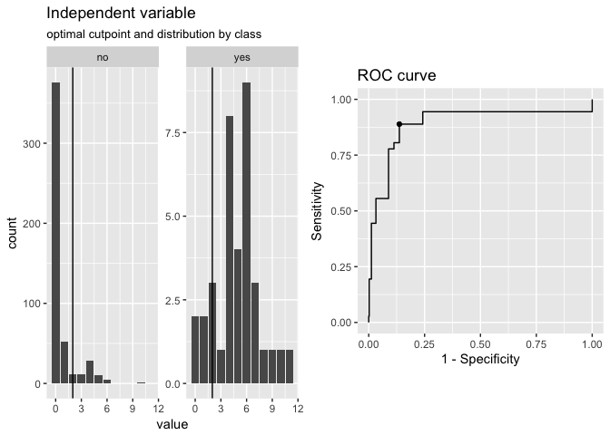

When considering the optimality of a cutpoint, we can only make a judgement based on the sample at hand. Thus, the estimated cutpoint may not be optimal within the population or on unseen data, which is why we sometimes put the "optimal" in quotation marks.

Features
--------

-   Calculation of optimal cutpoints in binary classification tasks
-   Tidy output, integrates well with functions from the tidyverse
-   Functions for plotting ROC-curves, metric distributions and more
-   Bootstrapping for simulating the cutpoint variability and for obtaining out-of-bag estimates of various metrics (as a form of internal validation)
-   Multiple methods for calculating cutpoints
-   Multiple metrics can be chosen for maximization / minimization
-   Standard/Nonstandard evaluation (`cutpointr_` and `cutpointr`)

Calculating cutpoints
=====================

Method functions for cutpoint estimation
----------------------------------------

The included methods for calculating cutpoints are:

-   `maximize_metric`: Maximize the metric function
-   `minimize_metric`: Minimize the metric function
-   `maximize_loess_metric`: Maximize the metric function after LOESS smoothing
-   `minimize_loess_metric`: Minimize the metric function after LOESS smoothing
-   `maximize_spline_metric`: Maximize the metric function after spline smoothing
-   `minimize_spline_metric`: Minimize the metric function after spline smoothing
-   `maximize_gam_metric`: Maximize the metric function after smoothing via Generalized Additive Models
-   `minimize_gam_metric`: Minimize the metric function after smoothing via Generalized Additive Models
-   `maximize_boot_metric`: Bootstrap the optimal cutpoint when maximizing a metric
-   `minimize_boot_metric`: Bootstrap the optimal cutpoint when minimizing a metric
-   `oc_manual`: Specify the cutoff value manually
-   `oc_mean`: Use the sample mean as the "optimal" cutpoint
-   `oc_median`: Use the sample median as the "optimal" cutpoint
-   `oc_youden_kernel`: Maximize the Youden-Index after kernel smoothing the distributions of the two classes
-   `oc_youden_normal`: Maximize the Youden-Index parametrically assuming normally distributed data in both classes

Metric functions
----------------

The included metrics to be used with the minimization and maximization methods are:

-   `accuracy`: Fraction correctly classified
-   `abs_d_sens_spec`: The absolute difference of sensitivity and specificity
-   `abs_d_ppv_npv`: The absolute difference between positive predictive value (PPV) and negative predictive value (NPV)
-   `roc01`: Distance to the point (0,1) on ROC space
-   `cohens_kappa`: Cohen's Kappa
-   `sum_sens_spec`: sensitivity + specificity
-   `sum_ppv_npv`: The sum of positive predictive value (PPV) and negative predictive value (NPV)
-   `prod_sens_spec`: sensitivity \* specificity
-   `prod_ppv_npv`: The product of positive predictive value (PPV) and negative predictive value (NPV)
-   `youden`: Youden- or J-Index = sensitivity + specificity - 1
-   `odds_ratio`: (Diagnostic) odds ratio
-   `risk_ratio`: risk ratio (relative risk)
-   `p_chisquared`: The p-value of a chi-squared test on the confusion matrix
-   `cost_misclassification`: The sum of the misclassification cost of false positives and false negatives. Additional arguments: cost\_fp, cost\_fn
-   `total_utility`: The total utility of true / false positives / negatives. Additional arguments: utility\_tp, utility\_tn, cost\_fp, cost\_fn
-   `F1_score`: The F1-score (2 \* TP) / (2 \* TP + FP + FN)
-   `sens_constrain`: Maximize sensitivity given a minimal value of specificity
-   `spec_constrain`: Maximize specificity given a minimal value of sensitivity
-   `metric_constrain`: Maximize a selected metric given a minimal value of another selected metric

Furthermore, the following functions are included which can be used as metric functions but are more useful for plotting purposes, for example in plot\_cutpointr, or for defining new metric functions: `tp`, `fp`, `tn`, `fn`, `tpr`, `fpr`, `tnr`, `fnr`, `false_omission_rate`, `false_discovery_rate`, `ppv`, `npv`, `precision`, `recall`, `sensitivity`, and `specificity`.

`cutpointr` makes use of nonstandard evaluation for higher usability and to allow for easy transformation of the variables. The inputs to the arguments `method` and `metric` are functions so that user-defined functions can easily be supplied instead of the built-in ones.

Applications
============

To showcase the functionality, we'll use the included `suicide` data set.

``` r
library(cutpointr)
data(suicide)
head(suicide)
#>   age gender dsi suicide
#> 1  29 female   1      no
#> 2  26   male   0      no
#> 3  26 female   0      no
#> 4  27 female   0      no
#> 5  28 female   0      no
#> 6  53   male   2      no
opt_cut <- cutpointr(suicide, dsi, suicide)
#> Assuming the positive class is yes
#> Assuming the positive class has higher x values
opt_cut
#> # A tibble: 1 x 16
#>   direction optimal_cutpoint method          sum_sens_spec      acc
#>   <chr>                <dbl> <chr>                   <dbl>    <dbl>
#> 1 >=                       2 maximize_metric       1.75179 0.864662
#>   sensitivity specificity      AUC pos_class neg_class prevalence outcome
#>         <dbl>       <dbl>    <dbl> <fct>     <fct>          <dbl> <chr>  
#> 1    0.888889    0.862903 0.923779 yes       no         0.0676692 suicide
#>   predictor data               roc_curve          boot 
#>   <chr>     <list>             <list>             <lgl>
#> 1 dsi       <tibble [532 × 2]> <tibble [13 × 10]> NA
```

Alternatively, instead of supplying a data frame the raw vectors of the predictor and outcome can be given as `x` and `class`:

``` r
cutpointr(x = suicide$dsi, class = suicide$suicide)
#> Assuming the positive class is yes
#> Assuming the positive class has higher x values
#> # A tibble: 1 x 16
#>   direction optimal_cutpoint method          sum_sens_spec      acc
#>   <chr>                <dbl> <chr>                   <dbl>    <dbl>
#> 1 >=                       2 maximize_metric       1.75179 0.864662
#>   sensitivity specificity      AUC pos_class neg_class prevalence outcome
#>         <dbl>       <dbl>    <dbl> <fct>     <fct>          <dbl> <chr>  
#> 1    0.888889    0.862903 0.923779 yes       no         0.0676692 class  
#>   predictor data               roc_curve          boot 
#>   <chr>     <list>             <list>             <lgl>
#> 1 x         <tibble [532 × 2]> <tibble [13 × 10]> NA
```

`cutpointr` makes assumptions about the direction of the dependency between `class` and `x`, if `direction` and / or `pos_class` or `neg_class` are not specified. The same result as above can be achieved by manually defining `direction` and the positive / negative classes which is slightly faster, since the classes and direction don't have to be determined:

``` r
opt_cut <- cutpointr(suicide, dsi, suicide, direction = ">=", pos_class = "yes",
                     neg_class = "no", method = maximize_metric, metric = youden)
opt_cut
#> # A tibble: 1 x 16
#>   direction optimal_cutpoint method            youden      acc sensitivity
#>   <chr>                <dbl> <chr>              <dbl>    <dbl>       <dbl>
#> 1 >=                       2 maximize_metric 0.751792 0.864662    0.888889
#>   specificity      AUC pos_class neg_class prevalence outcome predictor
#>         <dbl>    <dbl> <chr>     <chr>          <dbl> <chr>   <chr>    
#> 1    0.862903 0.923779 yes       no         0.0676692 suicide dsi      
#>   data               roc_curve          boot 
#>   <list>             <list>             <lgl>
#> 1 <tibble [532 × 2]> <tibble [13 × 10]> NA
```

`opt_cut` is a tidy data frame that returns the input data in a nested tibble. Methods for summarizing and plotting the data and results are included:

``` r
summary(opt_cut)
#> Method: maximize_metric 
#> Predictor: dsi 
#> Outcome: suicide 
#> Direction: >= 
#> 
#>  optimal_cutpoint youden    acc sensitivity specificity    AUC n_pos n_neg
#>                 2 0.7518 0.8647      0.8889      0.8629 0.9238    36   496
#> 
#> Cutpoint 2:
#>           observation
#> prediction yes  no
#>        yes  32  68
#>        no    4 428
#> 
#> 
#> Predictor summary: 
#>  Min. 5% 1st Qu. Median   Mean 3rd Qu. 95% Max.     SD
#>     0  0       0      0 0.9211       1   5   11 1.8527
#> 
#> Predictor summary per class: 
#>     Min.   5% 1st Qu. Median   Mean 3rd Qu.  95% Max     SD
#> no     0 0.00       0      0 0.6331       0 4.00  10 1.4122
#> yes    0 0.75       4      5 4.8889       6 9.25  11 2.5498
plot(opt_cut)
```


To inspect the optimization, the function of metric values per cutpoint can be plotted using `plot_metric`, if an optimization function was used that returns a metric column in the `roc_curve` column. For example, the `maximize_metric` and `minimize_metric` functions do so:

``` r
plot_metric(opt_cut)
```

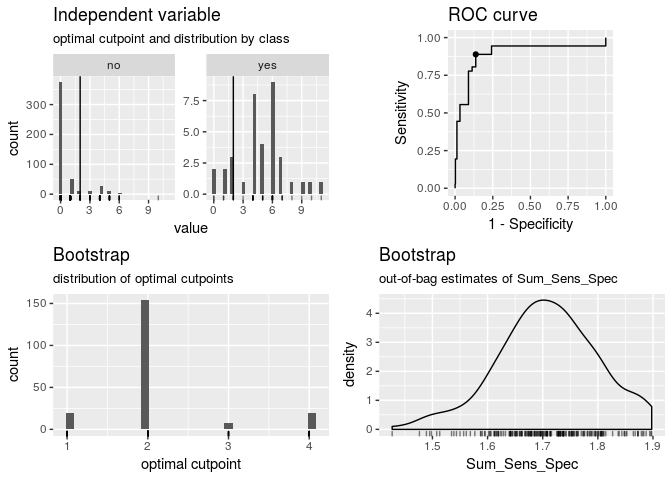

Predictions for new data can be made using `predict`:

``` r
predict(opt_cut, newdata = data.frame(dsi = 0:5))
#> [1] "no"  "no"  "yes" "yes" "yes" "yes"
```

Separate subgroups
------------------

Cutpoints can be separately estimated on subgroups that are defined by a third variable, `gender` in this case:

``` r
opt_cut <- cutpointr(suicide, dsi, suicide, gender)
#> Assuming the positive class is yes
#> Assuming the positive class has higher x values
summary(opt_cut)
#> Method: maximize_metric 
#> Predictor: dsi 
#> Outcome: suicide 
#> Direction: >= 
#> Subgroups: female, male 
#> 
#> Subgroup: female 
#> --------------------------------------------------------------------------- 
#>  optimal_cutpoint sum_sens_spec    acc sensitivity specificity    AUC
#>                 2        1.8081 0.8852      0.9259      0.8822 0.9446
#>  n_pos n_neg
#>     27   365
#> 
#> Cutpoint 2:
#>           observation
#> prediction yes  no
#>        yes  25  43
#>        no    2 322
#> 
#> 
#> Predictor summary: 
#>  Min. 5% 1st Qu. Median   Mean 3rd Qu. 95% Max.     SD
#>     0  0       0      0 0.8393       1   5   10 1.7452
#> 
#> Predictor summary per class: 
#>     Min.  5% 1st Qu. Median   Mean 3rd Qu. 95% Max     SD
#> no     0 0.0       0      0 0.5479       0   4  10 1.3181
#> yes    0 1.3       4      5 4.7778       6   7   9 2.0444
#> 
#> Subgroup: male 
#> --------------------------------------------------------------------------- 
#>  optimal_cutpoint sum_sens_spec    acc sensitivity specificity    AUC
#>                 3        1.6251 0.8429      0.7778      0.8473 0.8617
#>  n_pos n_neg
#>      9   131
#> 
#> Cutpoint 3:
#>           observation
#> prediction yes  no
#>        yes   7  20
#>        no    2 111
#> 
#> 
#> Predictor summary: 
#>  Min. 5% 1st Qu. Median Mean 3rd Qu. 95% Max.     SD
#>     0  0       0      0 1.15       1   6   11 2.1151
#> 
#> Predictor summary per class: 
#>     Min.  5% 1st Qu. Median   Mean 3rd Qu.  95% Max     SD
#> no     0 0.0       0      0 0.8702       1  5.0   6 1.6286
#> yes    0 0.4       3      4 5.2222       8 10.6  11 3.8333
plot(opt_cut)
```


Bootstrapping
-------------

If `boot_runs` is larger zero, `cutpointr` will carry out the usual cutpoint calculation on the full sample, just as before, and additionally on `boot_runs` bootstrap samples, which offers a way of gauging the out-of-sample performance of the cutpoint estimation method.

``` r
set.seed(12)
opt_cut <- cutpointr(suicide, dsi, suicide, boot_runs = 50)
#> Assuming the positive class is yes
#> Assuming the positive class has higher x values
#> Running bootstrap...
opt_cut
#> # A tibble: 1 x 16
#>   direction optimal_cutpoint method          sum_sens_spec      acc
#>   <chr>                <dbl> <chr>                   <dbl>    <dbl>
#> 1 >=                       2 maximize_metric       1.75179 0.864662
#>   sensitivity specificity      AUC pos_class neg_class prevalence outcome
#>         <dbl>       <dbl>    <dbl> <fct>     <fct>          <dbl> <chr>  
#> 1    0.888889    0.862903 0.923779 yes       no         0.0676692 suicide
#>   predictor data               roc_curve          boot              
#>   <chr>     <list>             <list>             <list>            
#> 1 dsi       <tibble [532 × 2]> <tibble [13 × 10]> <tibble [50 × 23]>
```

The returned object has the additional column `boot` which is a nested tibble that includes the cutpoints per bootstrap sample along with the metric calculated using the function in `metric` and various default metrics. The metrics are suffixed by `_b` to indicate in-bag results or `_oob` to indicate out-of-bag results:

``` r
opt_cut$boot
#> [[1]]
#> # A tibble: 50 x 23
#>    optimal_cutpoint AUC_b AUC_oob sum_sens_spec_b sum_sens_spec_o… acc_b
#>               <dbl> <dbl>   <dbl>           <dbl>            <dbl> <dbl>
#>  1                4 0.941   0.900            1.79             1.60 0.923
#>  2                2 0.910   0.927            1.71             1.80 0.857
#>  3                2 0.962   0.880            1.81             1.68 0.855
#>  4                3 0.946   0.906            1.76             1.62 0.906
#>  5                2 0.940   0.895            1.79             1.70 0.891
#>  6                4 0.940   0.932            1.82             1.56 0.929
#>  7                2 0.917   0.918            1.75             1.73 0.844
#>  8                2 0.862   0.925            1.63             1.76 0.831
#>  9                3 0.970   0.846            1.82             1.48 0.882
#> 10                1 0.912   0.920            1.71             1.67 0.782
#> # … with 40 more rows, and 17 more variables: acc_oob <dbl>,
#> #   sensitivity_b <dbl>, sensitivity_oob <dbl>, specificity_b <dbl>,
#> #   specificity_oob <dbl>, kappa_b <dbl>, kappa_oob <dbl>, TP_b <dbl>,
#> #   FP_b <dbl>, TN_b <int>, FN_b <int>, TP_oob <dbl>, FP_oob <dbl>,
#> #   TN_oob <int>, FN_oob <int>, roc_curve_b <list>, roc_curve_oob <list>
```

The summary and plots include additional elements that summarize or display the bootstrap results:

``` r
summary(opt_cut)
#> Method: maximize_metric 
#> Predictor: dsi 
#> Outcome: suicide 
#> Direction: >= 
#> Nr. of bootstraps: 50 
#> 
#>  optimal_cutpoint sum_sens_spec    acc sensitivity specificity    AUC
#>                 2        1.7518 0.8647      0.8889      0.8629 0.9238
#>  n_pos n_neg
#>     36   496
#> 
#> Cutpoint 2:
#>           observation
#> prediction yes  no
#>        yes  32  68
#>        no    4 428
#> 
#> 
#> Predictor summary: 
#>  Min. 5% 1st Qu. Median   Mean 3rd Qu. 95% Max.     SD
#>     0  0       0      0 0.9211       1   5   11 1.8527
#> 
#> Predictor summary per class: 
#>     Min.   5% 1st Qu. Median   Mean 3rd Qu.  95% Max     SD
#> no     0 0.00       0      0 0.6331       0 4.00  10 1.4122
#> yes    0 0.75       4      5 4.8889       6 9.25  11 2.5498
#> 
#> Bootstrap summary: 
#>           Variable   Min.     5% 1st Qu. Median   Mean 3rd Qu.    95%
#>   optimal_cutpoint 1.0000 1.4500  2.0000 2.0000 2.1400  2.0000 3.5500
#>              AUC_b 0.8621 0.8913  0.9168 0.9327 0.9296  0.9466 0.9586
#>            AUC_oob 0.8311 0.8541  0.8983 0.9142 0.9134  0.9338 0.9644
#>    sum_sens_spec_b 1.6285 1.6894  1.7478 1.7747 1.7702  1.7995 1.8385
#>  sum_sens_spec_oob 1.4764 1.5551  1.6510 1.7085 1.7068  1.7631 1.8324
#>              acc_b 0.7613 0.8164  0.8571 0.8712 0.8679  0.8816 0.9052
#>            acc_oob 0.7200 0.7976  0.8455 0.8618 0.8546  0.8721 0.8921
#>      sensitivity_b 0.7949 0.8358  0.8777 0.9077 0.9049  0.9316 0.9683
#>    sensitivity_oob 0.5833 0.6958  0.8031 0.8571 0.8519  0.9215 1.0000
#>      specificity_b 0.7520 0.8095  0.8545 0.8691 0.8653  0.8822 0.9091
#>    specificity_oob 0.7059 0.7866  0.8442 0.8628 0.8549  0.8722 0.8934
#>            kappa_b 0.2214 0.3289  0.3786 0.4221 0.4238  0.4673 0.5310
#>          kappa_oob 0.2145 0.2505  0.3198 0.3808 0.3814  0.4430 0.4866
#>    Max.     SD
#>  4.0000 0.6064
#>  0.9705 0.0214
#>  0.9737 0.0320
#>  1.8555 0.0471
#>  1.8876 0.0874
#>  0.9286 0.0296
#>  0.9091 0.0325
#>  0.9762 0.0426
#>  1.0000 0.0951
#>  0.9313 0.0322
#>  0.9389 0.0373
#>  0.6033 0.0720
#>  0.5003 0.0748
plot(opt_cut)
```

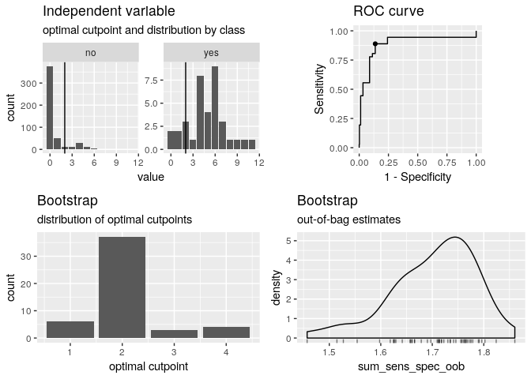

If a subgroup is given, the bootstrapping is carried out separately for every subgroup which is also reflected in the plots and output.

### Parallelized bootstrapping

Using `foreach` and `doRNG` the bootstrapping can be parallelized easily. The **doRNG** package is being used to make the bootstrap sampling reproducible. It may be preferable for long running tasks to specify `direction` and `pos_class` and / or `neg_class` manually to speed up `cutpointr`.

``` r
if (suppressPackageStartupMessages(require(doParallel) & require(doRNG))) {
  cl <- makeCluster(2) # 2 cores
  registerDoParallel(cl)
  registerDoRNG(12) # Reproducible parallel loops using doRNG
  opt_cut <- cutpointr(suicide, dsi, suicide, gender, pos_class = "yes",
                 direction = ">=", boot_runs = 30, allowParallel = TRUE)
  stopCluster(cl)
  opt_cut
}
#> Running bootstrap...
#> # A tibble: 2 x 18
#>   subgroup direction optimal_cutpoint method          sum_sens_spec
#>   <chr>    <chr>                <dbl> <chr>                   <dbl>
#> 1 female   >=                       2 maximize_metric       1.80812
#> 2 male     >=                       3 maximize_metric       1.62511
#>        acc sensitivity specificity      AUC pos_class neg_class prevalence
#>      <dbl>       <dbl>       <dbl>    <dbl> <chr>     <fct>          <dbl>
#> 1 0.885204    0.925926    0.882192 0.944647 yes       no         0.0688776
#> 2 0.842857    0.777778    0.847328 0.861747 yes       no         0.0642857
#>   outcome predictor grouping data               roc_curve         
#>   <chr>   <chr>     <chr>    <list>             <list>            
#> 1 suicide dsi       gender   <tibble [392 × 2]> <tibble [11 × 10]>
#> 2 suicide dsi       gender   <tibble [140 × 2]> <tibble [11 × 10]>
#>   boot              
#>   <list>            
#> 1 <tibble [30 × 23]>
#> 2 <tibble [30 × 23]>
```

More robust cutpoint estimation methods
=======================================

Bootstrapped cutpoints
----------------------

It has been shown that bagging can substantially improve performance of a wide range of types of models in regression as well as in classification tasks. In the setting of generating a numerical output, a number of bootstrap samples is drawn and the final result is the average of all models that were fit to the bootstrap samples. We make this pricinple available for cutpoint estimation via the `maximize_boot_metric` and `minimize_boot_metric` functions. If one of these functions is used as `method`, `boot_cut` bootstrap samples are drawn, the cutpoint optimization is carried out in each one and a summary (e.g. the mean) of the resulting optimal cutpoints on the bootstrap samples is returned as the optimal cutpoint in `cutpointr`. Note that if bootstrap validation is run, i.e. if `boot_runs` is larger zero, an outer bootstrap will be executed. In the bootstrap validation routine `boot_runs` bootstrap samples are generated and each one is again bootstrapped `boot_cut` times. This may lead to long run times, so activating the built-in parallelization may be advisable. The advantages of bootstrapping the optimal cutpoint are that the procedure doesn't possess parameters that have to be tuned, unlike the LOESS smoothing, that it doesn't rely on assumptions, unlike the Normal method, and that it is applicable to any metric that can be used with `minimize_metric` or `maximize_metric`, unlike the Kernel method. Furthermore, like Random Forests cannot be overfit by increasing the number of trees, the bootstrapped cutpoints cannot be overfit by running an excessive amount of `boot_cut` repetitions.

``` r
set.seed(100)
cutpointr(suicide, dsi, suicide, gender, 
          method = maximize_boot_metric,
          boot_cut = 30, summary_func = mean,
          metric = accuracy, silent = TRUE)
#> # A tibble: 2 x 18
#>   subgroup direction optimal_cutpoint method               accuracy
#>   <chr>    <chr>                <dbl> <chr>                   <dbl>
#> 1 female   >=                 5.59375 maximize_boot_metric 0.956633
#> 2 male     >=                 7.93333 maximize_boot_metric 0.957143
#>        acc sensitivity specificity      AUC pos_class neg_class prevalence
#>      <dbl>       <dbl>       <dbl>    <dbl> <fct>     <fct>          <dbl>
#> 1 0.956633    0.444444    0.994521 0.944647 yes       no         0.0688776
#> 2 0.957143    0.333333    1        0.861747 yes       no         0.0642857
#>   outcome predictor grouping data               roc_curve         boot 
#>   <chr>   <chr>     <chr>    <list>             <list>            <lgl>
#> 1 suicide dsi       gender   <tibble [392 × 2]> <tibble [11 × 9]> NA   
#> 2 suicide dsi       gender   <tibble [140 × 2]> <tibble [11 × 9]> NA
```

LOESS smoothing for selecting a cutpoint
----------------------------------------

When using `maximize_metric` and `minimize_metric` the optimal cutpoint is selected by searching the maximum or minimum of the metric function. For example, we may want to minimize the misclassification cost. Since false negatives (a suicide attempt was not anticipated) can be regarded as much more severe than false positives we can set the cost of a false negative `cost_fn` for example to ten times the cost of a false positive.

``` r
opt_cut <- cutpointr(suicide, dsi, suicide, gender, method = minimize_metric,
                     metric = misclassification_cost, cost_fp = 1, cost_fn = 10)
#> Assuming the positive class is yes
#> Assuming the positive class has higher x values
```

``` r
plot_metric(opt_cut)
```

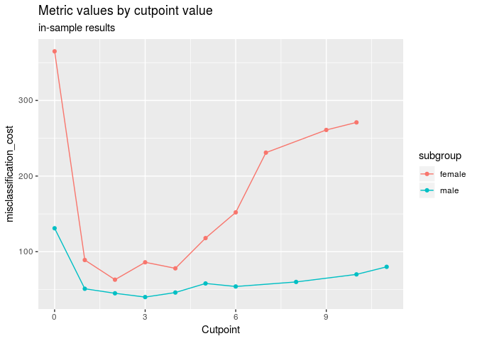

As this "optimal" cutpoint may depend on minor differences between the possible cutoffs, smoothing of the function of metric values by cutpoint value might be desirable, especially in small samples. The `minimize_loess_metric` and `maximize_loess_metric` functions can be used to smooth the function so that the optimal cutpoint is selected based on the smoothed metric values. Options to modify the smoothing, which is implemented using `loess.as` from the **fANCOVA** package, include:

-   `criterion`: the criterion for automatic smoothing parameter selection: "aicc" denotes bias-corrected AIC criterion, "gcv" denotes generalized cross-validation.
-   `degree`: the degree of the local polynomials to be used. It can be 0, 1 or 2.
-   `family`: if "gaussian" fitting is by least-squares, and if "symmetric" a re-descending M estimator is used with Tukey's biweight function.
-   `user.span`: the user-defined parameter which controls the degree of smoothing.

Using parameters for the LOESS smoothing of `criterion = "aicc"`, `degree = 2`, `family = "symmetric"`, and `user.span = 0.7` we get the following smoothed versions of the above metrics:

``` r
opt_cut <- cutpointr(suicide, dsi, suicide, gender, 
                     method = minimize_loess_metric,
                     criterion = "aicc", family = "symmetric", 
                     degree = 2, user.span = 0.7,
                     metric = misclassification_cost, cost_fp = 1, cost_fn = 10)
#> Assuming the positive class is yes
#> Assuming the positive class has higher x values
#> fANCOVA 0.5-1 loaded
```

``` r
plot_metric(opt_cut)
```


The optimal cutpoint for the female subgroup changes to 3. Note, though, that there are no reliable rules for selecting the "best" smoothing parameters. Notably, the LOESS smoothing is sensitive to the number of unique cutpoints. A large number of unique cutpoints generally leads to a more volatile curve of metric values by cutpoint value, even after smoothing. Thus, the curve tends to be undersmoothed in that scenario. The unsmoothed metric values are returned in `opt_cut$roc_curve` in the column `m_unsmoothed`.

Smoothing via Generalized Additive Models for selecting a cutpoint
------------------------------------------------------------------

In a similar fashion the function of metric values per cutpoint can be smoothed using Generalized Additive Models with smooth terms. Internally, `mgcv::gam` carries out the smoothing which can be customized via the arguments `formula` and `optimizer`, see `help("gam", package = "mgcv")`. Most importantly, the GAM can be specified by altering the default formula, for example the smoothing function could be configured to apply cubic regression splines (`"cr"`) as the smooth term. As the `suicide` data has only very few unique cutpoints, it is not very suitable for showcasing the GAM smoothing, so we will use two classes of the `iris` data here. In this case, the purely empirical method and the GAM smoothing lead to identical cutpoints, but in practice the GAM smoothing tends to be more robust, especially with larger data. An attractive feature of the GAM smoothing is, that the default values tend to work quite well and usually require no tuning, eliminating researcher degrees of freedom.

``` r
exdat <- iris
exdat <- exdat[exdat$Species != "setosa", ]
opt_cut <- cutpointr(exdat, Petal.Length, Species,
                     method = minimize_gam_metric,
                     formula = m ~ s(x.sorted, bs = "cr"),
                     metric = abs_d_sens_spec)
#> Assuming the positive class is virginica
#> Assuming the positive class has higher x values
plot_metric(opt_cut)
```

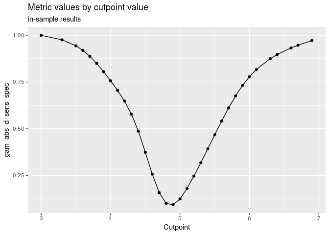

``` r
ggplot(opt_cut$roc_curve[[1]] %>% 
           gather(metric, value, m, m_unsmoothed, -x.sorted, na.rm = TRUE),
       aes(x = x.sorted, y = value, color = metric)) + 
    geom_line()
```

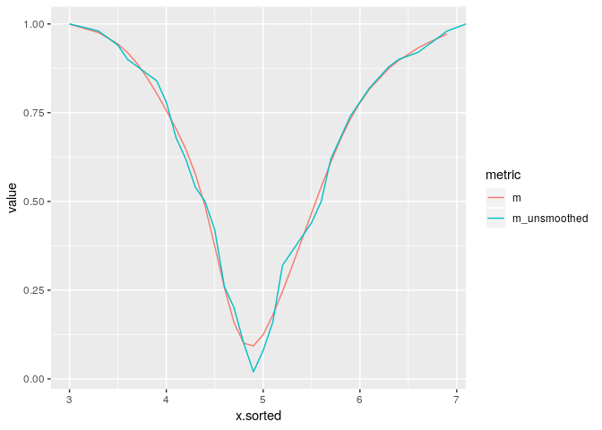

Spline smoothing for selecting a cutpoint
-----------------------------------------

Again in the same fashion the function of metric values per cutpoint can be smoothed using smoothing splines. By default, the number of knots is automatically chosen using the `cutpoint_knots` function. That function uses `stats::.nknots.smspl`, which is the default in `stats::smooth.spline` to pick the number of knots.

Alternatively, the number of knots can be set manually and also the other smoothing parameters of `stats::smooth.spline` can be set as desired. For details see `?maximize_spline_metric`.

``` r
opt_cut <- cutpointr(suicide, dsi, suicide, gender, 
                     method = minimize_spline_metric, spar = 0.4,
                     metric = misclassification_cost, cost_fp = 1, cost_fn = 10)
#> Assuming the positive class is yes
#> Assuming the positive class has higher x values
#> nknots: 10
#> nknots: 10
plot_metric(opt_cut)
```

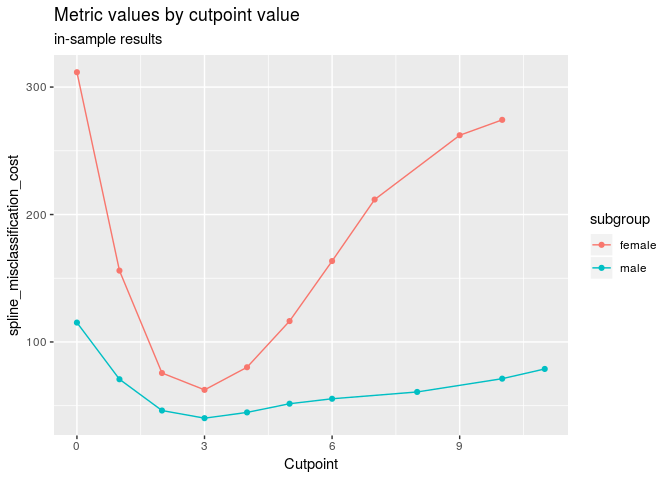

### Parametric method assuming normality

In addition to these general methods, which are applicable for all metrics, two methods to only maximize the Youden-Index robustly are included, the "normal method" and a method based on kernel smoothing. The "normal method" in `oc_youden_normal` is a parametric method for maximizing the Youden-Index or equivalently the sum of *S**e* and *S**p*. It relies on the assumption that the predictor for both the negative and positive observations is normally distributed. In that case it can be shown that

$$c^\* = \\frac{(\\mu\_P \\sigma\_N^2 - \\mu\_N \\sigma\_P^2) - \\sigma\_N \\sigma\_P \\sqrt{(\\mu\_N - \\mu\_P)^2 + (\\sigma\_N^2 - \\sigma\_P^2) log(\\sigma\_N^2 / \\sigma\_P^2)}}{\\sigma\_N^2 - \\sigma\_P^2}$$

where the negative class is normally distributed with ∼*N*(*μ*<sub>*N*</sub>, *σ*<sub>*N*</sub><sup>2</sup>) and the positive class independently normally distributed with ∼*N*(*μ*<sub>*P*</sub>, *σ*<sub>*P*</sub><sup>2</sup>) provides the optimal cutpoint *c*<sup>\*</sup> that maximizes the Youden-Index. If *σ*<sub>*N*</sub> and *σ*<sub>*P*</sub> are equal, the expression can be simplified to $c^\* = \\frac{\\mu\_N + \\mu\_P}{2}$. However, the `oc_youden_normal` method in cutpointr always assumes unequal standard deviations. Since this method does not select a cutpoint from the observed predictor values, it is questionable which values for *S**e* and *S**p* should be reported. Here, the Youden-Index can be calculated as

$$J = \\Phi(\\frac{c^\* - \\mu\_N}{\\sigma\_N}) - \\Phi(\\frac{c^\* - \\mu\_P}{\\sigma\_P})$$

if the assumption of normality holds. However, since there exist several methods that do not select cutpoints from the available observations and to unify the reporting of metrics for these methods, **cutpointr** reports all metrics, e.g. *S**e* and *S**p*, based on the empirical observations. If better estimates of the metrics are sought, the user is referred to the available bootstrapping routine that will be introduced later. If a method is superior, for example if the assumption of normality is appropriate, this should lead to a better performance in the bootstrap validation.

``` r
cutpointr(suicide, dsi, suicide, gender, method = oc_youden_normal)
#> Assuming the positive class is yes
#> Assuming the positive class has higher x values
#> # A tibble: 2 x 18
#>   subgroup direction optimal_cutpoint method           sum_sens_spec
#>   <chr>    <chr>                <dbl> <chr>                    <dbl>
#> 1 female   >=                 2.47775 oc_youden_normal       1.71618
#> 2 male     >=                 3.17226 oc_youden_normal       1.54453
#>        acc sensitivity specificity      AUC pos_class neg_class prevalence
#>      <dbl>       <dbl>       <dbl>    <dbl> <fct>     <fct>          <dbl>
#> 1 0.895408    0.814815    0.901370 0.944647 yes       no         0.0688776
#> 2 0.864286    0.666667    0.877863 0.861747 yes       no         0.0642857
#>   outcome predictor grouping data               roc_curve         boot 
#>   <chr>   <chr>     <chr>    <list>             <list>            <lgl>
#> 1 suicide dsi       gender   <tibble [392 × 2]> <tibble [11 × 9]> NA   
#> 2 suicide dsi       gender   <tibble [140 × 2]> <tibble [11 × 9]> NA
```

### Nonparametric kernel method

A nonparametric alternative is the "kernel method" \[@fluss\_estimation\_2005\]. Here, the empirical distribution functions are smoothed using the Gaussian kernel functions $\\hat{F}\_N(t) = \\frac{1}{n} \\sum^n\_{i=1} \\Phi(\\frac{t - y\_i}{h\_y})$ and $\\hat{G}\_P(t) = \\frac{1}{m} \\sum^m\_{i=1} \\Phi(\\frac{t - x\_i}{h\_x})$ for the negative and positive classes respectively. Following Silverman's plug-in "rule of thumb" the bandwidths are selected as *h*<sub>*y*</sub> = 0.9 \* *m**i**n*{*s*<sub>*y*</sub>, *i**q**r*<sub>*y*</sub>/1.34}\**n*<sup>−0.2</sup> and *h*<sub>*x*</sub> = 0.9 \* *m**i**n*{*s*<sub>*x*</sub>, *i**q**r*<sub>*x*</sub>/1.34}\**m*<sup>−0.2</sup> where *s* is the sample standard deviation and *i**q**r* is the inter quartile range. It has been demontrated that AUC estimation is rather insensitive to the choice of the bandwidth procedure \[@faraggi\_estimation\_2002\] and thus the plug-in bandwith estimator has also been recommended for cutpoint estimation. Indeed, as our preliminary simulations have shown, the choices of the bandwidth and the kernel function do not seem to exhibit a considerable influence on the variability (or bias) of the estimated cutpoints. Thus, the `oc_youden_kernel` function in **cutpointr** uses a Guassian kernel and the direct plug-in method for selecting the bandwidths. The kernel smoothing is done via the `bkde` function from the **KernSmooth** package \[@wand\_kernsmooth:\_2013\].

Again, there is a way to calculate the Youden-Index from the results of this method \[@fluss\_estimation\_2005\] which is

$$\\hat{J} = max\_c \\{\\hat{F}\_N(c) - \\hat{G}\_N(c) \\}$$

but as before we prefer to report all metrics based on applying the cutpoint that was estimated using the kernel method to the empirical observations.

``` r
cutpointr(suicide, dsi, suicide, gender, method = oc_youden_kernel)
#> Assuming the positive class is yes
#> Assuming the positive class has higher x values
#> # A tibble: 2 x 18
#>   subgroup direction optimal_cutpoint method           sum_sens_spec
#>   <chr>    <chr>                <dbl> <chr>                    <dbl>
#> 1 female   >=                 1.18128 oc_youden_kernel       1.80812
#> 2 male     >=                 1.31636 oc_youden_kernel       1.58694
#>        acc sensitivity specificity      AUC pos_class neg_class prevalence
#>      <dbl>       <dbl>       <dbl>    <dbl> <fct>     <fct>          <dbl>
#> 1 0.885204    0.925926    0.882192 0.944647 yes       no         0.0688776
#> 2 0.807143    0.777778    0.809160 0.861747 yes       no         0.0642857
#>   outcome predictor grouping data               roc_curve         boot 
#>   <chr>   <chr>     <chr>    <list>             <list>            <lgl>
#> 1 suicide dsi       gender   <tibble [392 × 2]> <tibble [11 × 9]> NA   
#> 2 suicide dsi       gender   <tibble [140 × 2]> <tibble [11 × 9]> NA
```

Additional features
===================

Calculating only the ROC curve
------------------------------

When running `cutpointr`, a ROC curve is by default returned in the column `roc_curve`. This ROC curve can be plotted using `plot_roc`. Alternatively, if only the ROC curve is desired and no cutpoint needs to be calculated, the ROC curve can be created using `roc()` and plotted using `plot_cutpointr`. The `roc` function, unlike `cutpointr`, does not determine `direction`, `pos_class` or `neg_class` automatically and does not support nonstandard evaluation, so the function arguments have to be enclosed in quotation marks.

``` r
roc_curve <- roc(data = suicide, x = "dsi", class = "suicide",
    pos_class = "yes", neg_class = "no")
plot_cutpointr(roc_curve, fpr, tpr, aspect_ratio = 1)
```

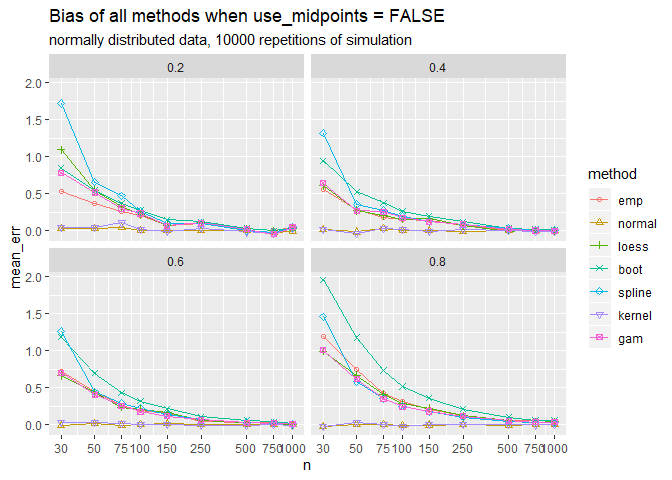

Additional metrics, e.g. Cohen's Kappa, PPV, NPV and so on, can be added to the ROC curve via `add_metric`.

Midpoints
---------

So far - which is the default in `cutpointr` - we have considered all unique values of the predictor as possible cutpoints. An alternative could be to use a sequence of equidistant values instead, for example in the case of the `suicide` data all integers in \[0, 10\]. However, with very sparse data and small intervals between the candidate cutpoints (i.e. a 'dense' sequence like `seq(0, 10, by = 0.01)`) this leads to the uninformative evaluation of large ranges of cutpoints that all result in the same metric value. A more elegant alternative, not only for the case of sparse data, that is supported by **cutpointr** is the use of a mean value of the optimal cutpoint and the next highest (if `direction = ">="`) or the next lowest (if `direction = "<="`) predictor value in the data. The result is an optimal cutpoint that is equal to the cutpoint that would be obtained using an infinitely dense sequence of candidate cutpoints and is thus usually more efficient computationally. This behavior can be activated by setting `use_midpoints = TRUE`, which is the default. If we use this setting, we obtain an optimal cutpoint of 1.5 for the complete sample on the `suicide` data instead of 2 when maximizing the sum of sensitivity and specificity.

Assume the following small data set:

``` r
dat <- data.frame(outcome = c("neg", "neg", "neg", "pos", "pos", "pos", "pos"),
                  pred    = c(1, 2, 3, 8, 11, 11, 12))
```

Since the distance of the optimal cutpoint (8) to the next lowest observation (3) is rather large we arrive at a range of possible cutpoints that all maximize the metric. In the case of this kind of sparseness it might for example be desirable to classify a new obsevation with a predictor value of 4 as belonging to the negative class. If `use_midpoints` is set to `TRUE`, the mean of the optimal cutpoint and the next lowest observation is returned as the optimal cutpoint, if direction is `>=`. The mean of the optimal cutpoint and the next highest observation is returned as the optimal cutpoint, if `direction = "<="`.

``` r
opt_cut <- cutpointr(dat, x = pred, class = outcome, use_midpoints = TRUE)
#> Assuming the positive class is pos
#> Assuming the positive class has higher x values
plot_x(opt_cut)
```


A simulation demonstrates more clearly that setting `use_midpoints = TRUE` avoids biasing the cutpoints. To simulate the bias of the metric functions, the predictor values of both classes were drawn from normal distributions with constant standard deviations of 10, a constant mean of the negative class of 100 and higher mean values of the positive class that are selected in such a way that optimal Youden-Index values of 0.2, 0.4, 0.6, and 0.8 result in the population. Samples of 9 different sizes were drawn and the cutpoints that maximize the Youden-Index were estimated. The simulation was repeated 10000 times. As can be seen by the mean error, `use_midpoints = TRUE` eliminates the bias that is introduced by otherwise selecting the value of an observation as the optimal cutpoint. If `direction = ">="`, as in this case, the observation that represents the optimal cutpoint is the highest possible cutpoint that leads to the optimal metric value and thus the biases are positive. The methods `oc_youden_normal` and `oc_youden_kernel` are always unbiased, as they don't select a cutpoint based on the ROC-curve or the function of metric values per cutpoint.

    #> Warning: Detecting old grouped_df format, replacing `vars` attribute by
    #> `groups`

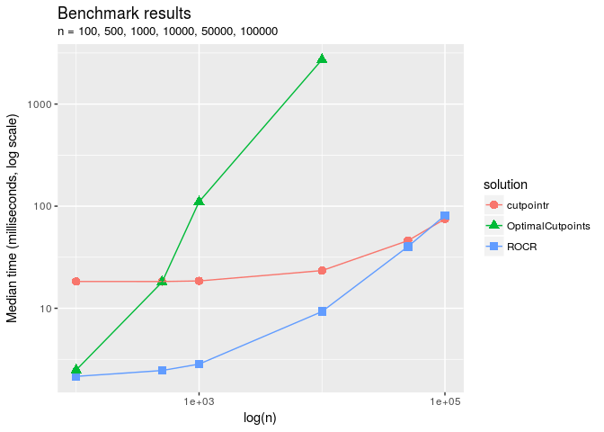

Finding all cutpoints with acceptable performance
-------------------------------------------------

By default, most packages only return the "best" cutpoint and disregard other cutpoints with quite similar performance, even if the performance differences are minuscule. **cutpointr** makes this process more explicit via the `tol_metric` argument. For example, if all cutpoints are of interest that achieve at least an accuracy within `0.05` of the optimally achievable accuracy, `tol_metric` can be set to `0.05` and also those cutpoints will be returned.

In the case of the `suicide` data and when maximizing the sum of sensitivity and specificity, empirically the cutpoints 2 and 3 lead to quite similar performances. If `tol_metric` is set to `0.05`, both will be returned.

``` r
opt_cut <- cutpointr(suicide, dsi, suicide, metric = sum_sens_spec, 
                     tol_metric = 0.05)
#> Assuming the positive class is yes
#> Assuming the positive class has higher x values
#> Multiple optimal cutpoints found
opt_cut %>% 
    select(optimal_cutpoint, sum_sens_spec) %>% 
    unnest
#> # A tibble: 2 x 2
#>   optimal_cutpoint sum_sens_spec
#>              <dbl>         <dbl>
#> 1                2          1.75
#> 2                1          1.70
```

Manual and mean / median cutpoints
----------------------------------

Using the `oc_manual` function the optimal cutpoint will not be determined based on, for example, a metric but is instead set manually using the `cutpoint` argument. This is useful for supplying and evaluating cutpoints that were found in the literature or in other external sources.

The `oc_manual` function could also be used to set the cutpoint to the sample mean using `cutpoint = mean(data$x)`. However, this may introduce a bias into the bootstrap validation procedure, since the actual mean of the population is not known and thus the mean to be used as the cutpoint should be automatically determined in every resample. To do so, the `oc_mean` and `oc_median` functions can be used.

``` r
set.seed(100)
opt_cut_manual <- cutpointr(suicide, dsi, suicide, method = oc_manual, 
                       cutpoint = mean(suicide$dsi), boot_runs = 30)
#> Assuming the positive class is yes
#> Assuming the positive class has higher x values
#> Running bootstrap...
set.seed(100)
opt_cut_mean <- cutpointr(suicide, dsi, suicide, method = oc_mean, boot_runs = 30)
#> Assuming the positive class is yes
#> Assuming the positive class has higher x values
#> Running bootstrap...
```

Nonstandard evaluation and transforming variables
-------------------------------------------------

The arguments to `cutpointr` do not need to be enclosed in quotes. This is possible thanks to nonstandard evaluation of the arguments, which are evaluated on `data`. As an example of a transformation of the `x`, `class` and `subgroup` variables consider:

``` r
set.seed(12)
opt_cut <- cutpointr(suicide, log(dsi + 1), suicide == "yes",
    subgroup = dsi %% 2 == 0, boot_runs = 30)
#> Assuming the positive class is TRUE
#> Assuming the positive class has higher x values
#> Running bootstrap...
opt_cut
#> # A tibble: 2 x 18
#>   subgroup direction optimal_cutpoint method          sum_sens_spec
#>   <chr>    <chr>                <dbl> <chr>                   <dbl>
#> 1 FALSE    >=                 1.79176 maximize_metric       1.61486
#> 2 TRUE     >=                 1.09861 maximize_metric       1.80766
#>        acc sensitivity specificity      AUC pos_class neg_class prevalence
#>      <dbl>       <dbl>       <dbl>    <dbl> <lgl>     <lgl>          <dbl>
#> 1 0.848837    0.75        0.864865 0.851351 TRUE      FALSE      0.139535 
#> 2 0.892377    0.916667    0.890995 0.922887 TRUE      FALSE      0.0538117
#>   outcome              predictor    grouping    data              
#>   <chr>                <chr>        <chr>       <list>            
#> 1 "suicide == \"yes\"" log(dsi + 1) dsi%%2 == 0 <tibble [86 × 2]> 
#> 2 "suicide == \"yes\"" log(dsi + 1) dsi%%2 == 0 <tibble [446 × 2]>
#>   roc_curve         boot              
#>   <list>            <list>            
#> 1 <tibble [7 × 10]> <tibble [30 × 23]>
#> 2 <tibble [7 × 10]> <tibble [30 × 23]>
predict(opt_cut, newdata = data.frame(dsi = 0:5))
#> [1] FALSE FALSE  TRUE FALSE  TRUE  TRUE
```

Functions that use nonstandard evaluation are often not suitable for programming with. The use of nonstandard evaluation often leads to scoping problems and subsequent obvious as well as possibly subtle errors. **cutpointr** offers a variant that uses standard evaluation which is suffixed by `_`. It gives the same results as `cutpointr`, of course, but does not support transforming variables as above.

ROC-curve and optimal cutpoint for multiple variables
-----------------------------------------------------

Alternatively, we can map the standard evaluation version `cutpointr_` to the column names. In this case, we would like to determine the optimal cutpoint along with the AUC of multiple variables in a data set.

If `direction` and / or `pos_class` and `neg_class` are unspecified, these parameters will automatically be determined by **cutpointr** so that the AUC values for all variables will be &gt;0.5.

``` r
dat <- iris %>% 
    dplyr::filter(Species %in% c("setosa", "virginica"))

purrr::map_df(colnames(dat)[1:4], function(coln) {
    cutpointr_(dat, x = coln, class = "Species", 
               pos_class = "setosa", use_midpoints = T) %>% 
        mutate(variable = coln)
}) %>% 
    dplyr::select(variable, direction, optimal_cutpoint, AUC)
#> Assuming the positive class has lower x values
#> Multiple optimal cutpoints found
#> Assuming the positive class has higher x values
#> Assuming the positive class has lower x values
#> Assuming the positive class has lower x values
#> # A tibble: 4 x 4
#>   variable     direction optimal_cutpoint      AUC
#>   <chr>        <chr>                <dbl>    <dbl>
#> 1 Sepal.Length <=                  5.65   0.9846  
#> 2 Sepal.Width  >=                  3.3500 0.834400
#> 3 Petal.Length <=                  3.2    1       
#> 4 Petal.Width  <=                  1      1
```

To make this task more convenient, the built-in `multi_cutpointr` function can be used to achieve the same result. It maps multiple predictor columns to `cutpointr_`, by default all columns except for the class column.

``` r
mcp <- multi_cutpointr(dat, class = "Species", pos_class = "setosa", 
                use_midpoints = TRUE, silent = TRUE) 
mcp
#> # A tibble: 4 x 16
#>   direction optimal_cutpoint method          sum_sens_spec   acc
#>   <chr>                <dbl> <chr>                   <dbl> <dbl>
#> 1 <=                  5.65   maximize_metric          1.9   0.95
#> 2 >=                  3.3500 maximize_metric          1.52  0.76
#> 3 <=                  3.2    maximize_metric          2     1   
#> 4 <=                  1      maximize_metric          2     1   
#>   sensitivity specificity      AUC pos_class neg_class prevalence outcome
#>         <dbl>       <dbl>    <dbl> <chr>     <fct>          <dbl> <chr>  
#> 1        0.94        0.96 0.9846   setosa    virginica        0.5 Species
#> 2        0.62        0.9  0.834400 setosa    virginica        0.5 Species
#> 3        1           1    1        setosa    virginica        0.5 Species
#> 4        1           1    1        setosa    virginica        0.5 Species
#>   predictor    data               roc_curve          boot 
#>   <chr>        <list>             <list>             <lgl>
#> 1 Sepal.Length <tibble [100 × 2]> <tibble [34 × 10]> NA   
#> 2 Sepal.Width  <tibble [100 × 2]> <tibble [22 × 10]> NA   
#> 3 Petal.Length <tibble [100 × 2]> <tibble [30 × 10]> NA   
#> 4 Petal.Width  <tibble [100 × 2]> <tibble [19 × 10]> NA

# Also the summary_multi_cutpointr object is a data frame
tibble:::print.tbl(summary(mcp))
#> # A tibble: 4 x 8
#>   predictor cutpointr desc  desc_by_class n_obs n_pos n_neg
#>   <chr>     <list>    <lis> <list>        <int> <int> <int>
#> 1 Sepal.Le… <tibble … <dat… <data.frame …   100    50    50
#> 2 Sepal.Wi… <tibble … <dat… <data.frame …   100    50    50
#> 3 Petal.Le… <tibble … <dat… <data.frame …   100    50    50
#> 4 Petal.Wi… <tibble … <dat… <data.frame …   100    50    50
#> # … with 1 more variable: confusion_matrix <list>
```

Accessing `data`, `roc_curve`, and `boot`
-----------------------------------------

The object returned by `cutpointr` is of the classes `cutpointr`, `tbl_df`, `tbl`, and `data.frame`. Thus, it can be handled like a usual data frame. The columns `data`, `roc_curve`, and `boot` consist of nested data frames, which means that these are list columns whose elements are data frames. They can either be accessed using `[` or by using functions from the tidyverse.

``` r
# Extracting the bootstrap results
set.seed(123)
opt_cut <- cutpointr(suicide, dsi, suicide, boot_runs = 20)
#> Assuming the positive class is yes
#> Assuming the positive class has higher x values
#> Running bootstrap...
# Using base R to summarise the result of the first bootstrap
summary(opt_cut$boot[[1]]$optimal_cutpoint)
#>    Min. 1st Qu.  Median    Mean 3rd Qu.    Max. 
#>    1.00    1.75    2.00    2.05    2.00    4.00
# Using dplyr
opt_cut %>% 
    select(boot) %>% 
    unnest %>% 
    select(optimal_cutpoint) %>% 
    summary
#>  optimal_cutpoint
#>  Min.   :1.00    
#>  1st Qu.:1.75    
#>  Median :2.00    
#>  Mean   :2.05    
#>  3rd Qu.:2.00    
#>  Max.   :4.00
```

If subgroups were given, the output contains one row per subgroup and the function that accesses the data should be mapped to every row or the data should be grouped by subgroup.

``` r
set.seed(123)
opt_cut <- cutpointr(suicide, dsi, suicide, gender, boot_runs = 20)
#> Assuming the positive class is yes
#> Assuming the positive class has higher x values
#> Running bootstrap...
opt_cut %>% 
    select(subgroup, boot) %>%
    unnest %>%
    group_by(subgroup) %>%
    summarise(mean_oc = mean(optimal_cutpoint), 
              mean_accuracy = mean(acc_oob))
#> # A tibble: 2 x 3
#>   subgroup mean_oc mean_accuracy
#>   <chr>      <dbl>         <dbl>
#> 1 female         2         0.866
#> 2 male           3         0.811
opt_cut %>%
    select(subgroup, boot) %>% 
    mutate(summary_b = map(boot, function(x) {
        data.frame(min = min(x$optimal_cutpoint),
                   mean = mean(x$optimal_cutpoint),
                   max = max(x$optimal_cutpoint))
    })) %>% 
    select(-boot) %>%
    unnest
#> # A tibble: 2 x 4
#>   subgroup   min  mean   max
#>   <chr>    <dbl> <dbl> <dbl>
#> 1 female       1     2     4
#> 2 male         1     3     8
```

Adding metrics to the result of cutpointr or roc
------------------------------------------------

By default, the output of cutpointr includes the optimized metric and several other metrics. The `add_metric` function adds further metrics. Suitable metric functions are all metric functions that are included in the package or that comply with those standards. Here, we're adding the negative predictive value (NPV) and the positive predictive value (PPV) at the optimal cutpoint per subgroup:

``` r
cutpointr(suicide, dsi, suicide, gender, metric = youden, silent = TRUE) %>% 
    add_metric(list(ppv, npv)) %>% 
    select(subgroup, optimal_cutpoint, youden, ppv, npv)
#> # A tibble: 2 x 5
#>   subgroup optimal_cutpoint   youden      ppv      npv
#>   <chr>               <dbl>    <dbl>    <dbl>    <dbl>
#> 1 female                  2 0.808118 0.367647 0.993827
#> 2 male                    3 0.625106 0.259259 0.982301
```

In the same fashion, additional metric columns can be added to a `roc_cutpointr` object:

``` r
roc(data = suicide, x = "dsi", class = "suicide", pos_class = "yes",
    neg_class = "no", direction = ">=") %>% 
    add_metric(list(cohens_kappa, F1_score)) %>% 
    select(x.sorted, tp, fp, tn, fn, cohens_kappa, F1_score)
#> # A tibble: 13 x 7
#>    x.sorted    tp    fp    tn    fn cohens_kappa F1_score
#>       <dbl> <dbl> <dbl> <int> <int>        <dbl>    <dbl>
#>  1      Inf     0     0   496    36       0        0     
#>  2       11     1     0   496    35       0.0506   0.0541
#>  3       10     2     1   495    34       0.0931   0.103 
#>  4        9     3     1   495    33       0.138    0.15  
#>  5        8     4     1   495    32       0.182    0.195 
#>  6        7     7     1   495    29       0.301    0.318 
#>  7        6    16     6   490    20       0.527    0.552 
#>  8        5    20    16   480    16       0.523    0.556 
#>  9        4    28    44   452     8       0.471    0.519 
#> 10        3    29    56   440     7       0.425    0.479 
#> 11        2    32    68   428     4       0.412    0.471 
#> 12        1    34   120   376     2       0.279    0.358 
#> 13        0    36   496     0     0       0        0.127
```

User-defined functions
----------------------

### method

User-defined functions can be supplied to `method`, which is the function that is responsible for returning the optimal cutpoint. To define a new method function, create a function that may take as input(s):

-   `data`: A `data.frame` or `tbl_df`
-   `x`: (character) The name of the predictor variable
-   `class`: (character) The name of the class variable
-   `metric_func`: A function for calculating a metric, e.g. accuracy. Note that the method function does not necessarily have to accept this argument
-   `pos_class`: The positive class
-   `neg_class`: The negative class
-   `direction`: `">="` if the positive class has higher x values, `"<="` otherwise
-   `tol_metric`: (numeric) In the built-in methods, all cutpoints will be returned that lead to a metric value in the interval \[m\_max - tol\_metric, m\_max + tol\_metric\] where m\_max is the maximum achievable metric value. This can be used to return multiple decent cutpoints and to avoid floating-point problems.
-   `use_midpoints`: (logical) In the built-in methods, if TRUE (default FALSE) the returned optimal cutpoint will be the mean of the optimal cutpoint and the next highest observation (for direction = "&gt;") or the next lowest observation (for direction = "&lt;") which avoids biasing the optimal cutpoint.
-   `...`: Further arguments that are passed to `metric` or that can be captured inside of `method`

The function should return a data frame or tibble with one row, the column `optimal_cutpoint`, and an optional column with an arbitrary name with the metric value at the optimal cutpoint.

For example, a function for choosing the cutpoint as the mean of the independent variable could look like this:

``` r
mean_cut <- function(data, x, ...) {
    oc <- mean(data[[x]])
    return(data.frame(optimal_cutpoint = oc))
}
```

If a `method` function does not return a metric column, the default `sum_sens_spec`, the sum of sensitivity and specificity, is returned as the extra metric column in addition to accuracy, sensitivity and specificity.

Some `method` functions that make use of the additional arguments (that are captured by `...`) are already included in **cutpointr**, see the list at the top. Since these functions are arguments to `cutpointr` their code can be accessed by simply typing their name, see for example `oc_youden_normal`.

### metric

User defined `metric` functions can be used as well. They are mainly useful in conjunction with `method = maximize_metric`, `method = minimize_metric`, or one of the other minimization and maximization functions. In case of a different `method` function `metric` will only be used as the main out-of-bag metric when plotting the result. The `metric` function should accept the following inputs as vectors:

-   `tp`: Vector of true positives
-   `fp`: Vector of false positives
-   `tn`: Vector of true negatives
-   `fn`: Vector of false negatives
-   `...`: Further arguments

The function should return a numeric vector, a matrix, or a `data.frame` with one column. If the column is named, the name will be included in the output and plots. Avoid using names that are identical to the column names that are by default returned by **cutpointr**, as such names will be prefixed by `metric_` in the output. The inputs (`tp`, `fp`, `tn`, and `fn`) are vectors. The code of the included metric functions can be accessed by simply typing their name.

For example, this is the `misclassification_cost` metric function:

``` r
misclassification_cost
#> function(tp, fp, tn, fn, cost_fp = 1, cost_fn = 1, ...) {
#>     misclassification_cost <- cost_fp * fp + cost_fn * fn
#>     misclassification_cost <- matrix(misclassification_cost, ncol = 1)
#>     colnames(misclassification_cost) <- "misclassification_cost"
#>     return(misclassification_cost)
#> }
#> <bytecode: 0x6c3f518>
#> <environment: namespace:cutpointr>
```

Plotting
========

**cutpointr** includes several convenience functions for plotting data from a `cutpointr` object. These include:

-   `plot_cut_boot`: Plot the bootstrapped distribution of optimal cutpoints
-   `plot_metric`: If `maximize_metric` or `minimize_metric` was used this function plots all possible cutoffs on the x-axis vs. the respective metric values on the y-axis. If bootstrapping was run, a confidence interval based on the bootstrapped distribution of metric values at each cutpoint can be displayed. To display no confidence interval set `conf_lvl = 0`.
-   `plot_metric_boot`: Plot the distribution of out-of-bag metric values
-   `plot_precision_recall`: Plot the precision recall curve
-   `plot_sensitivity_specificity`: Plot all cutpoints vs. sensitivity and specificity
-   `plot_roc`: Plot the ROC curve
-   `plot_x`: Plot the distribution of the predictor variable

``` r
set.seed(102)
opt_cut <- cutpointr(suicide, dsi, suicide, gender, method = minimize_metric,
                     metric = abs_d_sens_spec, boot_runs = 200, silent = TRUE)
opt_cut
#> # A tibble: 2 x 18
#>   subgroup direction optimal_cutpoint method          abs_d_sens_spec
#>   <chr>    <chr>                <dbl> <chr>                     <dbl>
#> 1 female   >=                       2 minimize_metric       0.0437341
#> 2 male     >=                       2 minimize_metric       0.0313825
#>        acc sensitivity specificity      AUC pos_class neg_class prevalence
#>      <dbl>       <dbl>       <dbl>    <dbl> <fct>     <fct>          <dbl>
#> 1 0.885204    0.925926    0.882192 0.944647 yes       no         0.0688776
#> 2 0.807143    0.777778    0.809160 0.861747 yes       no         0.0642857
#>   outcome predictor grouping data               roc_curve         
#>   <chr>   <chr>     <chr>    <list>             <list>            
#> 1 suicide dsi       gender   <tibble [392 × 2]> <tibble [11 × 10]>
#> 2 suicide dsi       gender   <tibble [140 × 2]> <tibble [11 × 10]>
#>   boot               
#>   <list>             
#> 1 <tibble [200 × 23]>
#> 2 <tibble [200 × 23]>
plot_cut_boot(opt_cut)
```


``` r
plot_metric(opt_cut, conf_lvl = 0.9)
```

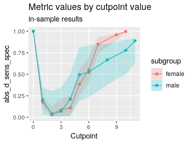

``` r
plot_metric_boot(opt_cut)
```

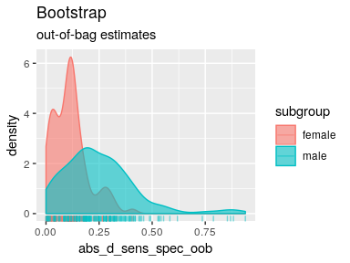

``` r
plot_precision_recall(opt_cut)
```

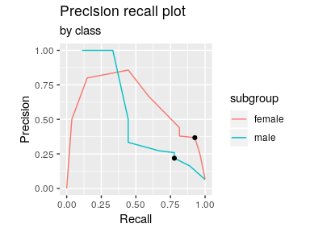

``` r
plot_sensitivity_specificity(opt_cut)
```

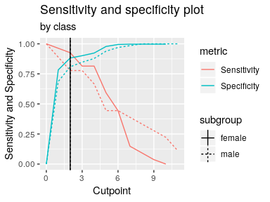

``` r
plot_roc(opt_cut)
```

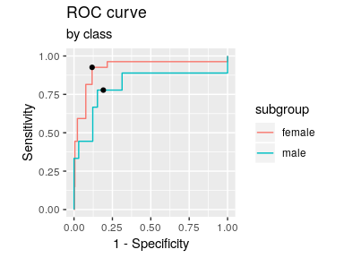

All plot functions, except for the standard plot method, return `ggplot` objects than can be further modified. For example, changing labels, title, and the theme can be achieved this way:

``` r
p <- plot_x(opt_cut)
p + ggtitle("Distribution of dsi") + theme_minimal() + xlab("Depression score")
```

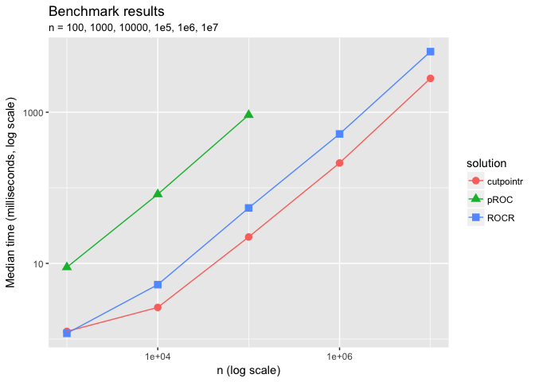

Flexible plotting function
--------------------------

Using `plot_cutpointr` any metric can be chosen to be plotted on the x- or y-axis and results of `cutpointr()` as well as `roc()` can be plotted. If a `cutpointr` object is to be plotted, it is thus irrelevant which `metric` function was chosen for cutpoint estimation. Any metric that can be calculated based on the ROC curve can be subsequently plotted as only the true / false positives / negatives over all cutpoints are needed. That way, not only the above plots can be produced, but also any combination of two metrics (or metric functions) and / or cutpoints. The built-in metric functions as well as user-defined functions or anonymous functions can be supplied to `xvar` and `yvar`. If bootstrapping was run, confidence intervals can be plotted around the y-variable. This is especially useful if the cutpoints, available in the `cutpoints` function, are placed on the x-axis. Note that confidence intervals can only be correctly plotted if the values of `xvar` are constant across bootstrap samples. For example, confidence intervals for TPR by FPR (a ROC curve) cannot be plotted, as the values of the false positive rate vary per bootstrap sample.

``` r
set.seed(500)
oc <- cutpointr(suicide, dsi, suicide, boot_runs = 20, 
                metric = sum_ppv_npv) # metric irrelevant for plot_cutpointr
#> Assuming the positive class is yes
#> Assuming the positive class has higher x values
#> Running bootstrap...
plot_cutpointr(oc, xvar = cutpoints, yvar = sum_sens_spec, conf_lvl = 0.9)
```

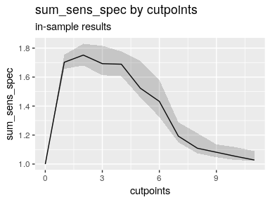

``` r
plot_cutpointr(oc, xvar = fpr, yvar = tpr, aspect_ratio = 1, conf_lvl = 0)
```

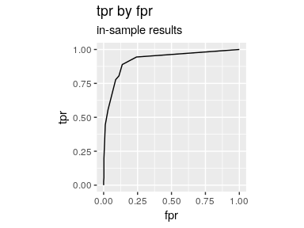

``` r
plot_cutpointr(oc, xvar = cutpoint, yvar = tp, conf_lvl = 0.9) + geom_point()
```

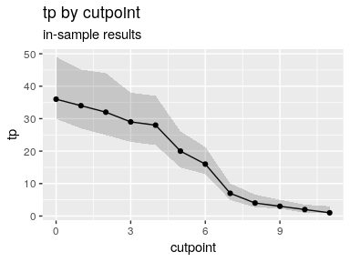

Manual plotting
---------------

Since `cutpointr` returns a `data.frame` with the original data, bootstrap results, and the ROC curve in nested tibbles, these data can be conveniently extracted and plotted manually. This offers additional ways of tweaking these plots as well as the possibility to plot results that are not included in `plot` or one of the other plotting functions. The relevant nested tibbles are in the columns `data`, `roc_curve` and `boot`. The following is an example of accessing and plotting the grouped data.

``` r
set.seed(123) # Some missing values expected
opt_cut <- cutpointr(suicide, dsi, suicide, gender, boot_runs = 50)
#> Assuming the positive class is yes
#> Assuming the positive class has higher x values
#> Running bootstrap...
head(opt_cut$data)
#> [[1]]
#> # A tibble: 392 x 2
#>      dsi suicide
#>    <dbl> <fct>  
#>  1     1 no     
#>  2     0 no     
#>  3     0 no     
#>  4     0 no     
#>  5     0 no     
#>  6     0 no     
#>  7     0 no     
#>  8     1 no     
#>  9     0 no     
#> 10     0 no     
#> # … with 382 more rows
#> 
#> [[2]]
#> # A tibble: 140 x 2
#>      dsi suicide
#>    <dbl> <fct>  
#>  1     0 no     
#>  2     2 no     
#>  3     1 no     
#>  4     0 no     
#>  5     0 no     
#>  6     0 no     
#>  7     1 no     
#>  8     0 no     
#>  9     0 no     
#> 10     0 no     
#> # … with 130 more rows

opt_cut %>% 
    select(data, subgroup) %>% 
    unnest %>% 
    ggplot(aes(x = suicide, y = dsi)) + 
    geom_boxplot(alpha = 0.3) + facet_grid(~subgroup)
```

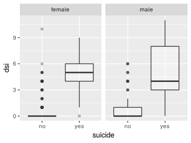

Benchmarks
----------

To offer a comparison to established solutions, **cutpointr** will be benchmarked against `optimal.cutpoints` from the **OptimalCutpoints** package and custom functions based on the **ROCR** and **pROC** packages. By generating data of different sizes the benchmarks will offer a comparison of the scalability of the different solutions. When selecting cutpoints, the `optimal.cutpoints` and `cutpointr` functions are more convenient and offer additional features in comparison to the functions based on **ROCR** and **pROC** but the latter ones are still useful for benchmarking purposes.

Using `prediction` and `performance` from the **ROCR** package and `roc` from the **pROC** package, we can write functions for computing the cutpoint that maximizes the sum of sensitivity and specificity:

``` r
# Return cutpoint that maximizes the sum of sensitivity and specificiy
# ROCR package
rocr_sensspec <- function(x, class) {
    pred <- ROCR::prediction(x, class)
    perf <- ROCR::performance(pred, "sens", "spec")
    sens <- slot(perf, "y.values")[[1]]
    spec <- slot(perf, "x.values")[[1]]
    cut <- slot(perf, "alpha.values")[[1]]
    cut[which.max(sens + spec)]
}

# pROC package
proc_sensspec <- function(x, class, 
                          levels = c("no", "yes"), algo = 2) {
    r <- pROC::roc(class, x, algorithm = algo)
    sens <- r$sensitivities
    spec <- r$specificities
    cut <- r$thresholds
    cut[which.max(sens + spec)]
}
```

The benchmarking will be carried out using the **microbenchmark** package and randomly generated data. The values of the `x` predictor variable are drawn from a normal distribution which leads to a lot more unique values than were encountered before in the `suicide` data. Accordingly, the search for an optimal cutpoint is much more demanding, if all possible cutpoints are evaluated.

Benchmarks are run for sample sizes of 1000, 1e4, 1e5, 1e6, and 1e7. For low sample sizes **cutpointr** is slower than the other solutions. While this should be of low practical importance, **cutpointr** scales more favorably with increasing sample size. The speed disadvantage in small samples that leads to the lower limit of around 25ms is mainly due to the nesting of the original data and the results that makes the compact output of `cutpointr` possible. For sample sizes &gt; 1e5 **cutpointr** is a little faster than the function based on **ROCR**. Both of these solutions are generally faster than **OptimalCutpoints** and **ThresholdROC** with the exception of small samples. **OptimalCutpoints** and **ThresholdROC** had to be excluded from benchmarks with more than 1e4 observations and **pROC** from benchmarks with more than 1e5 observations due to high memory requirements and/or excessive run times, rendering the use of these packages in larger samples impractical.


|      n|    cutpointr|  OptimalCutpoints|         pROC|          ROCR|  ThresholdROC|
|------:|------------:|-----------------:|------------:|-------------:|-------------:|
|  1e+03|     8.334464|          56.21193|     9.131493|      3.017892|      78.88322|
|  1e+04|    13.057035|        5383.76537|    94.403445|     11.284935|    7930.97356|
|  1e+05|    68.155645|                NA|  1021.098187|    108.988626|            NA|
|  1e+06|   708.193360|                NA|           NA|   1250.425970|            NA|
|  1e+07|  5893.323971|                NA|           NA|  13247.381417|            NA|

### ROC curve only

As we can see, the ROC curve calculation that is implemented in **cutpointr** is considerably faster in samples &gt; 1000 than the ones offered by **ROCR** and **pROC**.

``` r
# ROCR package
rocr_roc <- function(x, class) {
    pred <- ROCR::prediction(x, class)
    return(NULL)
}

# pROC package
proc_roc <- function(x, class, levels = c("no", "yes"), algo = 2) {
    r <- pROC::roc(class, x, algorithm = algo)
    return(NULL)
}
```

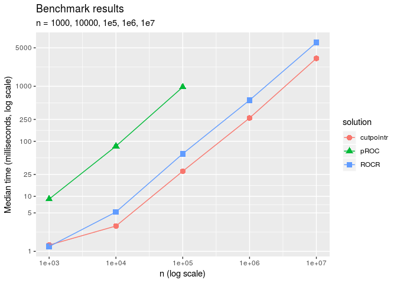

|      n|    cutpointr|        pROC|         ROCR|
|------:|------------:|-----------:|------------:|
|  1e+03|     1.302793|    8.905319|     1.223025|
|  1e+04|     2.889493|   81.582236|     5.190217|
|  1e+05|    28.598465|  968.227087|    59.418236|
|  1e+06|   265.087399|          NA|   559.158593|
|  1e+07|  3218.965990|          NA|  6227.157674|
