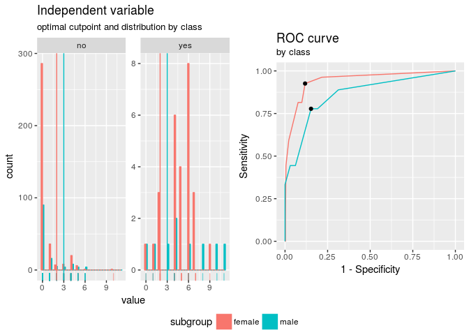
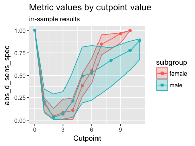
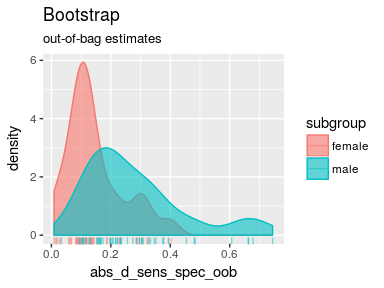
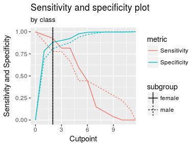
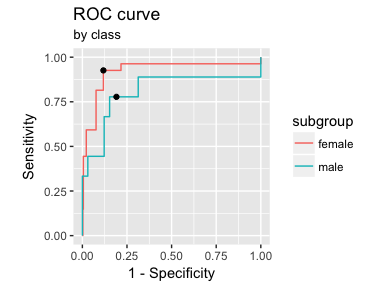
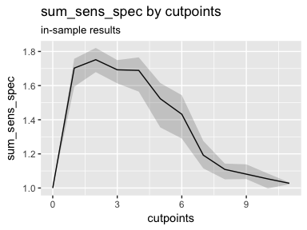
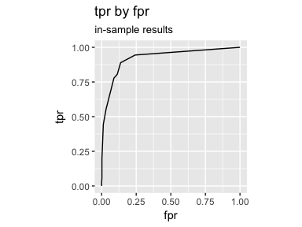
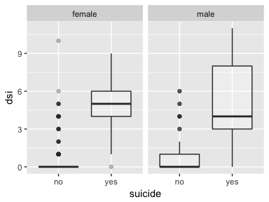
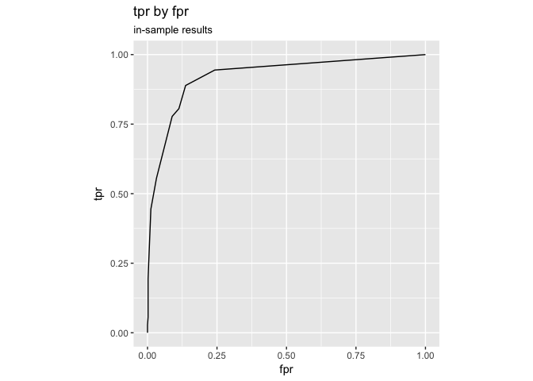
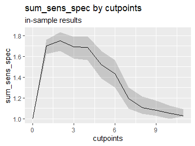

<!-- README.md is generated from README.Rmd. Please edit that file -->
cutpointr
=========

[](https://travis-ci.org/Thie1e/cutpointr) [](https://ci.appveyor.com/project/Thie1e/cutpointr) [](http://www.repostatus.org/#active) [](https://codecov.io/github/thie1e/cutpointr)

The cutpointr package is an R package for tidy calculation of "optimal" cutpoints. It supports several methods for calculating cutpoints and includes several metrics that can be maximized or minimized by selecting a cutpoint. Some of these methods are designed to be more robust than the simple empirical optimization of a metric. Additionally, cutpointr can automatically bootstrap the variability of the optimal cutpoints and return out-of-bag estimates of various performance metrics.

Features
--------

-   Calculation of "optimal" cutpoints in binary classification tasks
-   Tidy output, integrates well with functions from the tidyverse
-   Bootstrapping for simulating the cutpoint variability and for obtaining out-of-bag estimates of various metrics (as a form of cross validation)
-   Multiple methods for calculating cutpoints
-   Multiple metrics can be chosen for maximization / minimization
-   Standard/Nonstandard evaluation (`cutpointr_` and `cutpointr`)

Calculating cutpoints
=====================

Method functions for cutpoint estimation
----------------------------------------

The included methods for calculating cutpoints are:

-   `maximize_metric`: Maximize the metric function
-   `minimize_metric`: Minimize the metric function
-   `maximize_loess_metric`: Maximize the metric function after LOESS smoothing
-   `minimize_loess_metric`: Minimize the metric function after LOESS smoothing
-   `maximize_boot_metric`: Maximize the metric function as a mean of the optimal cutpoints in bootstrapped samples
-   `minimize_boot_metric`: Minimize the metric function as a mean of the optimal cutpoints in bootstrapped samples
-   `oc_manual`: Specify the cutoff value manually
-   `oc_mean`: Use the sample mean as the "optimal" cutpoint
-   `oc_median`: Use the sample median as the "optimal" cutpoint
-   `oc_youden_kernel`: Maximize the Youden-Index after kernel smoothing the distributions of the two classes
-   `oc_youden_normal`: Maximize the Youden-Index parametrically assuming normally distributed data in both classes

Metric functions
----------------

The included metrics to be used with the minimization and maximization methods are:

-   `accuracy`: Fraction correctly classified
-   `abs_d_sens_spec`: The absolute difference of sensitivity and specificity
-   `abs_d_ppv_npv`: The absolute difference between positive predictive value (PPV) and negative predictive value (NPV)
-   `cohens_kappa`: Cohen's Kappa
-   `sum_sens_spec`: sensitivity + specificity
-   `sum_ppv_npv`: The sum of positive predictive value (PPV) and negative predictive value (NPV)
-   `prod_sens_spec`: sensitivity \* specificity
-   `prod_ppv_npv`: The product of positive predictive value (PPV) and negative predictive value (NPV)
-   `youden`: Youden- or J-Index = sensitivity + specificity - 1
-   `odds_ratio`: (Diagnostic) odds ratio
-   `risk_ratio`: risk ratio (relative risk)
-   `p_chisquared`: The p-value of a chi-squared test on the confusion matrix
-   `cost_misclassification`: The sum of the misclassification cost of false positives and false negatives. Additional arguments: cost\_fp, cost\_fn
-   `total_utility`: The total utility of true / false positives / negatives. Additional arguments: utility\_tp, utility\_tn, cost\_fp, cost\_fn
-   `F1_score`: The F1-score (2 \* TP) / (2 \* TP + FP + FN)

`cutpointr` makes use of nonstandard evaluation for higher usability and to allow for easy transformation of the variables. The inputs to the arguments `method` and `metric` are functions so that user-defined functions can easily be supplied instead of the built-in ones.

Applications
============

To showcase the functionality, we'll use the included `suicide` data set.

``` r
library(cutpointr)
data(suicide)
head(suicide)
#>   age gender dsi suicide
#> 1  29 female   1      no
#> 2  26   male   0      no
#> 3  26 female   0      no
#> 4  27 female   0      no
#> 5  28 female   0      no
#> 6  53   male   2      no
opt_cut <- cutpointr(suicide, dsi, suicide)
#> Assuming yes as the positive class
#> Assuming the positive class has higher x values
opt_cut
#> # A tibble: 1 x 15
#>   direction optimal_cutpoint method          sum_sens_spec   acc
#>   <chr>                <dbl> <chr>                   <dbl> <dbl>
#> 1 >=                    2.00 maximize_metric          1.75 0.865
#>   sensitivity specificity   AUC pos_class neg_class prevalence outcome
#>         <dbl>       <dbl> <dbl> <fctr>    <fctr>         <dbl> <chr>  
#> 1       0.889       0.863 0.924 yes       no            0.0677 suicide
#>   predictor data               roc_curve             
#>   <chr>     <list>             <list>                
#> 1 dsi       <tibble [532 × 2]> <data.frame [13 × 10]>
```

Alternatively, instead of supplying a data frame the raw vectors of the predictor and outcome can be given as `x` and `class`:

``` r
cutpointr(x = suicide$dsi, class = suicide$suicide)
#> Assuming yes as the positive class
#> Assuming the positive class has higher x values
#> # A tibble: 1 x 15
#>   direction optimal_cutpoint method          sum_sens_spec   acc
#>   <chr>                <dbl> <chr>                   <dbl> <dbl>
#> 1 >=                    2.00 maximize_metric          1.75 0.865
#>   sensitivity specificity   AUC pos_class neg_class prevalence outcome
#>         <dbl>       <dbl> <dbl> <fctr>    <fctr>         <dbl> <chr>  
#> 1       0.889       0.863 0.924 yes       no            0.0677 class  
#>   predictor data               roc_curve             
#>   <chr>     <list>             <list>                
#> 1 x         <tibble [532 × 2]> <data.frame [13 × 10]>
```

cutpointr makes assumptions about the direction of the dependency between `class` and `x`, if `direction` and / or `pos_class` or `neg_class` are not specified. The same result as above can be achieved by manually defining `direction` and the positive / negative classes which is also slightly faster:

``` r
opt_cut <- cutpointr(suicide, dsi, suicide, direction = ">=", pos_class = "yes",
                     neg_class = "no", method = maximize_metric, metric = youden)
opt_cut
#> # A tibble: 1 x 15
#>   direction optimal_cutpoint method          youden_index   acc
#>   <chr>                <dbl> <chr>                  <dbl> <dbl>
#> 1 >=                    2.00 maximize_metric        0.752 0.865
#>   sensitivity specificity   AUC pos_class neg_class prevalence outcome
#>         <dbl>       <dbl> <dbl> <chr>     <chr>          <dbl> <chr>  
#> 1       0.889       0.863 0.924 yes       no            0.0677 suicide
#>   predictor data               roc_curve             
#>   <chr>     <list>             <list>                
#> 1 dsi       <tibble [532 × 2]> <data.frame [13 × 10]>
```

`opt_cut` is a tidy data frame that returns the input data in a nested tibble. Methods for summarizing and plotting the data and results are included:

``` r
summary(opt_cut)
#> Method: maximize_metric 
#> Predictor: dsi 
#> Outcome: suicide 
#> Direction: >= 
#> 
#>  optimal_cutpoint youden_index    acc sensitivity specificity    AUC n_pos
#>                 2       0.7518 0.8647      0.8889      0.8629 0.9238    36
#>  n_neg
#>    496
#> 
#>           observation
#> prediction yes  no
#>        yes  32  68
#>        no    4 428
#> 
#> Predictor summary: 
#>  Min. 5% 1st Qu. Median   Mean 3rd Qu. 95% Max.     SD
#>     0  0       0      0 0.9211       1   5   11 1.8527
#> 
#> Predictor summary per class: 
#>     Min.   5% 1st Qu. Median   Mean 3rd Qu.  95% Max     SD
#> no     0 0.00       0      0 0.6331       0 4.00  10 1.4122
#> yes    0 0.75       4      5 4.8889       6 9.25  11 2.5498
plot(opt_cut)
```


Predictions for new data can be made using `predict`:

``` r
predict(opt_cut, newdata = data.frame(dsi = 0:5))
#> [1] "no"  "no"  "yes" "yes" "yes" "yes"
```

Separate subgroups
------------------

Cutpoints can be separately estimated on subgroups that are defined by a variable, `gender` in this case:

``` r
opt_cut <- cutpointr(suicide, dsi, suicide, gender)
#> Assuming yes as the positive class
#> Assuming the positive class has higher x values
opt_cut
#> # A tibble: 2 x 17
#>   subgroup direction optimal_cutpoint method          sum_sens_spec   acc
#>   <chr>    <chr>                <dbl> <chr>                   <dbl> <dbl>
#> 1 female   >=                    2.00 maximize_metric          1.81 0.885
#> 2 male     >=                    3.00 maximize_metric          1.63 0.843
#>   sensitivity specificity   AUC pos_class neg_class prevalence outcome
#>         <dbl>       <dbl> <dbl> <fctr>    <fctr>         <dbl> <chr>  
#> 1       0.926       0.882 0.945 yes       no            0.0689 suicide
#> 2       0.778       0.847 0.862 yes       no            0.0643 suicide
#>   predictor grouping data               roc_curve             
#>   <chr>     <chr>    <list>             <list>                
#> 1 dsi       gender   <tibble [392 × 2]> <data.frame [11 × 10]>
#> 2 dsi       gender   <tibble [140 × 2]> <data.frame [11 × 10]>
summary(opt_cut)
#> Method: maximize_metric 
#> Predictor: dsi 
#> Outcome: suicide 
#> Direction: >= 
#> Subgroups: female, male 
#> 
#> Subgroup: female 
#> --------------------------------------------------------------------------- 
#>  optimal_cutpoint sum_sens_spec    acc sensitivity specificity    AUC
#>                 2        1.8081 0.8852      0.9259      0.8822 0.9446
#>  n_pos n_neg
#>     27   365
#> 
#>           observation
#> prediction yes  no
#>        yes  25  43
#>        no    2 322
#> 
#> Predictor summary: 
#>  Min. 5% 1st Qu. Median   Mean 3rd Qu. 95% Max.     SD
#>     0  0       0      0 0.8393       1   5   10 1.7452
#> 
#> Predictor summary per class: 
#>     Min.  5% 1st Qu. Median   Mean 3rd Qu. 95% Max     SD
#> no     0 0.0       0      0 0.5479       0   4  10 1.3181
#> yes    0 1.3       4      5 4.7778       6   7   9 2.0444
#> 
#> Subgroup: male 
#> --------------------------------------------------------------------------- 
#>  optimal_cutpoint sum_sens_spec    acc sensitivity specificity    AUC
#>                 3        1.6251 0.8429      0.7778      0.8473 0.8617
#>  n_pos n_neg
#>      9   131
#> 
#>           observation
#> prediction yes  no
#>        yes   7  20
#>        no    2 111
#> 
#> Predictor summary: 
#>  Min. 5% 1st Qu. Median Mean 3rd Qu. 95% Max.     SD
#>     0  0       0      0 1.15       1   6   11 2.1151
#> 
#> Predictor summary per class: 
#>     Min.  5% 1st Qu. Median   Mean 3rd Qu.  95% Max     SD
#> no     0 0.0       0      0 0.8702       1  5.0   6 1.6286
#> yes    0 0.4       3      4 5.2222       8 10.6  11 3.8333
plot(opt_cut)
```



Bootstrapping
-------------

If `boot_runs` is larger zero, cutpointr will carry out the usual cutpoint calculation on the full sample, just as before, and additionally on `boot_runs` bootstrap samples.

``` r
set.seed(12)
opt_cut <- cutpointr(suicide, dsi, suicide, boot_runs = 50)
#> Assuming yes as the positive class
#> Assuming the positive class has higher x values
#> Running bootstrap...
opt_cut
#> # A tibble: 1 x 16
#>   direction optimal_cutpoint method          sum_sens_spec   acc
#>   <chr>                <dbl> <chr>                   <dbl> <dbl>
#> 1 >=                    2.00 maximize_metric          1.75 0.865
#>   sensitivity specificity   AUC pos_class neg_class prevalence outcome
#>         <dbl>       <dbl> <dbl> <fctr>    <fctr>         <dbl> <chr>  
#> 1       0.889       0.863 0.924 yes       no            0.0677 suicide
#>   predictor data               roc_curve              boot              
#>   <chr>     <list>             <list>                 <list>            
#> 1 dsi       <tibble [532 × 2]> <data.frame [13 × 10]> <tibble [50 × 23]>
```

The returned object has the additional column `boot` which is a nested tibble that includes the cutpoints per bootstrap sample along with the metric calculated using the function in `metric` and various default metrics. The metrics are suffixed by `_b` to indicate in-bag results or `_oob` to indicate out-of-bag results:

``` r
opt_cut$boot
#> [[1]]
#> # A tibble: 50 x 23
#>    opti… AUC_b AUC_… sum_… sum_… acc_b acc_… sens… sens… spec… spec… kapp…
#>    <dbl> <dbl> <dbl> <dbl> <dbl> <dbl> <dbl> <dbl> <dbl> <dbl> <dbl> <dbl>
#>  1  4.00 0.941 0.900  1.79  1.60 0.923 0.860 0.860 0.727 0.928 0.868 0.603
#>  2  2.00 0.910 0.927  1.71  1.80 0.857 0.878 0.852 0.929 0.857 0.874 0.324
#>  3  2.00 0.962 0.880  1.81  1.68 0.855 0.862 0.966 0.812 0.849 0.866 0.367
#>  4  3.00 0.946 0.906  1.76  1.62 0.906 0.862 0.853 0.750 0.910 0.870 0.493
#>  5  2.00 0.940 0.895  1.79  1.70 0.891 0.832 0.903 0.867 0.890 0.828 0.444
#>  6  4.00 0.940 0.932  1.82  1.56 0.929 0.858 0.892 0.692 0.931 0.869 0.599
#>  7  2.00 0.917 0.918  1.75  1.73 0.844 0.871 0.906 0.857 0.840 0.872 0.351
#>  8  2.00 0.862 0.925  1.63  1.76 0.831 0.897 0.795 0.857 0.834 0.901 0.335
#>  9  3.00 0.970 0.846  1.82  1.48 0.882 0.874 0.943 0.583 0.877 0.893 0.460
#> 10  1.00 0.912 0.920  1.71  1.67 0.782 0.761 0.935 0.917 0.772 0.751 0.263
#> # ... with 40 more rows, and 11 more variables: kappa_oob <dbl>,
#> #   TP_b <dbl>, FP_b <dbl>, TN_b <int>, FN_b <int>, TP_oob <dbl>,
#> #   FP_oob <dbl>, TN_oob <int>, FN_oob <int>, roc_curve_b <list>,
#> #   roc_curve_oob <list>
```

The summary and plots include additional elements:

``` r
summary(opt_cut)
#> Method: maximize_metric 
#> Predictor: dsi 
#> Outcome: suicide 
#> Direction: >= 
#> Nr. of bootstraps: 50 
#> 
#>  optimal_cutpoint sum_sens_spec    acc sensitivity specificity    AUC
#>                 2        1.7518 0.8647      0.8889      0.8629 0.9238
#>  n_pos n_neg
#>     36   496
#> 
#>           observation
#> prediction yes  no
#>        yes  32  68
#>        no    4 428
#> 
#> Predictor summary: 
#>  Min. 5% 1st Qu. Median   Mean 3rd Qu. 95% Max.     SD
#>     0  0       0      0 0.9211       1   5   11 1.8527
#> 
#> Predictor summary per class: 
#>     Min.   5% 1st Qu. Median   Mean 3rd Qu.  95% Max     SD
#> no     0 0.00       0      0 0.6331       0 4.00  10 1.4122
#> yes    0 0.75       4      5 4.8889       6 9.25  11 2.5498
#> 
#> Bootstrap summary: 
#>           Variable   Min.     5% 1st Qu. Median   Mean 3rd Qu.    95%
#>   optimal_cutpoint 1.0000 1.4500  2.0000 2.0000 2.1400  2.0000 3.5500
#>              AUC_b 0.8621 0.8913  0.9168 0.9327 0.9296  0.9466 0.9586
#>            AUC_oob 0.8311 0.8541  0.8983 0.9142 0.9134  0.9338 0.9644
#>    sum_sens_spec_b 1.6285 1.6894  1.7478 1.7747 1.7702  1.7995 1.8385
#>  sum_sens_spec_oob 1.4764 1.5551  1.6510 1.7085 1.7068  1.7631 1.8324
#>              acc_b 0.7613 0.8164  0.8571 0.8712 0.8679  0.8816 0.9052
#>            acc_oob 0.7200 0.7976  0.8455 0.8618 0.8546  0.8721 0.8921
#>      sensitivity_b 0.7949 0.8358  0.8777 0.9077 0.9049  0.9316 0.9683
#>    sensitivity_oob 0.5833 0.6958  0.8031 0.8571 0.8519  0.9215 1.0000
#>      specificity_b 0.7520 0.8095  0.8545 0.8691 0.8653  0.8822 0.9091
#>    specificity_oob 0.7059 0.7866  0.8442 0.8628 0.8549  0.8722 0.8934
#>            kappa_b 0.2214 0.3289  0.3786 0.4221 0.4238  0.4673 0.5310
#>          kappa_oob 0.2145 0.2505  0.3198 0.3808 0.3814  0.4430 0.4866
#>    Max.     SD
#>  4.0000 0.6064
#>  0.9705 0.0214
#>  0.9737 0.0320
#>  1.8555 0.0471
#>  1.8876 0.0874
#>  0.9286 0.0296
#>  0.9091 0.0325
#>  0.9762 0.0426
#>  1.0000 0.0951
#>  0.9313 0.0322
#>  0.9389 0.0373
#>  0.6033 0.0720
#>  0.5003 0.0748
plot(opt_cut)
```


If a subgroup is given, the bootstrapping is carried out separately for every subgroup:

``` r
set.seed(12)
opt_cut <- cutpointr(suicide, dsi, suicide, gender, boot_runs = 30)
#> Assuming yes as the positive class
#> Assuming the positive class has higher x values
#> Running bootstrap...
opt_cut
#> # A tibble: 2 x 18
#>   subgroup direction optimal_cutpoint method          sum_sens_spec   acc
#>   <chr>    <chr>                <dbl> <chr>                   <dbl> <dbl>
#> 1 female   >=                    2.00 maximize_metric          1.81 0.885
#> 2 male     >=                    3.00 maximize_metric          1.63 0.843
#>   sensitivity specificity   AUC pos_class neg_class prevalence outcome
#>         <dbl>       <dbl> <dbl> <fctr>    <fctr>         <dbl> <chr>  
#> 1       0.926       0.882 0.945 yes       no            0.0689 suicide
#> 2       0.778       0.847 0.862 yes       no            0.0643 suicide
#>   predictor grouping data               roc_curve             
#>   <chr>     <chr>    <list>             <list>                
#> 1 dsi       gender   <tibble [392 × 2]> <data.frame [11 × 10]>
#> 2 dsi       gender   <tibble [140 × 2]> <data.frame [11 × 10]>
#>   boot              
#>   <list>            
#> 1 <tibble [30 × 23]>
#> 2 <tibble [30 × 23]>
summary(opt_cut)
#> Method: maximize_metric 
#> Predictor: dsi 
#> Outcome: suicide 
#> Direction: >= 
#> Subgroups: female, male 
#> Nr. of bootstraps: 30 
#> 
#> Subgroup: female 
#> --------------------------------------------------------------------------- 
#>  optimal_cutpoint sum_sens_spec    acc sensitivity specificity    AUC
#>                 2        1.8081 0.8852      0.9259      0.8822 0.9446
#>  n_pos n_neg
#>     27   365
#> 
#>           observation
#> prediction yes  no
#>        yes  25  43
#>        no    2 322
#> 
#> Predictor summary: 
#>  Min. 5% 1st Qu. Median   Mean 3rd Qu. 95% Max.     SD
#>     0  0       0      0 0.8393       1   5   10 1.7452
#> 
#> Predictor summary per class: 
#>     Min.  5% 1st Qu. Median   Mean 3rd Qu. 95% Max     SD
#> no     0 0.0       0      0 0.5479       0   4  10 1.3181
#> yes    0 1.3       4      5 4.7778       6   7   9 2.0444
#> 
#> Bootstrap summary: 
#>           Variable   Min.     5% 1st Qu. Median   Mean 3rd Qu.    95%
#>   optimal_cutpoint 1.0000 2.0000  2.0000 2.0000 2.5667  4.0000 4.0000
#>              AUC_b 0.8936 0.9003  0.9264 0.9444 0.9422  0.9641 0.9731
#>            AUC_oob 0.9046 0.9145  0.9287 0.9538 0.9472  0.9589 0.9793
#>    sum_sens_spec_b 1.6962 1.7202  1.7717 1.8217 1.8150  1.8520 1.8841
#>  sum_sens_spec_oob 1.5189 1.5641  1.6731 1.7675 1.7479  1.8066 1.8933
#>              acc_b 0.7781 0.8555  0.8750 0.8890 0.8909  0.9184 0.9362
#>            acc_oob 0.7961 0.8515  0.8783 0.8931 0.8878  0.8997 0.9185
#>      sensitivity_b 0.8333 0.8521  0.8832 0.9231 0.9261  0.9574 1.0000
#>    sensitivity_oob 0.6000 0.6438  0.7625 0.8944 0.8574  0.9792 1.0000
#>      specificity_b 0.7731 0.8492  0.8716 0.8886 0.8889  0.9140 0.9353
#>    specificity_oob 0.7721 0.8441  0.8771 0.8931 0.8905  0.9106 0.9270
#>            kappa_b 0.1675 0.3745  0.4140 0.4630 0.4746  0.5368 0.6261
#>          kappa_oob 0.3153 0.3452  0.4329 0.4996 0.4842  0.5223 0.5924
#>    Max.     SD
#>  4.0000 0.9714
#>  0.9854 0.0248
#>  0.9825 0.0223
#>  1.9164 0.0556
#>  1.9179 0.1104
#>  0.9362 0.0321
#>  0.9310 0.0249
#>  1.0000 0.0487
#>  1.0000 0.1268
#>  0.9391 0.0338
#>  0.9556 0.0330
#>  0.7078 0.1003
#>  0.6083 0.0763
#> 
#> Subgroup: male 
#> --------------------------------------------------------------------------- 
#>  optimal_cutpoint sum_sens_spec    acc sensitivity specificity    AUC
#>                 3        1.6251 0.8429      0.7778      0.8473 0.8617
#>  n_pos n_neg
#>      9   131
#> 
#>           observation
#> prediction yes  no
#>        yes   7  20
#>        no    2 111
#> 
#> Predictor summary: 
#>  Min. 5% 1st Qu. Median Mean 3rd Qu. 95% Max.     SD
#>     0  0       0      0 1.15       1   6   11 2.1151
#> 
#> Predictor summary per class: 
#>     Min.  5% 1st Qu. Median   Mean 3rd Qu.  95% Max     SD
#> no     0 0.0       0      0 0.8702       1  5.0   6 1.6286
#> yes    0 0.4       3      4 5.2222       8 10.6  11 3.8333
#> 
#> Bootstrap summary: 
#>           Variable    Min.      5% 1st Qu. Median   Mean 3rd Qu.    95%
#>   optimal_cutpoint  1.0000  1.0000  3.0000 3.0000 2.7667  3.0000 4.0000
#>              AUC_b  0.6607  0.7033  0.8280 0.8764 0.8621  0.9141 0.9572
#>            AUC_oob  0.3523  0.5798  0.7885 0.8512 0.8341  0.9439 0.9985
#>    sum_sens_spec_b  1.3571  1.3792  1.6284 1.6799 1.6701  1.7500 1.8481
#>  sum_sens_spec_oob  0.7708  0.8400  1.3592 1.5200 1.4553  1.7648 1.8789
#>              acc_b  0.6500  0.6836  0.8000 0.8429 0.8250  0.8714 0.9000
#>            acc_oob  0.6250  0.6536  0.7982 0.8297 0.8096  0.8571 0.8931
#>      sensitivity_b  0.5455  0.6206  0.8000 0.8397 0.8462  0.9091 1.0000
#>    sensitivity_oob  0.0000  0.0000  0.5000 0.7500 0.6389  1.0000 1.0000
#>      specificity_b  0.6385  0.6692  0.8059 0.8444 0.8239  0.8745 0.9018
#>    specificity_oob  0.6154  0.6458  0.7945 0.8405 0.8164  0.8640 0.9073
#>            kappa_b  0.1082  0.1744  0.2919 0.3570 0.3524  0.4207 0.5504
#>          kappa_oob -0.1019 -0.0717  0.1171 0.2169 0.1929  0.2719 0.4039
#>    Max.     SD
#>  4.0000 0.9714
#>  0.9785 0.0786
#>  1.0000 0.1488
#>  1.9323 0.1351
#>  1.9149 0.3622
#>  0.9357 0.0697
#>  0.9216 0.0765
#>  1.0000 0.1216
#>  1.0000 0.3671
#>  0.9323 0.0754
#>  0.9149 0.0826
#>  0.6117 0.1234
#>  0.6277 0.1647
plot(opt_cut)
```


### Parallelized bootstrapping

Using `foreach` and `doRNG` the bootstrapping can be parallelized easily. The `doRNG` package is being used to make the bootstrap sampling reproducible. It may be preferable for long running tasks to specify `direction` and `pos_class` and / or `neg_class` manually to speed up `cutpointr`.

``` r
if (suppressPackageStartupMessages(require(doParallel) & require(doRNG))) {
  cl <- makeCluster(2) # 2 cores
  registerDoParallel(cl)
  registerDoRNG(12) # Reproducible parallel loops using doRNG
  opt_cut <- cutpointr(suicide, dsi, suicide, gender, pos_class = "yes",
                 direction = ">=", boot_runs = 30, allowParallel = TRUE)
  stopCluster(cl)
  opt_cut
}
#> Running bootstrap...
#> # A tibble: 2 x 18
#>   subgroup direction optimal_cutpoint method          sum_sens_spec   acc
#>   <chr>    <chr>                <dbl> <chr>                   <dbl> <dbl>
#> 1 female   >=                    2.00 maximize_metric          1.81 0.885
#> 2 male     >=                    3.00 maximize_metric          1.63 0.843
#>   sensitivity specificity   AUC pos_class neg_class prevalence outcome
#>         <dbl>       <dbl> <dbl> <chr>     <fctr>         <dbl> <chr>  
#> 1       0.926       0.882 0.945 yes       no            0.0689 suicide
#> 2       0.778       0.847 0.862 yes       no            0.0643 suicide
#>   predictor grouping data               roc_curve             
#>   <chr>     <chr>    <list>             <list>                
#> 1 dsi       gender   <tibble [392 × 2]> <data.frame [11 × 10]>
#> 2 dsi       gender   <tibble [140 × 2]> <data.frame [11 × 10]>
#>   boot              
#>   <list>            
#> 1 <tibble [30 × 23]>
#> 2 <tibble [30 × 23]>
```

### Bootstrapped cutpoints

It has been shown that bagging can substantially improve performance of a wide range of types of models in regression as well as in classification tasks. In the setting of generating a numerical output, a number of bootstrap samples is drawn and the final result is the average of all models that were fit to the bootstrap samples. We make this pricinple available for cutpoint estimation via the `maximize_boot_metric` and `minimize_boot_metric` functions. If one of these functions is used as `method`, `boot_cut` bootstrap samples are drawn, the cutpoint optimization is carried out in each one and the mean of the resulting optimal cutpoints on the bootstrap samples is returned as the optimal cutpoint in `cutpointr`. Note that if bootstrap validation is run, i.e. if `boot_runs` is larger zero, a double bootstrap will be executed, as in the bootstrap validation routine `boot_runs` bootstrap samples are generated and each one is again bootstrapped `boot_cut` times. This may lead to long run times, so activating the built-in parallelization may be advisable. The advantages of the bootstrapped cutpoints are that they don't have tuneable parameters, unlike the LOESS smoothing, that they don't rely on assumptions, unlike the Normal method, and that they are applicable to every metric that can be used with `minimize_metric` or `maximize_metric`, unlike the Kernel method. Furthermore, like Random Forests cannot be overfit by increasing the number of trees, the bootstrapped cutpoints cannot be overfit by running an excessive amount of repetitions.

``` r
set.seed(100)
cutpointr(suicide, dsi, suicide, gender, 
          method = maximize_boot_metric,
          boot_cut = 30, summary_func = mean,
          metric = accuracy, silent = TRUE)
#> # A tibble: 2 x 17
#>   subgroup direction optimal_cutpoint method               accuracy   acc
#>   <chr>    <chr>                <dbl> <chr>                   <dbl> <dbl>
#> 1 female   >=                    5.57 maximize_boot_metric    0.957 0.957
#> 2 male     >=                    7.85 maximize_boot_metric    0.957 0.957
#>   sensitivity specificity   AUC pos_class neg_class prevalence outcome
#>         <dbl>       <dbl> <dbl> <fctr>    <fctr>         <dbl> <chr>  
#> 1       0.444       0.995 0.945 yes       no            0.0689 suicide
#> 2       0.333       1.00  0.862 yes       no            0.0643 suicide
#>   predictor grouping data               roc_curve            
#>   <chr>     <chr>    <list>             <list>               
#> 1 dsi       gender   <tibble [392 × 2]> <data.frame [11 × 9]>
#> 2 dsi       gender   <tibble [140 × 2]> <data.frame [11 × 9]>
```

LOESS smoothing for selecting a cutpoint
----------------------------------------

When using `maximize_metric` and `minimize_metric` the optimal cutpoint is selected by searching the maximum or minimum of the metric function. For example, we would like to minimize the misclassification cost. Since false negatives (a suicide attempt was not anticipated) can be regarded as much more severe than false positives we can set the cost of false negatives `cost_fn` for example to ten times the cost of a false positive.

``` r
opt_cut <- cutpointr(suicide, dsi, suicide, gender, method = minimize_metric,
                     metric = misclassification_cost, cost_fp = 1, cost_fn = 10)
#> Assuming yes as the positive class
#> Assuming the positive class has higher x values
opt_cut
#> # A tibble: 2 x 17
#>   subgroup direction optimal_cutpoint method         
#>   <chr>    <chr>                <dbl> <chr>          
#> 1 female   >=                    2.00 minimize_metric
#> 2 male     >=                    3.00 minimize_metric
#>   misclassification_cost   acc sensitivity specificity   AUC pos_class
#>                    <dbl> <dbl>       <dbl>       <dbl> <dbl> <fctr>   
#> 1                   63.0 0.885       0.926       0.882 0.945 yes      
#> 2                   40.0 0.843       0.778       0.847 0.862 yes      
#>   neg_class prevalence outcome predictor grouping data              
#>   <fctr>         <dbl> <chr>   <chr>     <chr>    <list>            
#> 1 no            0.0689 suicide dsi       gender   <tibble [392 × 2]>
#> 2 no            0.0643 suicide dsi       gender   <tibble [140 × 2]>
#>   roc_curve             
#>   <list>                
#> 1 <data.frame [11 × 10]>
#> 2 <data.frame [11 × 10]>
```

``` r
plot_metric(opt_cut)
```


As this "optimal" cutpoint may depend on minor differences between the possible cutoffs, smoothing of the function of metric values by cutpoint value might be desirable, especially in small samples. The `minimize_loess_metric` and `maximize_loess_metric` functions can be used to smooth the function so that the optimal cutpoint is selected based on the smoothed metric values. Options to modify the smoothing, which is implemented using `loess.as` from the `fANCOVA` package, include:

-   `criterion`: the criterion for automatic smoothing parameter selection: "aicc" denotes bias-corrected AIC criterion, "gcv" denotes generalized cross-validation.
-   `degree`: the degree of the local polynomials to be used. It can be 0, 1 or 2.
-   `family`: if "gaussian" fitting is by least-squares, and if "symmetric" a re-descending M estimator is used with Tukey's biweight function.
-   `user.span`: the user-defined parameter which controls the degree of smoothing.

Using the values for the LOESS smoothing of `criterion = "aicc"`, `degree = 2`, `family = "symmetric"`, and `user.span = 0.7` we get the following smoothed versions of the above metrics:

``` r
opt_cut <- cutpointr(suicide, dsi, suicide, gender, 
                     method = minimize_loess_metric,
                     criterion = "aicc", family = "symmetric", 
                     degree = 2, user.span = 0.7,
                     metric = misclassification_cost, cost_fp = 1, cost_fn = 10)
#> Assuming yes as the positive class
#> Assuming the positive class has higher x values
#> fANCOVA 0.5-1 loaded
opt_cut
#> # A tibble: 2 x 17
#>   subgroup direction optimal_cutpoint method               
#>   <chr>    <chr>                <dbl> <chr>                
#> 1 female   >=                    3.00 minimize_loess_metric
#> 2 male     >=                    3.00 minimize_loess_metric
#>   loess_misclassification_cost   acc sensitivity specificity   AUC
#>                          <dbl> <dbl>       <dbl>       <dbl> <dbl>
#> 1                         76.7 0.895       0.815       0.901 0.945
#> 2                         40.0 0.843       0.778       0.847 0.862
#>   pos_class neg_class prevalence outcome predictor grouping
#>   <fctr>    <fctr>         <dbl> <chr>   <chr>     <chr>   
#> 1 yes       no            0.0689 suicide dsi       gender  
#> 2 yes       no            0.0643 suicide dsi       gender  
#>   data               roc_curve             
#>   <list>             <list>                
#> 1 <tibble [392 × 2]> <data.frame [11 × 11]>
#> 2 <tibble [140 × 2]> <data.frame [11 × 11]>
```

``` r
plot_metric(opt_cut)
```


The optimal cutpoint for the female subgroup changes to 3. Note that there are no reliable rules for selecting the 'best' smoothing parameters. Notably, the LOESS smoothing is sensitive to the number of unique cutpoints. A large number of unique cutpoints generally leads to a more volatile curve of metric values by cutpoint value, even after smoothing. Thus, the curve tends to be undersmoothed in that scenario. The unsmoothed metric values are returned in `opt_cut$roc_curve` in the column `m_unsmoothed`.

Manual and mean / median cutpoints
----------------------------------

Using the `oc_manual` function the optimal cutpoint will not be determined based on, for example, a metric but it is instead set manually using the `cutpoint` argument. This is useful for supplying and evaluating cutpoints that were found in the literature or in other external sources.

The `oc_manual` function could also be used to set the cutpoint to the sample mean using `cutpoint = mean(data$x)`. However, this may introduce a bias into the bootstrap validation procedure, since the actual mean of the population is not known and thus the mean to be used as the cutpoint should be automatically determined in every resample. To do so, the `oc_mean` and `oc_median` functions can be used.

``` r
set.seed(100)
opt_cut_manual <- cutpointr(suicide, dsi, suicide, method = oc_manual, 
                       cutpoint = mean(suicide$dsi), boot_runs = 30)
#> Assuming yes as the positive class
#> Assuming the positive class has higher x values
#> Running bootstrap...
set.seed(100)
opt_cut_mean <- cutpointr(suicide, dsi, suicide, method = oc_mean, boot_runs = 30)
#> Assuming yes as the positive class
#> Assuming the positive class has higher x values
#> Running bootstrap...
```

Midpoints
---------

So far - which is the default in `cutpointr` - we have considered all unique values of the predictor as possible cutpoints. An alternative could be to use a sequence of equidistant values instead, for example in the case of the `suicide` data all integers in \[0, 10\]. However, in the case of very sparse data and small intervals between the candidate cutpoints (i.e. a 'dense' sequence like `seq(0, 10, by = 0.01)`) this leads to the uninformative evaluation of large ranges of cutpoints that all result in the same metric value. A more elegant alternative, not only for the case of sparse data, that is supported by **cutpointr** is the use of a mean value of the optimal cutpoint and the next highest (if `direction = ">="`) or the next lowest (if `direction = "<="`) predictor value in the data. The result is an optimal cutpoint that is close to or equal to the cutpoint that would be obtained using a very dense sequence of candidate cutpoints and is thus usually more efficient. This behavior can be activated by setting `use_midpoints = TRUE`. If we use this setting, we obtain an optimal cutpoint of 1.5 for the complete sample on the `suicide` data instead of 2 when maximizing the sum of sensitivity and specificity.

Assume the following small data set:

``` r
sparse_dat <- data.frame(outcome = c("neg", "neg", "neg", 
                                     "pos", "pos", "pos", "pos"),
                         pred    = c(1, 2, 3, 
                                     8, 11, 11, 12))
```

Since the distance of the optimal cutpoint (8) to the next lowest observation (3) is rather large we arrive at a range of possible cutpoints that all maximize the metric. In the case of this kind of sparseness it might for example be desirable to classify a new obsevation with a predictor value of 4 as belonging to the negative class. When `use_midpoints` is set to `TRUE` the mean of the optimal cutpoint and the next lowest observation is returned as the optimal cutpoint if direction is `>=`. The mean of the optimal cutpoint and the next highest observation is returned as the optimal cutpoint if `direction = "<="`.

``` r
opt_cut <- cutpointr(sparse_dat, x = pred, class = outcome, 
                     use_midpoints = TRUE)
#> Assuming pos as the positive class
#> Assuming the positive class has higher x values
plot_x(opt_cut)
```


Nonstandard evaluation and transforming variables
-------------------------------------------------

The arguments to `cutpointr` do not need to be enclosed in quotes. This is possible thanks to nonstandard evaluation of the arguments, which are evaluated on `data`. As an example of a transformation of the `x`, `class` and `subgroup` variables consider:

``` r
set.seed(12)
opt_cut <- cutpointr(suicide, log(dsi + 1), suicide == "yes",
    subgroup = dsi %% 2 == 0, boot_runs = 30)
#> Assuming TRUE as the positive class
#> Assuming the positive class has higher x values
#> Running bootstrap...
opt_cut
#> # A tibble: 2 x 18
#>   subgroup direction optimal_cutpoint method          sum_sens_spec   acc
#>   <chr>    <chr>                <dbl> <chr>                   <dbl> <dbl>
#> 1 FALSE    >=                    1.79 maximize_metric          1.61 0.849
#> 2 TRUE     >=                    1.10 maximize_metric          1.81 0.892
#>   sensitivity specificity   AUC pos_class neg_class prevalence
#>         <dbl>       <dbl> <dbl> <lgl>     <lgl>          <dbl>
#> 1       0.750       0.865 0.851 T         F             0.140 
#> 2       0.917       0.891 0.923 T         F             0.0538
#>   outcome              predictor    grouping    data              
#>   <chr>                <chr>        <chr>       <list>            
#> 1 "suicide == \"yes\"" log(dsi + 1) dsi%%2 == 0 <tibble [86 × 2]> 
#> 2 "suicide == \"yes\"" log(dsi + 1) dsi%%2 == 0 <tibble [446 × 2]>
#>   roc_curve             boot              
#>   <list>                <list>            
#> 1 <data.frame [7 × 10]> <tibble [30 × 23]>
#> 2 <data.frame [7 × 10]> <tibble [30 × 23]>
predict(opt_cut, newdata = data.frame(dsi = 0:5))
#> [1] FALSE FALSE  TRUE FALSE  TRUE  TRUE
```

Functions that use nonstandard evaluation are usually not suitable for programming with. The use of nonstandard evaluation often leads to scoping problems and subsequent obvious as well as possibly subtle errors. Similar to tidyverse functions, cutpointr offers a variant that uses standard evaluation which is suffixed by `_`. Thus, `cutpointr_` is suitable for programming with. It gives the same results as `cutpointr`, of course, but does not support transforming variables as above.

``` r
identical(cutpointr(suicide, dsi, suicide), cutpointr_(suicide, "dsi", "suicide"))
#> Assuming yes as the positive class
#> Assuming the positive class has higher x values
#> Assuming yes as the positive class
#> Assuming the positive class has higher x values
#> [1] TRUE
```

cutpointr in the tidyverse
--------------------------

Since `cutpointr` returns a tidy data frame and `data` is the first argument, `cutpointr` can be conveniently used in conjunction with various functions from the 'tidyverse'.

``` r
opt_cut <- cutpointr(suicide, dsi, suicide)
#> Assuming yes as the positive class
#> Assuming the positive class has higher x values
class(opt_cut) # the result is also a data.frame
#> [1] "cutpointr"  "tbl_df"     "tbl"        "data.frame"

suppressMessages(library(dplyr))
suppressMessages(library(tidyr))
suppressMessages(library(purrr))
suppressMessages(library(ggplot2))
suicide %>%
    group_by(gender) %>%
    nest() %>%
    mutate(cutmod1 = map(data, function(x) cutpointr(x, dsi, suicide,
                                                     metric = accuracy)),
           cutmod2 = map(data, function(x) cutpointr(x, dsi, suicide,
                                                     metric = sum_sens_spec)))
#> Assuming yes as the positive class
#> Assuming the positive class has higher x values
#> Assuming yes as the positive class
#> Assuming the positive class has higher x values
#> Assuming yes as the positive class
#> Assuming the positive class has higher x values
#> Assuming yes as the positive class
#> Assuming the positive class has higher x values
#> # A tibble: 2 x 4
#>   gender data               cutmod1           cutmod2          
#>   <fctr> <list>             <list>            <list>           
#> 1 female <tibble [392 × 3]> <tibble [1 × 15]> <tibble [1 × 15]>
#> 2 male   <tibble [140 × 3]> <tibble [1 × 15]> <tibble [1 × 15]>
```

AUC and optimal cutpoint for multiple variables
-----------------------------------------------

Alternatively, we can map the standard evaluation version `cutpointr_` to the column names. In this case, we would like to determine the optimal cutpoint along with the AUC of multiple variables in a data set.

If `direction` and / or `pos_class` and `neg_class` are unspecified, these parameters will automatically be determined by cutpointr so that the AUC values for all variables will be &gt;0.5.

``` r
dat <- iris %>% 
    dplyr::filter(Species %in% c("setosa", "virginica"))

purrr::map_df(colnames(dat)[1:4], function(coln) {
    cutpointr_(dat, x = coln, class = "Species", 
               pos_class = "setosa", use_midpoints = T) %>% 
        mutate(variable = coln)
}) %>% 
    dplyr::select(variable, direction, optimal_cutpoint, AUC)
#> Assuming the positive class has lower x values
#> Multiple optimal cutpoints found, returning minimum of: 5.5, 5.7
#> Assuming the positive class has higher x values
#> Assuming the positive class has lower x values
#> Assuming the positive class has lower x values
#> # A tibble: 4 x 4
#>   variable     direction optimal_cutpoint   AUC
#>   <chr>        <chr>                <dbl> <dbl>
#> 1 Sepal.Length <=                    5.55 0.985
#> 2 Sepal.Width  >=                    3.35 0.834
#> 3 Petal.Length <=                    3.20 1.00 
#> 4 Petal.Width  <=                    1.00 1.00
```

To make this task more convenient, the built-in `multi_cutpointr` function can be used to achieve the same result.

``` r
multi_cutpointr(dat, class = "Species", pos_class = "setosa", 
                use_midpoints = TRUE, silent = TRUE) %>% 
    dplyr::select(variable, direction, optimal_cutpoint, AUC)
#> # A tibble: 4 x 4
#>   variable     direction optimal_cutpoint   AUC
#>   <chr>        <chr>                <dbl> <dbl>
#> 1 Sepal.Length <=                    5.55 0.985
#> 2 Sepal.Width  >=                    3.35 0.834
#> 3 Petal.Length <=                    3.20 1.00 
#> 4 Petal.Width  <=                    1.00 1.00
```

Accessing `data`, `roc_curve`, and `boot`
-----------------------------------------

The object returned by `cutpointr` is of the classes `cutpointr`, `tbl_df`, `tbl`, and `data.frame`. Thus, it can be handled like a usual object of one of these classes. The columns `data`, `roc_curve`, and `boot` consist of nested data frames, which means that these are list columns whose elements are data frames. They can either be accessed using `[` or by using functions from the tidyverse.

``` r
# Extracting the bootstrap results
set.seed(123)
opt_cut <- cutpointr(suicide, dsi, suicide, boot_runs = 20)
#> Assuming yes as the positive class
#> Assuming the positive class has higher x values
#> Running bootstrap...
# Using base R to summarise the result of the first bootstrap
summary(opt_cut$boot[[1]]$optimal_cutpoint)
#>    Min. 1st Qu.  Median    Mean 3rd Qu.    Max. 
#>    1.00    1.75    2.00    2.05    2.00    4.00
# Using dplyr
opt_cut %>% 
    select(boot) %>% 
    unnest %>% 
    select(optimal_cutpoint) %>% 
    summary
#>  optimal_cutpoint
#>  Min.   :1.00    
#>  1st Qu.:1.75    
#>  Median :2.00    
#>  Mean   :2.05    
#>  3rd Qu.:2.00    
#>  Max.   :4.00
```

If subgroups were given, the output contains one row per subgroup and the function that accesses the data should be mapped to every row or the data should be grouped by subgroup.

``` r
set.seed(123)
opt_cut <- cutpointr(suicide, dsi, suicide, gender, boot_runs = 20)
#> Assuming yes as the positive class
#> Assuming the positive class has higher x values
#> Running bootstrap...
opt_cut %>% 
    select(subgroup, boot) %>%
    unnest %>%
    group_by(subgroup) %>%
    summarise(mean_oc = mean(optimal_cutpoint), 
              mean_accuracy = mean(acc_oob))
#> # A tibble: 2 x 3
#>   subgroup mean_oc mean_accuracy
#>   <chr>      <dbl>         <dbl>
#> 1 female      2.00         0.866
#> 2 male        3.00         0.811
opt_cut %>%
    select(subgroup, boot) %>% 
    mutate(summary_b = map(boot, function(x) {
        data.frame(min = min(x$optimal_cutpoint),
                   mean = mean(x$optimal_cutpoint),
                   max = max(x$optimal_cutpoint))
    })) %>% 
    select(-boot) %>%
    unnest
#> # A tibble: 2 x 4
#>   subgroup   min  mean   max
#>   <chr>    <dbl> <dbl> <dbl>
#> 1 female    1.00  2.00  4.00
#> 2 male      1.00  3.00  8.00
```

User-defined functions
----------------------

### method

User-defined functions can be supplied to `method`, which is the function that is responsible for returning the optimal cutpoint. To define a new method function, create a function that may take as input(s):

-   `data`: A `data.frame` or `tbl_df`
-   `x`: (character) The name of the predictor variable
-   `class`: (character) The name of the class variable
-   `metric_func`: A function for calculating a metric, e.g. accuracy. Note that the method function does not necessarily have to accept this argument
-   `pos_class`: The positive class
-   `neg_class`: The negative class
-   `direction`: `">="` if the positive class has higher x values, `"<="` otherwise
-   `...`: Further arguments that are passed to `metric` or that can be captured inside of `method`

The function should return a data frame or tibble with one row, the column `optimal_cutpoint`, and an optional column with an arbitraty name with the metric value at the optimal cutpoint.

For example, a function for choosing the cutpoint as the mean of the independent variable could look like this:

``` r
mean_cut <- function(data, x, ...) {
    oc <- mean(data[[x]])
    return(data.frame(optimal_cutpoint = oc))
}
```

If a `method` function does not return a metric column, the default `sum_sens_spec`, the sum of sensitivity and specificity, is returned as the extra metric column in addition to accuracy, sensitivity and specificity.

Some `method` functions that make use of the additional arguments (that are captured by `...` in `mean_cut`) are already included in cutpointr, see the list at the top. Since these functions are arguments to `cutpointr` their code can be accessed by simply typing their name, see for example `oc_youden_normal`.

### metric

User defined `metric` functions can be used as well. They are mainly useful in conjunction with `method = maximize_metric`, `method = minimize_metric`, or one of the other minimization and maximization functions. In case of a different `method` function `metric` will only be used as the main out-of-bag metric when plotting the result. The `metric` function should accept the following inputs as vectors:

-   `tp`: Vector of true positives
-   `fp`: Vector of false positives
-   `tn`: Vector of true negatives
-   `fn`: Vector of false negatives
-   `...`: Further arguments

The function should return a numeric vector, a matrix, or a data.frame with one column. If the column is named, the name will be included in the output and plots. Avoid using names that are identical to the column names that are by default returned by cutpointr, as such names will be prefixed by `metric_` in the output. The inputs (`tp`, `fp`, `tn`, and `fn`) are vectors. The code of the included metric functions can be accessed by simply typing their name.

For example, this is the `misclassification_cost` metric function:

``` r
misclassification_cost
#> function(tp, fp, tn, fn, cost_fp = 1, cost_fn = 1, ...) {
#>     misclassification_cost <- cost_fp * fp + cost_fn * fn
#>     misclassification_cost <- matrix(misclassification_cost, ncol = 1)
#>     colnames(misclassification_cost) <- "misclassification_cost"
#>     return(misclassification_cost)
#> }
#> <environment: namespace:cutpointr>
```

Plotting
========

cutpointr includes several convenience functions for plotting data from a `cutpointr` object. These include:

-   `plot_cut_boot`: Plot the bootstrapped distribution of optimal cutpoints
-   `plot_metric`: If `maximize_metric` or `minimize_metric` was used this function plots all possible cutoffs on the x-axis vs. the respective metric values on the y-axis. If bootstrapping was run, a confidence interval based on the bootstrapped distribution of metric values at each cutpoint can be displayed. To display no confidence interval set `conf_lvl = 0`.
-   `plot_metric_boot`: Plot the distribution of out-of-bag metric values
-   `plot_precision_recall`: Plot the precision recall curve
-   `plot_sensitivity_specificity`: Plot all cutpoints vs. sensitivity and specificity
-   `plot_roc`: Plot the ROC curve
-   `plot_x`: Plot the distribution of the predictor variable

``` r
set.seed(100)
opt_cut <- cutpointr(suicide, dsi, suicide, gender, method = minimize_metric,
                     metric = abs_d_sens_spec, boot_runs = 50)
#> Assuming yes as the positive class
#> Assuming the positive class has higher x values
#> Running bootstrap...
#> Multiple optimal cutpoints found, returning maximum of: 2, 1
#> Warning in roc(data = g[-b_ind, ], x = predictor, class = outcome,
#> pos_class = pc, : ROC curve contains no positives
#> Multiple optimal cutpoints found, returning maximum of: 4, 3
#> Warning in .f(.x[[i]], .y[[i]], ...): 3 Missing values in bootstrap, maybe
#> due to sampling of only one class
opt_cut
#> # A tibble: 2 x 18
#>   subgroup direction optimal_cutpoint method          abs_d_sens_spec
#>   <chr>    <chr>                <dbl> <chr>                     <dbl>
#> 1 female   >=                    2.00 minimize_metric          0.0437
#> 2 male     >=                    2.00 minimize_metric          0.0314
#>     acc sensitivity specificity   AUC pos_class neg_class prevalence
#>   <dbl>       <dbl>       <dbl> <dbl> <fctr>    <fctr>         <dbl>
#> 1 0.885       0.926       0.882 0.945 yes       no            0.0689
#> 2 0.807       0.778       0.809 0.862 yes       no            0.0643
#>   outcome predictor grouping data               roc_curve             
#>   <chr>   <chr>     <chr>    <list>             <list>                
#> 1 suicide dsi       gender   <tibble [392 × 2]> <data.frame [11 × 10]>
#> 2 suicide dsi       gender   <tibble [140 × 2]> <data.frame [11 × 10]>
#>   boot              
#>   <list>            
#> 1 <tibble [50 × 23]>
#> 2 <tibble [50 × 23]>
plot_cut_boot(opt_cut)
```


``` r
plot_metric(opt_cut, conf_lvl = 0.9)
```



``` r
plot_metric_boot(opt_cut)
#> Warning: Removed 1 rows containing non-finite values (stat_density).
```



``` r
plot_precision_recall(opt_cut)
```


``` r
plot_sensitivity_specificity(opt_cut)
```



``` r
plot_roc(opt_cut)
```



All plot functions, except for the standard plot method, return `ggplot` objects than can be further modified. For example, changing labels, title, and the theme can be achieved this way:

``` r
p <- plot_x(opt_cut)
p + ggtitle("Distribution of dsi") + theme_minimal() + xlab("Depression score")
```


Flexible plotting function
--------------------------

Using `plot_cutpointr` any metric can be chosen to be plotted on the x- or y-axis and results of `cutpointr()` as well as `roc()` can be plotted, which return objects of the classes `cutpointr` and `roc_cutpointr`. If a `cutpointr` object is to be plotted, it is thus irrelevant which `metric` function was chosen for cutpoint estimation. Any metric that can be calculated based on the ROC curve can be subsequently plotted as only the true / false positives / negatives over all cutpoints are needed. That way, not only the above plots can be produced but also any combination of two metrics (or metric functions) and / or cutpoints. The built-in metric functions, as well as user-defined functions or anonymous functions can be supplied to `xvar` and `yvar`. If bootstrapping was run, confidence intervals can be plotted around the y-variable. This is especially useful if the cutpoints, available as a metric in the `cutpoints` function, are placed on the x-axis. Note that confidence intervals can only be correctly plotted if the values of `xvar` are constant across bootstrap samples. For example, confidence intervals for TPR by FPR (a ROC curve) cannot be plotted, as the values of the false positive rate vary per bootstrap sample.

``` r
set.seed(500)
oc <- cutpointr(suicide, dsi, suicide, boot_runs = 20, 
                metric = sum_ppv_npv) # metric irrelevant for plot_cutpointr
#> Assuming yes as the positive class
#> Assuming the positive class has higher x values
#> Running bootstrap...
#> Warning in .f(.x[[1L]], .y[[1L]], ...): 6 Missing values in bootstrap,
#> maybe due to sampling of only one class
plot_cutpointr(oc, cutpoints, sum_sens_spec, conf_lvl = 0.9)
```



``` r
plot_cutpointr(oc, fpr, tpr, aspect_ratio = 1, conf_lvl = 0)
```



Manual plotting
---------------

Since `cutpointr` returns a data frame with the original data, bootstrap results and the ROC curve in nested tibbles these data can coveniently be extracted and plotted manually. This offers additional ways of tweaking these plots as well as the possibility to plot results that are not included in `plot` or one of the other plotting functions. The relevant nested tibbles are in the columns `data`, `roc_curve` and `boot`. The following is an example of accessing and plotting the grouped data.

``` r
set.seed(123) # Some missing values expected
opt_cut <- cutpointr(suicide, dsi, suicide, gender, boot_runs = 50)
#> Assuming yes as the positive class
#> Assuming the positive class has higher x values
#> Running bootstrap...
#> Warning in roc(data = g[-b_ind, ], x = predictor, class = outcome,
#> pos_class = pc, : ROC curve contains no positives
#> Warning in .f(.x[[i]], .y[[i]], ...): 3 Missing values in bootstrap, maybe
#> due to sampling of only one class
head(opt_cut$data)
#> [[1]]
#> # A tibble: 392 x 2
#>      dsi suicide
#>    <dbl> <fctr> 
#>  1  1.00 no     
#>  2  0    no     
#>  3  0    no     
#>  4  0    no     
#>  5  0    no     
#>  6  0    no     
#>  7  0    no     
#>  8  1.00 no     
#>  9  0    no     
#> 10  0    no     
#> # ... with 382 more rows
#> 
#> [[2]]
#> # A tibble: 140 x 2
#>      dsi suicide
#>    <dbl> <fctr> 
#>  1  0    no     
#>  2  2.00 no     
#>  3  1.00 no     
#>  4  0    no     
#>  5  0    no     
#>  6  0    no     
#>  7  1.00 no     
#>  8  0    no     
#>  9  0    no     
#> 10  0    no     
#> # ... with 130 more rows

opt_cut %>% 
    select(data, subgroup) %>% 
    unnest %>% 
    ggplot(aes(x = suicide, y = dsi)) + 
    geom_boxplot(alpha = 0.3) + facet_grid(~subgroup)
```



Calculating only the ROC curve
------------------------------

When running `cutpointr` a ROC curve is by default returned in the column `roc_curve`. This ROC curve can be plotted using `plot_roc`. Alternatively, if only the ROC curve is desired and no cutpoint needs to be calculated, the ROC curve can be created using `roc()` and plotted using `plot_cutpointr`. Note that the `roc` function, unlike `cutpointr`, does not determine `direction`, `pos_class` or `neg_class` automatically and does not support nonstandard evaluation, so the function arguments have to be enclosed in quotation marks.

``` r
roc_curve <- roc(data = suicide, x = "dsi", class = "suicide",
    pos_class = "yes", neg_class = "no")
plot_cutpointr(roc_curve, fpr, tpr, aspect_ratio = 1)
```



Benchmarks
----------

To offer a comparison to established solutions, `cutpointr` will be benchmarked against `optimal.cutpoints` from the `OptimalCutpoints` package and custom functions that use the `ROCR` and `pROC` packages. By generating data of different sizes the benchmarks will offer a comparison of the scalability of the different solutions.

Using `prediction` and `performance` from the `ROCR` package and `roc` from the `pROC` package, we can write functions for computing the cutpoint that maximizes the sum of sensitivity and specificity:

``` r
# Return cutpoint that maximizes the sum of sensitivity and specificiy
# ROCR package
rocr_sensspec <- function(x, class) {
    pred <- ROCR::prediction(x, class)
    perf <- ROCR::performance(pred, "sens", "spec")
    sens <- slot(perf, "y.values")[[1]]
    spec <- slot(perf, "x.values")[[1]]
    cut <- slot(perf, "alpha.values")[[1]]
    cut[which.max(sens + spec)]
}

# pROC package
proc_sensspec <- function(x, class, 
                          levels = c("no", "yes"), algo = 2) {
    r <- pROC::roc(class, x, algorithm = algo)
    sens <- r$sensitivities
    spec <- r$specificities
    cut <- r$thresholds
    cut[which.max(sens + spec)]
}
```

The benchmarking will be carried out using the `microbenchmark` package and randomly generated data. The values of the `x` variable are drawn from a normal distribution which leads to a lot more unique values than were encountered before in the `suicide` data. Accordingly, the search for an optimal cutpoint is much more demanding, depending on the size of the data.

Benchmarks are run for sample sizes of 1000, 1e5, 1e6, and 1e7. For low sample sizes cutpointr is slower than the other solutions. While this should be of low practical importance, cutpointr scales more favorably with increasing sample size. The speed disadvantage in small samples that leads to the lower limit of around 25ms is mainly due to the nesting of the original data and the results that makes the compact output of `cutpointr` possible. For sample sizes &gt; 1e5 cutpointr is a little faster than the simple function based on `ROCR`. Both of these solutions are generally faster than `OptimalCutpoints` with the exception of small samples. `OptimalCutpoints` had to be excluded from benchmarks with more than 1e4 observations and `pROC` from benchmarks with more than 1e5 observations, both due to high memory requirements.

``` r
library(OptimalCutpoints)
n <- 1000
set.seed(123)
dat <- data.frame(x = rnorm(n), y = sample(c(0:1), size = n, replace = TRUE))
bench_1000 <- microbenchmark::microbenchmark(
    cutpointr(dat, x, y, pos_class = 1, neg_class = 0,
              direction = ">=", metric = youden),
    rocr_sensspec(dat$x, dat$y),
    proc_sensspec(dat$x, dat$y, algo = 2),
    optimal.cutpoints(X = "x", status = "y", tag.healthy = 0, methods = "Youden",
                      data = dat)
)

n <- 10000
set.seed(123)
dat <- data.frame(x = rnorm(n), y = sample(c(0:1), size = n, replace = TRUE))
bench_10000 <- microbenchmark::microbenchmark(
    cutpointr(dat, x, y, pos_class = 1, neg_class = 0,
              direction = ">=", metric = youden),
    rocr_sensspec(dat$x, dat$y),
    optimal.cutpoints(X = "x", status = "y", tag.healthy = 0, methods = "Youden",
                      data = dat),
    proc_sensspec(dat$x, dat$y, algo = 2),
    times = 10
)

n <- 1e5
set.seed(123)
dat <- data.frame(x = rnorm(n), y = sample(c(0:1), size = n, replace = TRUE))
bench_1e5 <- microbenchmark::microbenchmark(
    cutpointr(dat, x, y, pos_class = 1, neg_class = 0,
              direction = ">=", metric = youden),
    rocr_sensspec(dat$x, dat$y),
    proc_sensspec(dat$x, dat$y, algo = 2),
    times = 20
)

n <- 1e6
set.seed(123)
dat <- data.frame(x = rnorm(n), y = sample(c(0:1), size = n, replace = TRUE))
bench_1e6 <- microbenchmark::microbenchmark(
    cutpointr(dat, x, y, pos_class = 1, neg_class = 0,
              direction = ">=", metric = youden),
    rocr_sensspec(dat$x, dat$y),
    times = 5
)

n <- 1e7
set.seed(123)
dat <- data.frame(x = rnorm(n), y = sample(c(0:1), size = n, replace = TRUE))
bench_1e7 <- microbenchmark::microbenchmark(
    cutpointr(dat, x, y, pos_class = 1, neg_class = 0,
              direction = ">=", metric = youden),
    rocr_sensspec(dat$x, dat$y),
    times = 5, unit = "ms"
)

results <- rbind(
    data.frame(time = summary(bench_1000)$median,
               solution = summary(bench_1000)$expr, 
               n = 1000),
    data.frame(time = summary(bench_10000)$median,
               solution = summary(bench_10000)$expr, 
               n = 10000),
    data.frame(time = summary(bench_1e5)$median,
               solution = summary(bench_1e5)$expr, 
               n = 1e5),
    data.frame(time = summary(bench_1e6)$median,
               solution = summary(bench_1e6)$expr, 
               n = 1e6),
    data.frame(time = summary(bench_1e7)$median,
               solution = summary(bench_1e7)$expr, 
               n = 1e7)
)
results$solution <- as.character(results$solution)
results$solution[grep(pattern = "cutpointr", x = results$solution)] <- "cutpointr"
results$solution[grep(pattern = "rocr", x = results$solution)] <- "ROCR"
results$solution[grep(pattern = "optimal", x = results$solution)] <- "OptimalCutpoints"
results$solution[grep(pattern = "proc", x = results$solution)] <- "pROC"
```

``` r
ggplot(results, aes(x = n, y = time, col = solution, shape = solution)) +
    geom_point(size = 3) + geom_line() +
    scale_y_log10() + scale_x_log10() + 
    ggtitle("Benchmark results", "n = 1000, 10000, 1e5, 1e6, 1e7") +
    ylab("Median time (milliseconds, log scale)") + xlab("n (log scale)")
```



``` r
res_table <- tidyr::spread(results, solution, time)
knitr::kable(res_table)
```

|      n|   cutpointr|  OptimalCutpoints|        pROC|          ROCR|
|------:|-----------:|-----------------:|-----------:|-------------:|
|  1e+03|    26.37132|          56.83302|    8.789848|      3.018822|
|  1e+04|    29.88429|        4674.14065|   84.794063|     10.506638|
|  1e+05|    83.36821|                NA|  947.456491|     99.370739|
|  1e+06|   521.06338|                NA|          NA|   1044.734740|
|  1e+07|  5147.81565|                NA|          NA|  13350.011368|

### ROC curve only

As we can see, the ROC curve calculation that is implemented in `cutpointr` is considerably faster in samples &gt; 1000 than the ones offered by `ROCR` and `pROC`. This speed advantage is achieved by writing some parts of the code in C++ which offers no advantage in small samples (or is slightly slower) but is faster in larger samples.

``` r
# ROCR package
rocr_roc <- function(x, class) {
    pred <- ROCR::prediction(x, class)
    return(NULL)
}

# pROC package
proc_roc <- function(x, class, levels = c("no", "yes"), algo = 2) {
    r <- pROC::roc(class, x, algorithm = algo)
    return(NULL)
}
```

``` r
n <- 1000
set.seed(123)
dat <- data.frame(x = rnorm(n), y = sample(c(0:1), size = n, replace = TRUE))
bench_1000 <- microbenchmark::microbenchmark(unit = "ms",
    cutpointr::roc(dat, "x", "y", pos_class = 1, neg_class = 0,
              direction = ">="),
    rocr_roc(dat$x, dat$y),
    proc_roc(dat$x, dat$y, algo = 2)
)

n <- 10000
set.seed(123)
dat <- data.frame(x = rnorm(n), y = sample(c(0:1), size = n, replace = TRUE))
bench_10000 <- microbenchmark::microbenchmark(unit = "ms",
    cutpointr::roc(dat, "x", "y", pos_class = 1, neg_class = 0,
              direction = ">="),
    rocr_roc(dat$x, dat$y),
    proc_roc(dat$x, dat$y, algo = 2),
    times = 50
)

n <- 1e5
set.seed(123)
dat <- data.frame(x = rnorm(n), y = sample(c(0:1), size = n, replace = TRUE))
bench_1e5 <- microbenchmark::microbenchmark(unit = "ms",
    cutpointr::roc(dat, "x", "y", pos_class = 1, neg_class = 0,
              direction = ">="),
    rocr_roc(dat$x, dat$y),
    proc_roc(dat$x, dat$y, algo = 2),
    times = 20
)

n <- 1e6
set.seed(123)
dat <- data.frame(x = rnorm(n), y = sample(c(0:1), size = n, replace = TRUE))
bench_1e6 <- microbenchmark::microbenchmark(unit = "ms",
    cutpointr::roc(dat, "x", "y", pos_class = 1, neg_class = 0,
              direction = ">="),
    rocr_roc(dat$x, dat$y),
    times = 15
)

n <- 1e7
set.seed(123)
dat <- data.frame(x = rnorm(n), y = sample(c(0:1), size = n, replace = TRUE))
bench_1e7 <- microbenchmark::microbenchmark(
    cutpointr::roc(dat, "x", "y", pos_class = 1, neg_class = 0,
              direction = ">="),
    rocr_roc(dat$x, dat$y),
    times = 5, unit = "ms"
)

results <- rbind(
    data.frame(time = summary(bench_1000)$median,
               solution = summary(bench_1000)$expr, 
               n = 1000),
    data.frame(time = summary(bench_10000)$median,
               solution = summary(bench_10000)$expr, 
               n = 10000),
    data.frame(time = summary(bench_1e5)$median,
               solution = summary(bench_1e5)$expr, 
               n = 1e5),
    data.frame(time = summary(bench_1e6)$median,
               solution = summary(bench_1e6)$expr, 
               n = 1e6),
    data.frame(time = summary(bench_1e7)$median,
               solution = summary(bench_1e7)$expr, 
               n = 1e7)
)
results$solution <- as.character(results$solution)
results$solution[grep(pattern = "cutpointr", x = results$solution)] <- "cutpointr"
results$solution[grep(pattern = "rocr", x = results$solution)] <- "ROCR"
results$solution[grep(pattern = "proc", x = results$solution)] <- "pROC"
```

``` r
ggplot(results, aes(x = n, y = time, col = solution, shape = solution)) +
    geom_point(size = 3) + geom_line() +
    scale_y_log10() + scale_x_log10() + 
    ggtitle("Benchmark results", "n = 1000, 10000, 1e5, 1e6, 1e7") +
    ylab("Median time (milliseconds, log scale)") + xlab("n (log scale)")
```


``` r
res_table <- tidyr::spread(results, solution, time)
knitr::kable(res_table)
```

|      n|    cutpointr|        pROC|         ROCR|
|------:|------------:|-----------:|------------:|
|  1e+03|     1.260493|    8.893465|     1.188387|
|  1e+04|     2.616090|   82.116095|     5.238207|
|  1e+05|    22.370421|  918.858120|    54.158825|
|  1e+06|   213.048363|          NA|   515.907807|
|  1e+07|  2805.307834|          NA|  6335.161553|
