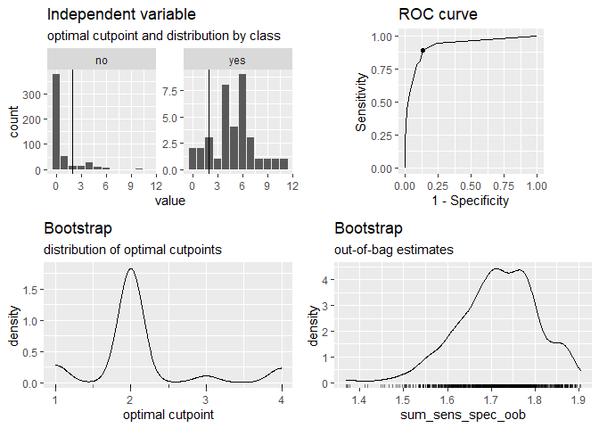
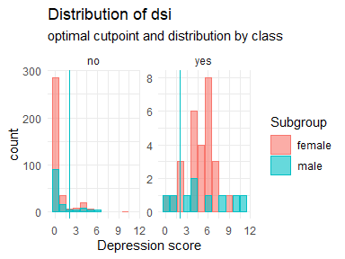

<!-- README.md is generated from README.Rmd. Please edit that file -->

# cutpointr

[](https://travis-ci.org/Thie1e/cutpointr)
[](https://ci.appveyor.com/project/Thie1e/cutpointr)
[](http://www.repostatus.org/#active)
[](https://codecov.io/github/thie1e/cutpointr)
[](https://CRAN.R-project.org/package=cutpointr)

**cutpointr** is an R package for tidy calculation of “optimal”
cutpoints. It supports several methods for calculating cutpoints and
includes several metrics that can be maximized or minimized by selecting
a cutpoint. Some of these methods are designed to be more robust than
the simple empirical optimization of a metric. Additionally,
**cutpointr** can automatically bootstrap the variability of the optimal
cutpoints and return out-of-bag estimates of various performance
metrics.

## Installation

You can install **cutpointr** from CRAN using the menu in RStudio or
simply:

``` r
install.packages("cutpointr")
```

## Example

For example, the optimal cutpoint for the included data set is 2 when
maximizing the sum of sensitivity and specificity.

``` r
library(cutpointr)
data(suicide)
head(suicide)
#>   age gender dsi suicide
#> 1  29 female   1      no
#> 2  26   male   0      no
#> 3  26 female   0      no
#> 4  27 female   0      no
#> 5  28 female   0      no
#> 6  53   male   2      no
cp <- cutpointr(suicide, dsi, suicide, 
                method = maximize_metric, metric = sum_sens_spec)
#> Assuming the positive class is yes
#> Assuming the positive class has higher x values
cp
#> # A tibble: 1 x 16
#>   direction optimal_cutpoint method          sum_sens_spec      acc
#>   <chr>                <dbl> <chr>                   <dbl>    <dbl>
#> 1 >=                       2 maximize_metric       1.75179 0.864662
#>   sensitivity specificity      AUC pos_class neg_class prevalence outcome
#>         <dbl>       <dbl>    <dbl> <fct>     <fct>          <dbl> <chr>  
#> 1    0.888889    0.862903 0.923779 yes       no         0.0676692 suicide
#>   predictor           data roc_curve          boot 
#>   <chr>     <list<df[,2]>> <list>             <lgl>
#> 1 dsi            [532 × 2] <tibble [13 × 10]> NA
```

``` r
summary(cp)
#> Method: maximize_metric 
#> Predictor: dsi 
#> Outcome: suicide 
#> Direction: >= 
#> 
#>     AUC   n n_pos n_neg
#>  0.9238 532    36   496
#> 
#>  optimal_cutpoint sum_sens_spec    acc sensitivity specificity tp fn fp
#>                 2        1.7518 0.8647      0.8889      0.8629 32  4 68
#>   tn
#>  428
#> 
#> Predictor summary: 
#>         Min.   5% 1st Qu. Median  Mean 3rd Qu.  95% Max.    SD NAs
#> overall    0 0.00       0      0 0.921       1 5.00   11 1.853   0
#> no         0 0.00       0      0 0.633       0 4.00   10 1.412   0
#> yes        0 0.75       4      5 4.889       6 9.25   11 2.550   0
```

``` r
plot(cp)
```

<!-- -->

When considering the optimality of a cutpoint, we can only make a
judgement based on the sample at hand. Thus, the estimated cutpoint may
not be optimal within the population or on unseen data, which is why we
sometimes put the “optimal” in quotation marks.

`cutpointr` makes assumptions about the direction of the dependency
between `class` and `x`, if `direction` and / or `pos_class` or
`neg_class` are not specified. The same result as above can be achieved
by manually defining `direction` and the positive / negative classes
which is slightly faster, since the classes and direction don’t have to
be
determined:

``` r
opt_cut <- cutpointr(suicide, dsi, suicide, direction = ">=", pos_class = "yes",
                     neg_class = "no", method = maximize_metric, metric = youden)
```

`opt_cut` is a data frame that returns the input data and the ROC curve
(and optionally the bootstrap results) in a nested tibble. Methods for
summarizing and plotting the data and results are included
(e.g. `summary`, `plot`, `plot_roc`, `plot_metric`)

To inspect the optimization, the function of metric values per cutpoint
can be plotted using `plot_metric`, if an optimization function was used
that returns a metric column in the `roc_curve` column. For example, the
`maximize_metric` and `minimize_metric` functions do so:

``` r
plot_metric(opt_cut)
```

<!-- -->

Predictions for new data can be made using `predict`:

``` r
predict(opt_cut, newdata = data.frame(dsi = 0:5))
#> [1] "no"  "no"  "yes" "yes" "yes" "yes"
```

## Features

  - Calculation of optimal cutpoints in binary classification tasks
  - Tidy output, integrates well with functions from the tidyverse
  - Functions for plotting ROC curves, metric distributions and more
  - Bootstrapping for simulating the cutpoint variability and for
    obtaining out-of-bag estimates of various metrics (as a form of
    internal validation) with optional parallelisation
  - Multiple methods for calculating cutpoints
  - Multiple metrics can be chosen for maximization / minimization
  - Tidyeval

# Calculating cutpoints

## Method functions for cutpoint estimation

The included methods for calculating cutpoints are:

  - `maximize_metric`: Maximize the metric function
  - `minimize_metric`: Minimize the metric function
  - `maximize_loess_metric`: Maximize the metric function after LOESS
    smoothing
  - `minimize_loess_metric`: Minimize the metric function after LOESS
    smoothing
  - `maximize_spline_metric`: Maximize the metric function after spline
    smoothing
  - `minimize_spline_metric`: Minimize the metric function after spline
    smoothing
  - `maximize_gam_metric`: Maximize the metric function after smoothing
    via Generalized Additive Models
  - `minimize_gam_metric`: Minimize the metric function after smoothing
    via Generalized Additive Models
  - `maximize_boot_metric`: Bootstrap the optimal cutpoint when
    maximizing a metric
  - `minimize_boot_metric`: Bootstrap the optimal cutpoint when
    minimizing a metric
  - `oc_manual`: Specify the cutoff value manually
  - `oc_mean`: Use the sample mean as the “optimal” cutpoint
  - `oc_median`: Use the sample median as the “optimal” cutpoint
  - `oc_youden_kernel`: Maximize the Youden-Index after kernel smoothing
    the distributions of the two classes
  - `oc_youden_normal`: Maximize the Youden-Index parametrically
    assuming normally distributed data in both classes

## Metric functions

The included metrics to be used with the minimization and maximization
methods are:

  - `accuracy`: Fraction correctly classified
  - `abs_d_sens_spec`: The absolute difference of sensitivity and
    specificity
  - `abs_d_ppv_npv`: The absolute difference between positive predictive
    value (PPV) and negative predictive value (NPV)
  - `roc01`: Distance to the point (0,1) on ROC space
  - `cohens_kappa`: Cohen’s Kappa
  - `sum_sens_spec`: sensitivity + specificity
  - `sum_ppv_npv`: The sum of positive predictive value (PPV) and
    negative predictive value (NPV)
  - `prod_sens_spec`: sensitivity \* specificity
  - `prod_ppv_npv`: The product of positive predictive value (PPV) and
    negative predictive value (NPV)
  - `youden`: Youden- or J-Index = sensitivity + specificity - 1
  - `odds_ratio`: (Diagnostic) odds ratio
  - `risk_ratio`: risk ratio (relative risk)
  - `p_chisquared`: The p-value of a chi-squared test on the confusion
    matrix
  - `cost_misclassification`: The sum of the misclassification cost of
    false positives and false negatives. Additional arguments: cost\_fp,
    cost\_fn
  - `total_utility`: The total utility of true / false positives /
    negatives. Additional arguments: utility\_tp, utility\_tn, cost\_fp,
    cost\_fn
  - `F1_score`: The F1-score (2 \* TP) / (2 \* TP + FP + FN)
  - `metric_constrain`: Maximize a selected metric given a minimal value
    of another selected metric
  - `sens_constrain`: Maximize sensitivity given a minimal value of
    specificity
  - `spec_constrain`: Maximize specificity given a minimal value of
    sensitivity
  - `acc_constrain`: Maximize accuracy given a minimal value of
    sensitivity

Furthermore, the following functions are included which can be used as
metric functions but are more useful for plotting purposes, for example
in `plot_cutpointr`, or for defining new metric functions: `tp`, `fp`,
`tn`, `fn`, `tpr`, `fpr`, `tnr`, `fnr`, `false_omission_rate`,
`false_discovery_rate`, `ppv`, `npv`, `precision`, `recall`,
`sensitivity`, and `specificity`.

The inputs to the arguments `method` and `metric` are functions so that
user-defined functions can easily be supplied instead of the built-in
ones.

## Separate subgroups and bootstrapping

Cutpoints can be separately estimated on subgroups that are defined by a
third variable, `gender` in this case. Additionally, if `boot_runs` is
larger zero, `cutpointr` will carry out the usual cutpoint calculation
on the full sample, just as before, and additionally on `boot_runs`
bootstrap samples. This offers a way of gauging the out-of-sample
performance of the cutpoint estimation method. If a subgroup is given,
the bootstrapping is carried out separately for every subgroup which is
also reflected in the plots and output.

``` r
set.seed(12)
opt_cut <- cutpointr(suicide, dsi, suicide, boot_runs = 1000)
#> Assuming the positive class is yes
#> Assuming the positive class has higher x values
#> Running bootstrap...
opt_cut
#> # A tibble: 1 x 16
#>   direction optimal_cutpoint method          sum_sens_spec      acc
#>   <chr>                <dbl> <chr>                   <dbl>    <dbl>
#> 1 >=                       2 maximize_metric       1.75179 0.864662
#>   sensitivity specificity      AUC pos_class neg_class prevalence outcome
#>         <dbl>       <dbl>    <dbl> <fct>     <fct>          <dbl> <chr>  
#> 1    0.888889    0.862903 0.923779 yes       no         0.0676692 suicide
#>   predictor           data roc_curve          boot                 
#>   <chr>     <list<df[,2]>> <list>             <list>               
#> 1 dsi            [532 × 2] <tibble [13 × 10]> <tibble [1,000 × 23]>
```

The returned object has the additional column `boot` which is a nested
tibble that includes the cutpoints per bootstrap sample along with the
metric calculated using the function in `metric` and various default
metrics. The metrics are suffixed by `_b` to indicate in-bag results or
`_oob` to indicate out-of-bag results:

``` r
opt_cut$boot
#> [[1]]
#> # A tibble: 1,000 x 23
#>    optimal_cutpoint AUC_b AUC_oob sum_sens_spec_b sum_sens_spec_o… acc_b
#>               <dbl> <dbl>   <dbl>           <dbl>            <dbl> <dbl>
#>  1                2 0.957   0.884            1.80             1.71 0.874
#>  2                1 0.918   0.935            1.70             1.70 0.752
#>  3                2 0.920   0.946            1.79             1.73 0.874
#>  4                2 0.940   0.962            1.82             1.76 0.893
#>  5                2 0.849   0.96             1.66             1.76 0.848
#>  6                4 0.926   0.927            1.80             1.51 0.925
#>  7                2 0.927   0.919            1.74             1.78 0.885
#>  8                2 0.958   0.882            1.82             1.67 0.863
#>  9                4 0.911   0.923            1.80             1.53 0.914
#> 10                1 0.871   0.975            1.62             1.80 0.737
#> # … with 990 more rows, and 17 more variables: acc_oob <dbl>,
#> #   sensitivity_b <dbl>, sensitivity_oob <dbl>, specificity_b <dbl>,
#> #   specificity_oob <dbl>, cohens_kappa_b <dbl>, cohens_kappa_oob <dbl>,
#> #   TP_b <dbl>, FP_b <dbl>, TN_b <int>, FN_b <int>, TP_oob <dbl>,
#> #   FP_oob <dbl>, TN_oob <int>, FN_oob <int>, roc_curve_b <list>,
#> #   roc_curve_oob <list>
```

The summary and plots include additional elements that summarize or
display the bootstrap results:

``` r
summary(opt_cut)
#> Method: maximize_metric 
#> Predictor: dsi 
#> Outcome: suicide 
#> Direction: >= 
#> Nr. of bootstraps: 1000 
#> 
#>     AUC   n n_pos n_neg
#>  0.9238 532    36   496
#> 
#>  optimal_cutpoint sum_sens_spec    acc sensitivity specificity tp fn fp
#>                 2        1.7518 0.8647      0.8889      0.8629 32  4 68
#>   tn
#>  428
#> 
#> Predictor summary: 
#>         Min.   5% 1st Qu. Median  Mean 3rd Qu.  95% Max.    SD NAs
#> overall    0 0.00       0      0 0.921       1 5.00   11 1.853   0
#> no         0 0.00       0      0 0.633       0 4.00   10 1.412   0
#> yes        0 0.75       4      5 4.889       6 9.25   11 2.550   0
#> 
#> Bootstrap summary: 
#>           Variable  Min.    5% 1st Qu. Median  Mean 3rd Qu.   95%  Max.
#>   optimal_cutpoint 1.000 1.000   2.000  2.000 2.118   2.000 4.000 4.000
#>              AUC_b 0.830 0.880   0.908  0.926 0.924   0.943 0.962 0.976
#>            AUC_oob 0.822 0.863   0.901  0.923 0.922   0.951 0.971 0.996
#>    sum_sens_spec_b 1.566 1.671   1.722  1.759 1.758   1.796 1.837 1.890
#>  sum_sens_spec_oob 1.369 1.556   1.660  1.718 1.714   1.778 1.861 1.904
#>              acc_b 0.729 0.771   0.853  0.867 0.861   0.882 0.908 0.936
#>            acc_oob 0.716 0.768   0.846  0.863 0.856   0.879 0.902 0.930
#>      sensitivity_b 0.725 0.806   0.865  0.903 0.900   0.939 0.975 1.000
#>    sensitivity_oob 0.444 0.667   0.800  0.868 0.859   0.929 1.000 1.000
#>      specificity_b 0.721 0.757   0.849  0.865 0.858   0.880 0.913 0.943
#>    specificity_oob 0.693 0.755   0.844  0.862 0.855   0.880 0.914 0.944
#>     cohens_kappa_b 0.160 0.266   0.371  0.416 0.412   0.462 0.524 0.662
#>   cohens_kappa_oob 0.149 0.252   0.337  0.393 0.389   0.442 0.514 0.625
#>     SD NAs
#>  0.721   0
#>  0.025   0
#>  0.034   0
#>  0.053   0
#>  0.091   0
#>  0.037   0
#>  0.038   0
#>  0.053   0
#>  0.101   0
#>  0.041   0
#>  0.044   0
#>  0.075   0
#>  0.079   0
plot(opt_cut)
```

<!-- -->

### Parallelized bootstrapping

Using `foreach` and `doRNG` the bootstrapping can be parallelized
easily. The **doRNG** package is being used to make the bootstrap
sampling
reproducible.

``` r
if (suppressPackageStartupMessages(require(doParallel) & require(doRNG))) {
  cl <- makeCluster(2) # 2 cores
  registerDoParallel(cl)
  registerDoRNG(12) # Reproducible parallel loops using doRNG
  opt_cut <- cutpointr(suicide, dsi, suicide, gender, pos_class = "yes",
                 direction = ">=", boot_runs = 1000, allowParallel = TRUE)
  stopCluster(cl)
  opt_cut
}
#> Running bootstrap...
#> # A tibble: 2 x 18
#>   subgroup direction optimal_cutpoint method          sum_sens_spec
#>   <chr>    <chr>                <dbl> <chr>                   <dbl>
#> 1 female   >=                       2 maximize_metric       1.80812
#> 2 male     >=                       3 maximize_metric       1.62511
#>        acc sensitivity specificity      AUC pos_class neg_class prevalence
#>      <dbl>       <dbl>       <dbl>    <dbl> <chr>     <fct>          <dbl>
#> 1 0.885204    0.925926    0.882192 0.944647 yes       no         0.0688776
#> 2 0.842857    0.777778    0.847328 0.861747 yes       no         0.0642857
#>   outcome predictor grouping           data roc_curve         
#>   <chr>   <chr>     <chr>    <list<df[,2]>> <list>            
#> 1 suicide dsi       gender        [392 × 2] <tibble [11 × 10]>
#> 2 suicide dsi       gender        [140 × 2] <tibble [11 × 10]>
#>   boot                 
#>   <list>               
#> 1 <tibble [1,000 × 23]>
#> 2 <tibble [1,000 × 23]>
```

# More robust cutpoint estimation methods

## Bootstrapped cutpoints

It has been shown that bagging can substantially improve performance of
a wide range of types of models in regression as well as in
classification tasks. This method is available for cutpoint estimation
via the `maximize_boot_metric` and `minimize_boot_metric` functions. If
one of these functions is used as `method`, `boot_cut` bootstrap samples
are drawn, the cutpoint optimization is carried out in each one and a
summary (e.g. the mean) of the resulting optimal cutpoints on the
bootstrap samples is returned as the optimal cutpoint in `cutpointr`.
Note that if bootstrap validation is run, i.e. if `boot_runs` is larger
zero, an outer bootstrap will be executed. In the bootstrap validation
routine `boot_runs` bootstrap samples are generated and each one is
again bootstrapped `boot_cut` times. This may lead to long run times, so
activating the built-in parallelization may be advisable.

The advantages of bootstrapping the optimal cutpoint are that the
procedure doesn’t possess parameters that have to be tuned, unlike the
LOESS smoothing, that it doesn’t rely on assumptions, unlike the Normal
method, and that it is applicable to any metric that can be used with
`minimize_metric` or `maximize_metric`, unlike the Kernel method.
Furthermore, like Random Forests cannot be overfit by increasing the
number of trees, the bootstrapped cutpoints cannot be overfit by running
an excessive amount of `boot_cut` repetitions.

``` r
set.seed(100)
cutpointr(suicide, dsi, suicide, gender, 
          method = maximize_boot_metric,
          boot_cut = 200, summary_func = mean,
          metric = accuracy, silent = TRUE)
#> # A tibble: 2 x 18
#>   subgroup direction optimal_cutpoint method               accuracy
#>   <chr>    <chr>                <dbl> <chr>                   <dbl>
#> 1 female   >=                 5.73246 maximize_boot_metric 0.956633
#> 2 male     >=                 8.41026 maximize_boot_metric 0.95    
#>        acc sensitivity specificity      AUC pos_class neg_class prevalence
#>      <dbl>       <dbl>       <dbl>    <dbl> <fct>     <fct>          <dbl>
#> 1 0.956633    0.444444    0.994521 0.944647 yes       no         0.0688776
#> 2 0.95        0.222222    1        0.861747 yes       no         0.0642857
#>   outcome predictor grouping           data roc_curve         boot 
#>   <chr>   <chr>     <chr>    <list<df[,2]>> <list>            <lgl>
#> 1 suicide dsi       gender        [392 × 2] <tibble [11 × 9]> NA   
#> 2 suicide dsi       gender        [140 × 2] <tibble [11 × 9]> NA
```

## LOESS smoothing for selecting a cutpoint

When using `maximize_metric` and `minimize_metric` the optimal cutpoint
is selected by searching the maximum or minimum of the metric function.
For example, we may want to minimize the misclassification cost. Since
false negatives (a suicide attempt was not anticipated) can be regarded
as much more severe than false positives we can set the cost of a false
negative `cost_fn` for example to ten times the cost of a false
positive.

``` r
opt_cut <- cutpointr(suicide, dsi, suicide, gender, method = minimize_metric,
                     metric = misclassification_cost, cost_fp = 1, cost_fn = 10)
#> Assuming the positive class is yes
#> Assuming the positive class has higher x values
```

``` r
plot_metric(opt_cut)
```

<!-- -->

As this “optimal” cutpoint may depend on minor differences between the
possible cutoffs, smoothing of the function of metric values by cutpoint
value might be desirable, especially in small samples. The
`minimize_loess_metric` and `maximize_loess_metric` functions can be
used to smooth the function so that the optimal cutpoint is selected
based on the smoothed metric values. Options to modify the smoothing,
which is implemented using `loess.as` from the **fANCOVA** package,
include:

  - `criterion`: the criterion for automatic smoothing parameter
    selection: “aicc” denotes bias-corrected AIC criterion, “gcv”
    denotes generalized cross-validation.
  - `degree`: the degree of the local polynomials to be used. It can be
    0, 1 or 2.
  - `family`: if “gaussian” fitting is by least-squares, and if
    “symmetric” a re-descending M estimator is used with Tukey’s
    biweight function.
  - `user.span`: the user-defined parameter which controls the degree of
    smoothing.

Using parameters for the LOESS smoothing of `criterion = "aicc"`,
`degree = 2`, `family = "symmetric"`, and `user.span = 0.7` we get the
following smoothed versions of the above metrics:

``` r
opt_cut <- cutpointr(suicide, dsi, suicide, gender, 
                     method = minimize_loess_metric,
                     criterion = "aicc", family = "symmetric", 
                     degree = 2, user.span = 0.7,
                     metric = misclassification_cost, cost_fp = 1, cost_fn = 10)
#> Assuming the positive class is yes
#> Assuming the positive class has higher x values
#> fANCOVA 0.5-1 loaded
```

``` r
plot_metric(opt_cut)
```

<!-- -->

The optimal cutpoint for the female subgroup changes to 3. Note, though,
that there are no reliable rules for selecting the “best” smoothing
parameters. Notably, the LOESS smoothing is sensitive to the number of
unique cutpoints. A large number of unique cutpoints generally leads to
a more volatile curve of metric values by cutpoint value, even after
smoothing. Thus, the curve tends to be undersmoothed in that scenario.
The unsmoothed metric values are returned in `opt_cut$roc_curve` in the
column `m_unsmoothed`.

## Smoothing via Generalized Additive Models for selecting a cutpoint

In a similar fashion, the function of metric values per cutpoint can be
smoothed using Generalized Additive Models with smooth terms.
Internally, `mgcv::gam` carries out the smoothing which can be
customized via the arguments `formula` and `optimizer`, see `help("gam",
package = "mgcv")`. Most importantly, the GAM can be specified by
altering the default formula, for example the smoothing function could
be configured to apply cubic regression splines (`"cr"`) as the smooth
term. As the `suicide` data has only very few unique cutpoints, it is
not very suitable for showcasing the GAM smoothing, so we will use two
classes of the `iris` data here. In this case, the purely empirical
method and the GAM smoothing lead to identical cutpoints, but in
practice the GAM smoothing tends to be more robust, especially with
larger data. An attractive feature of the GAM smoothing is that the
default values tend to work quite well and usually require no tuning,
eliminating researcher degrees of freedom.

``` r
library(ggplot2)
exdat <- iris
exdat <- exdat[exdat$Species != "setosa", ]
opt_cut <- cutpointr(exdat, Petal.Length, Species,
                     method = minimize_gam_metric,
                     formula = m ~ s(x.sorted, bs = "cr"),
                     metric = abs_d_sens_spec)
#> Assuming the positive class is virginica
#> Assuming the positive class has higher x values
plot_metric(opt_cut)
```

<!-- -->

## Spline smoothing for selecting a cutpoint

Again in the same fashion the function of metric values per cutpoint can
be smoothed using smoothing splines. By default, the number of knots is
automatically chosen using the `cutpoint_knots` function. That function
uses `stats::.nknots.smspl`, which is the default in
`stats::smooth.spline` to pick the number of knots.

Alternatively, the number of knots can be set manually and also the
other smoothing parameters of `stats::smooth.spline` can be set as
desired. For details see `?maximize_spline_metric`.

``` r
opt_cut <- cutpointr(suicide, dsi, suicide, gender, 
                     method = minimize_spline_metric, spar = 0.4,
                     metric = misclassification_cost, cost_fp = 1, cost_fn = 10)
#> Assuming the positive class is yes
#> Assuming the positive class has higher x values
#> nknots: 10
#> nknots: 10
plot_metric(opt_cut)
```

<!-- -->

### Parametric method assuming normality

The Normal method in `oc_youden_normal` is a parametric method for
maximizing the Youden-Index or equivalently the sum of \(Se\) and
\(Sp\). It relies on the assumption that the predictor for both the
negative and positive observations is normally distributed. In that case
it can be shown
that

\[c^* = \frac{(\mu_P \sigma_N^2 - \mu_N \sigma_P^2) - \sigma_N \sigma_P \sqrt{(\mu_N - \mu_P)^2 + (\sigma_N^2 - \sigma_P^2) log(\sigma_N^2 / \sigma_P^2)}}{\sigma_N^2 - \sigma_P^2}\]

where the negative class is normally distributed with
\(\sim N(\mu_N, \sigma_N^2)\) and the positive class independently
normally distributed with \(\sim N(\mu_P, \sigma_P^2)\) provides the
optimal cutpoint \(c^*\) that maximizes the Youden-Index. If
\(\sigma_N\) and \(\sigma_P\) are equal, the expression can be
simplified to \(c^* = \frac{\mu_N + \mu_P}{2}\). However, the
`oc_youden_normal` method in cutpointr always assumes unequal standard
deviations. Since this method does not select a cutpoint from the
observed predictor values, it is questionable which values for \(Se\)
and \(Sp\) should be reported. Here, the Youden-Index can be calculated
as

\[J = \Phi(\frac{c^* - \mu_N}{\sigma_N}) - \Phi(\frac{c^* - \mu_P}{\sigma_P})\]

if the assumption of normality holds. However, since there exist several
methods that do not select cutpoints from the available observations and
to unify the reporting of metrics for these methods, **cutpointr**
reports all metrics, e.g. \(Se\) and \(Sp\), based on the empirical
observations.

``` r
cutpointr(suicide, dsi, suicide, gender, method = oc_youden_normal)
#> Assuming the positive class is yes
#> Assuming the positive class has higher x values
#> # A tibble: 2 x 18
#>   subgroup direction optimal_cutpoint method           sum_sens_spec
#>   <chr>    <chr>                <dbl> <chr>                    <dbl>
#> 1 female   >=                 2.47775 oc_youden_normal       1.71618
#> 2 male     >=                 3.17226 oc_youden_normal       1.54453
#>        acc sensitivity specificity      AUC pos_class neg_class prevalence
#>      <dbl>       <dbl>       <dbl>    <dbl> <fct>     <fct>          <dbl>
#> 1 0.895408    0.814815    0.901370 0.944647 yes       no         0.0688776
#> 2 0.864286    0.666667    0.877863 0.861747 yes       no         0.0642857
#>   outcome predictor grouping           data roc_curve         boot 
#>   <chr>   <chr>     <chr>    <list<df[,2]>> <list>            <lgl>
#> 1 suicide dsi       gender        [392 × 2] <tibble [11 × 9]> NA   
#> 2 suicide dsi       gender        [140 × 2] <tibble [11 × 9]> NA
```

### Nonparametric kernel method

A nonparametric alternative is the Kernel method
\[@fluss\_estimation\_2005\]. Here, the empirical distribution functions
are smoothed using the Gaussian kernel functions
\(\hat{F}_N(t) = \frac{1}{n} \sum^n_{i=1} \Phi(\frac{t - y_i}{h_y})\)
and
\(\hat{G}_P(t) = \frac{1}{m} \sum^m_{i=1} \Phi(\frac{t - x_i}{h_x})\)
for the negative and positive classes respectively. Following
Silverman’s plug-in “rule of thumb” the bandwidths are selected as
\(h_y = 0.9 * min\{s_y, iqr_y/1.34\} * n^{-0.2}\) and
\(h_x = 0.9 * min\{s_x, iqr_x/1.34\} * m^{-0.2}\) where \(s\) is the
sample standard deviation and \(iqr\) is the inter quartile range. It
has been demonstrated that AUC estimation is rather insensitive to the
choice of the bandwidth procedure \[@faraggi\_estimation\_2002\] and
thus the plug-in bandwidth estimator has also been recommended for
cutpoint estimation. The `oc_youden_kernel` function in **cutpointr**
uses a Gaussian kernel and the direct plug-in method for selecting the
bandwidths. The kernel smoothing is done via the `bkde` function from
the **KernSmooth** package \[@wand\_kernsmooth:\_2013\].

Again, there is a way to calculate the Youden-Index from the results of
this method \[@fluss\_estimation\_2005\] which is

\[\hat{J} = max_c \{\hat{F}_N(c) - \hat{G}_N(c) \}\]

but as before we prefer to report all metrics based on applying the
cutpoint that was estimated using the Kernel method to the empirical
observations.

``` r
cutpointr(suicide, dsi, suicide, gender, method = oc_youden_kernel)
#> Assuming the positive class is yes
#> Assuming the positive class has higher x values
#> # A tibble: 2 x 18
#>   subgroup direction optimal_cutpoint method           sum_sens_spec
#>   <chr>    <chr>                <dbl> <chr>                    <dbl>
#> 1 female   >=                 1.18128 oc_youden_kernel       1.80812
#> 2 male     >=                 1.31636 oc_youden_kernel       1.58694
#>        acc sensitivity specificity      AUC pos_class neg_class prevalence
#>      <dbl>       <dbl>       <dbl>    <dbl> <fct>     <fct>          <dbl>
#> 1 0.885204    0.925926    0.882192 0.944647 yes       no         0.0688776
#> 2 0.807143    0.777778    0.809160 0.861747 yes       no         0.0642857
#>   outcome predictor grouping           data roc_curve         boot 
#>   <chr>   <chr>     <chr>    <list<df[,2]>> <list>            <lgl>
#> 1 suicide dsi       gender        [392 × 2] <tibble [11 × 9]> NA   
#> 2 suicide dsi       gender        [140 × 2] <tibble [11 × 9]> NA
```

# Additional features

## Calculating only the ROC curve

When running `cutpointr`, a ROC curve is by default returned in the
column `roc_curve`. This ROC curve can be plotted using `plot_roc`.
Alternatively, if only the ROC curve is desired and no cutpoint needs to
be calculated, the ROC curve can be created using `roc()` and plotted
using `plot_cutpointr`. The `roc` function, unlike `cutpointr`, does not
determine `direction`, `pos_class` or `neg_class` automatically.

``` r
roc_curve <- roc(data = suicide, x = dsi, class = suicide,
    pos_class = "yes", neg_class = "no", direction = ">=")
auc(roc_curve)
#> [1] 0.9237791
head(roc_curve)
#> # A tibble: 6 x 9
#>   x.sorted    tp    fp    tn    fn    tpr   tnr     fpr   fnr
#>      <dbl> <dbl> <dbl> <int> <int>  <dbl> <dbl>   <dbl> <dbl>
#> 1      Inf     0     0   496    36 0      1     0       1    
#> 2       11     1     0   496    35 0.0278 1     0       0.972
#> 3       10     2     1   495    34 0.0556 0.998 0.00202 0.944
#> 4        9     3     1   495    33 0.0833 0.998 0.00202 0.917
#> 5        8     4     1   495    32 0.111  0.998 0.00202 0.889
#> 6        7     7     1   495    29 0.194  0.998 0.00202 0.806
plot_roc(roc_curve)
```

<!-- -->

## Midpoints

So far - which is the default in `cutpointr` - we have considered all
unique values of the predictor as possible cutpoints. An alternative
could be to use a sequence of equidistant values instead, for example in
the case of the `suicide` data all integers in \([0, 10]\). However,
with very sparse data and small intervals between the candidate
cutpoints (i.e. a ‘dense’ sequence like `seq(0, 10, by = 0.01)`) this
leads to the uninformative evaluation of large ranges of cutpoints that
all result in the same metric value. A more elegant alternative, not
only for the case of sparse data, that is supported by **cutpointr** is
the use of a mean value of the optimal cutpoint and the next highest (if
`direction = ">="`) or the next lowest (if `direction = "<="`) predictor
value in the data. The result is an optimal cutpoint that is equal to
the cutpoint that would be obtained using an infinitely dense sequence
of candidate cutpoints and is thus usually more efficient
computationally. This behavior can be activated by setting
`use_midpoints = TRUE`, which is the default. If we use this setting, we
obtain an optimal cutpoint of 1.5 for the complete sample on the
`suicide` data instead of 2 when maximizing the sum of sensitivity and
specificity.

Assume the following small data
set:

``` r
dat <- data.frame(outcome = c("neg", "neg", "neg", "pos", "pos", "pos", "pos"),
                  pred    = c(1, 2, 3, 8, 11, 11, 12))
```

Since the distance of the optimal cutpoint (8) to the next lowest
observation (3) is rather large we arrive at a range of possible
cutpoints that all maximize the metric. In the case of this kind of
sparseness it might for example be desirable to classify a new
observation with a predictor value of 4 as belonging to the negative
class. If `use_midpoints` is set to `TRUE`, the mean of the optimal
cutpoint and the next lowest observation is returned as the optimal
cutpoint, if direction is `>=`. The mean of the optimal cutpoint and the
next highest observation is returned as the optimal cutpoint, if
`direction =
"<="`.

``` r
opt_cut <- cutpointr(dat, x = pred, class = outcome, use_midpoints = TRUE)
#> Assuming the positive class is pos
#> Assuming the positive class has higher x values
plot_x(opt_cut)
```

<!-- -->

A simulation demonstrates more clearly that setting `use_midpoints =
TRUE` avoids biasing the cutpoints. To simulate the bias of the metric
functions, the predictor values of both classes were drawn from normal
distributions with constant standard deviations of 10, a constant mean
of the negative class of 100 and higher mean values of the positive
class that are selected in such a way that optimal Youden-Index values
of 0.2, 0.4, 0.6, and 0.8 result in the population. Samples of 9
different sizes were drawn and the cutpoints that maximize the
Youden-Index were estimated. The simulation was repeated 10000 times. As
can be seen by the mean error, `use_midpoints = TRUE` eliminates the
bias that is introduced by otherwise selecting the value of an
observation as the optimal cutpoint. If `direction = ">="`, as in this
case, the observation that represents the optimal cutpoint is the
highest possible cutpoint that leads to the optimal metric value and
thus the biases are positive. The methods `oc_youden_normal` and
`oc_youden_kernel` are always unbiased, as they don’t select a cutpoint
based on the ROC-curve or the function of metric values per cutpoint.

<!-- -->

## Finding all cutpoints with acceptable performance

By default, most packages only return the “best” cutpoint and disregard
other cutpoints with quite similar performance, even if the performance
differences are minuscule. **cutpointr** makes this process more
explicit via the `tol_metric` argument. For example, if all cutpoints
are of interest that achieve at least an accuracy within `0.05` of the
optimally achievable accuracy, `tol_metric` can be set to `0.05` and
also those cutpoints will be returned.

In the case of the `suicide` data and when maximizing the sum of
sensitivity and specificity, empirically the cutpoints 2 and 3 lead to
quite similar performances. If `tol_metric` is set to `0.05`, both will
be returned.

``` r
opt_cut <- cutpointr(suicide, dsi, suicide, metric = sum_sens_spec, 
                     tol_metric = 0.05, break_ties = c)
#> Assuming the positive class is yes
#> Assuming the positive class has higher x values
#> Multiple optimal cutpoints found, applying break_ties.
library(tidyr)
opt_cut %>% 
    select(optimal_cutpoint, sum_sens_spec) %>% 
    unnest(cols = c(optimal_cutpoint, sum_sens_spec))
#> # A tibble: 2 x 2
#>   optimal_cutpoint sum_sens_spec
#>              <dbl>         <dbl>
#> 1                2          1.75
#> 2                1          1.70
```

## Manual and mean / median cutpoints

Using the `oc_manual` function the optimal cutpoint will not be
determined based on, for example, a metric but is instead set manually
using the `cutpoint` argument. This is useful for supplying and
evaluating cutpoints that were found in the literature or in other
external sources.

The `oc_manual` function could also be used to set the cutpoint to the
sample mean using `cutpoint = mean(data$x)`. However, this may introduce
a bias into the bootstrap validation procedure, since the actual mean of
the population is not known and thus the mean to be used as the cutpoint
should be automatically determined in every resample. To do so, the
`oc_mean` and `oc_median` functions can be used.

``` r
set.seed(100)
opt_cut_manual <- cutpointr(suicide, dsi, suicide, method = oc_manual, 
                       cutpoint = mean(suicide$dsi), boot_runs = 30)
#> Assuming the positive class is yes
#> Assuming the positive class has higher x values
#> Running bootstrap...
set.seed(100)
opt_cut_mean <- cutpointr(suicide, dsi, suicide, method = oc_mean, boot_runs = 30)
#> Assuming the positive class is yes
#> Assuming the positive class has higher x values
#> Running bootstrap...
```

## Nonstandard evaluation via tidyeval

The arguments to `cutpointr` do not need to be enclosed in quotes. This
is possible thanks to nonstandard evaluation of the arguments, which are
evaluated on `data`.

Functions that use nonstandard evaluation are often not suitable for
programming with. The use of nonstandard evaluation may lead to scoping
problems and subsequent obvious as well as possibly subtle errors.
**cutpointr** uses tidyeval internally and accordingly the same rules as
for programming with `dplyr` apply. Arguments can be unquoted with `!!`:

``` r
myvar <- "dsi"
cutpointr(suicide, !!myvar, suicide)
```

## ROC curve and optimal cutpoint for multiple variables

Alternatively, we can map the standard evaluation version `cutpointr` to
the column names. If `direction` and / or `pos_class` and `neg_class`
are unspecified, these parameters will automatically be determined by
**cutpointr** so that the AUC values for all variables will be
\(> 0.5\).

We could do this manually, e.g. using `purrr::map`, but to make this
task more convenient `multi_cutpointr` can be used to achieve the same
result. It maps multiple predictor columns to `cutpointr`, by default
all numeric columns except for the class column.

``` r
mcp <- multi_cutpointr(suicide, class = suicide, pos_class = "yes", 
                use_midpoints = TRUE, silent = TRUE) 
summary(mcp)
#> Method: maximize_metric 
#> Predictor: age, dsi 
#> Outcome: suicide 
#> 
#> Predictor: age 
#> --------------------------------------------------------------------------- 
#>     AUC   n n_pos n_neg
#>  0.5257 532    36   496
#> 
#>  direction optimal_cutpoint sum_sens_spec    acc sensitivity specificity
#>         <=             55.5        1.1154 0.1992      0.9722      0.1431
#>  tp fn  fp tn
#>  35  1 425 71
#> 
#> Predictor summary: 
#>         Min. 5% 1st Qu. Median   Mean 3rd Qu.   95% Max.     SD NAs
#> overall   18 19      24   28.0 34.126   41.25 65.00   83 15.054   0
#> no        18 19      24   28.0 34.222   41.25 65.50   83 15.186   0
#> yes       18 18      22   27.5 32.806   41.25 54.25   69 13.227   0
#> 
#> Predictor: dsi 
#> --------------------------------------------------------------------------- 
#>     AUC   n n_pos n_neg
#>  0.9238 532    36   496
#> 
#>  direction optimal_cutpoint sum_sens_spec    acc sensitivity specificity
#>         >=              1.5        1.7518 0.8647      0.8889      0.8629
#>  tp fn fp  tn
#>  32  4 68 428
#> 
#> Predictor summary: 
#>         Min.   5% 1st Qu. Median  Mean 3rd Qu.  95% Max.    SD NAs
#> overall    0 0.00       0      0 0.921       1 5.00   11 1.853   0
#> no         0 0.00       0      0 0.633       0 4.00   10 1.412   0
#> yes        0 0.75       4      5 4.889       6 9.25   11 2.550   0
```

## Accessing `data`, `roc_curve`, and `boot`

The object returned by `cutpointr` is of the classes `cutpointr`,
`tbl_df`, `tbl`, and `data.frame`. Thus, it can be handled like a usual
data frame. The columns `data`, `roc_curve`, and `boot` consist of
nested data frames, which means that these are list columns whose
elements are data frames. They can either be accessed using `[` or by
using functions from the tidyverse. If subgroups were given, the output
contains one row per subgroup and the function that accesses the data
should be mapped to every row or the data should be grouped by subgroup.

``` r
# Extracting the bootstrap results
set.seed(123)
opt_cut <- cutpointr(suicide, dsi, suicide, gender, boot_runs = 1000)
#> Assuming the positive class is yes
#> Assuming the positive class has higher x values
#> Running bootstrap...

# Using base R to summarise the result of the bootstrap
summary(opt_cut$boot[[1]]$optimal_cutpoint)
#>    Min. 1st Qu.  Median    Mean 3rd Qu.    Max. 
#>   1.000   2.000   2.000   2.172   2.000   5.000
summary(opt_cut$boot[[2]]$optimal_cutpoint)
#>    Min. 1st Qu.  Median    Mean 3rd Qu.    Max. 
#>   1.000   1.000   3.000   2.921   4.000  11.000

# Using dplyr and tidyr
library(tidyr)
opt_cut %>% 
  group_by(subgroup) %>% 
  select(boot) %>% 
  unnest(boot) %>% 
  summarise(sd_oc_boot = sd(optimal_cutpoint),
            m_oc_boot  = mean(optimal_cutpoint),
            m_acc_oob  = mean(acc_oob))
#> Adding missing grouping variables: `subgroup`
#> # A tibble: 2 x 4
#>   subgroup sd_oc_boot m_oc_boot m_acc_oob
#>   <chr>         <dbl>     <dbl>     <dbl>
#> 1 female        0.766      2.17     0.880
#> 2 male          1.51       2.92     0.806
```

## Adding metrics to the result of cutpointr() or roc()

By default, the output of `cutpointr` includes the optimized metric and
several other metrics. The `add_metric` function adds further metrics.
Here, we’re adding the negative predictive value (NPV) and the positive
predictive value (PPV) at the optimal cutpoint per
subgroup:

``` r
cutpointr(suicide, dsi, suicide, gender, metric = youden, silent = TRUE) %>% 
    add_metric(list(ppv, npv)) %>% 
    select(subgroup, optimal_cutpoint, youden, ppv, npv)
#> # A tibble: 2 x 5
#>   subgroup optimal_cutpoint   youden      ppv      npv
#>   <chr>               <dbl>    <dbl>    <dbl>    <dbl>
#> 1 female                  2 0.808118 0.367647 0.993827
#> 2 male                    3 0.625106 0.259259 0.982301
```

In the same fashion, additional metric columns can be added to a
`roc_cutpointr` object:

``` r
roc(data = suicide, x = dsi, class = suicide, pos_class = "yes",
    neg_class = "no", direction = ">=") %>% 
  add_metric(list(cohens_kappa, F1_score)) %>% 
  select(x.sorted, tp, fp, tn, fn, cohens_kappa, F1_score) %>% 
  head()
#> # A tibble: 6 x 7
#>   x.sorted    tp    fp    tn    fn cohens_kappa F1_score
#>      <dbl> <dbl> <dbl> <int> <int>        <dbl>    <dbl>
#> 1      Inf     0     0   496    36       0        0     
#> 2       11     1     0   496    35       0.0506   0.0541
#> 3       10     2     1   495    34       0.0931   0.103 
#> 4        9     3     1   495    33       0.138    0.15  
#> 5        8     4     1   495    32       0.182    0.195 
#> 6        7     7     1   495    29       0.301    0.318
```

## User-defined functions

### method

User-defined functions can be supplied to `method`, which is the
function that is responsible for returning the optimal cutpoint. To
define a new method function, create a function that may take as
input(s):

  - `data`: A `data.frame` or `tbl_df`
  - `x`: (character) The name of the predictor variable
  - `class`: (character) The name of the class variable
  - `metric_func`: A function for calculating a metric, e.g. accuracy.
    Note that the method function does not necessarily have to accept
    this argument
  - `pos_class`: The positive class
  - `neg_class`: The negative class
  - `direction`: `">="` if the positive class has higher x values,
    `"<="` otherwise
  - `tol_metric`: (numeric) In the built-in methods, all cutpoints will
    be returned that lead to a metric value in the interval \[m\_max -
    tol\_metric, m\_max + tol\_metric\] where m\_max is the maximum
    achievable metric value. This can be used to return multiple decent
    cutpoints and to avoid floating-point problems.
  - `use_midpoints`: (logical) In the built-in methods, if TRUE (default
    FALSE) the returned optimal cutpoint will be the mean of the optimal
    cutpoint and the next highest observation (for direction = “\>”) or
    the next lowest observation (for direction = “\<”) which avoids
    biasing the optimal cutpoint.
  - `...`: Further arguments that are passed to `metric` or that can be
    captured inside of `method`

The function should return a data frame or tibble with one row, the
column `optimal_cutpoint`, and an optional column with an arbitrary name
with the metric value at the optimal cutpoint.

For example, a function for choosing the cutpoint as the mean of the
independent variable could look like this:

``` r
mean_cut <- function(data, x, ...) {
    oc <- mean(data[[x]])
    return(data.frame(optimal_cutpoint = oc))
}
```

If a `method` function does not return a metric column, the default
`sum_sens_spec`, the sum of sensitivity and specificity, is returned as
the extra metric column in addition to accuracy, sensitivity and
specificity.

Some `method` functions that make use of the additional arguments (that
are captured by `...`) are already included in **cutpointr**, see the
list at the top. Since these functions are arguments to `cutpointr`
their code can be accessed by simply typing their name, see for example
`oc_youden_normal`.

### metric

User defined `metric` functions can be used as well. They are mainly
useful in conjunction with `method = maximize_metric`, `method =
minimize_metric`, or one of the other minimization and maximization
functions. In case of a different `method` function `metric` will only
be used as the main out-of-bag metric when plotting the result. The
`metric` function should accept the following inputs as vectors:

  - `tp`: Vector of true positives
  - `fp`: Vector of false positives
  - `tn`: Vector of true negatives
  - `fn`: Vector of false negatives
  - `...`: Further arguments

The function should return a numeric vector, a matrix, or a `data.frame`
with one column. If the column is named, the name will be included in
the output and plots. Avoid using names that are identical to the column
names that are by default returned by **cutpointr**, as such names will
be prefixed by `metric_` in the output. The inputs (`tp`, `fp`, `tn`,
and `fn`) are vectors. The code of the included metric functions can be
accessed by simply typing their name.

For example, this is the `misclassification_cost` metric function:

``` r
misclassification_cost
#> function (tp, fp, tn, fn, cost_fp = 1, cost_fn = 1, ...) 
#> {
#>     misclassification_cost <- cost_fp * fp + cost_fn * fn
#>     misclassification_cost <- matrix(misclassification_cost, 
#>         ncol = 1)
#>     colnames(misclassification_cost) <- "misclassification_cost"
#>     return(misclassification_cost)
#> }
#> <bytecode: 0x7fa7af31f9d8>
#> <environment: namespace:cutpointr>
```

# Plotting

**cutpointr** includes several convenience functions for plotting data
from a `cutpointr` object. These include:

  - `plot_cutpointr`: General purpose plotting function for cutpointr or
    roc\_cutpointr objects
  - `plot_cut_boot`: Plot the bootstrapped distribution of optimal
    cutpoints
  - `plot_metric`: If `maximize_metric` or `minimize_metric` was used
    this function plots all possible cutoffs on the x-axis vs. the
    respective metric values on the y-axis. If bootstrapping was run, a
    confidence interval based on the bootstrapped distribution of metric
    values at each cutpoint can be displayed. To display no confidence
    interval set `conf_lvl = 0`.
  - `plot_metric_boot`: Plot the distribution of out-of-bag metric
    values
  - `plot_precision_recall`: Plot the precision recall curve
  - `plot_sensitivity_specificity`: Plot all cutpoints vs. sensitivity
    and specificity
  - `plot_roc`: Plot the ROC curve
  - `plot_x`: Plot the distribution of the predictor variable

<!-- end list -->

``` r
set.seed(102)
opt_cut <- cutpointr(suicide, dsi, suicide, gender, method = minimize_metric,
                     metric = abs_d_sens_spec, boot_runs = 200, silent = TRUE)
opt_cut
#> # A tibble: 2 x 18
#>   subgroup direction optimal_cutpoint method          abs_d_sens_spec
#>   <chr>    <chr>                <dbl> <chr>                     <dbl>
#> 1 female   >=                       2 minimize_metric       0.0437341
#> 2 male     >=                       2 minimize_metric       0.0313825
#>        acc sensitivity specificity      AUC pos_class neg_class prevalence
#>      <dbl>       <dbl>       <dbl>    <dbl> <fct>     <fct>          <dbl>
#> 1 0.885204    0.925926    0.882192 0.944647 yes       no         0.0688776
#> 2 0.807143    0.777778    0.809160 0.861747 yes       no         0.0642857
#>   outcome predictor grouping           data roc_curve         
#>   <chr>   <chr>     <chr>    <list<df[,2]>> <list>            
#> 1 suicide dsi       gender        [392 × 2] <tibble [11 × 10]>
#> 2 suicide dsi       gender        [140 × 2] <tibble [11 × 10]>
#>   boot               
#>   <list>             
#> 1 <tibble [200 × 23]>
#> 2 <tibble [200 × 23]>
plot_cut_boot(opt_cut)
```

<!-- -->

``` r
plot_metric(opt_cut, conf_lvl = 0.9)
```

<!-- -->

``` r
plot_metric_boot(opt_cut)
```

<!-- -->

``` r
plot_precision_recall(opt_cut)
```

<!-- -->

``` r
plot_sensitivity_specificity(opt_cut)
```

<!-- -->

``` r
plot_roc(opt_cut)
```

<!-- -->

All plot functions, except for the standard plot method that returns a
composed plot, return `ggplot` objects than can be further modified. For
example, changing labels, title, and the theme can be achieved this way:

``` r
p <- plot_x(opt_cut)
p + ggtitle("Distribution of dsi") + theme_minimal() + xlab("Depression score")
```

<!-- -->

## Flexible plotting function

Using `plot_cutpointr` any metric can be chosen to be plotted on the x-
or y-axis and results of `cutpointr()` as well as `roc()` can be
plotted. If a `cutpointr` object is to be plotted, it is thus irrelevant
which `metric` function was chosen for cutpoint estimation. Any metric
that can be calculated based on the ROC curve can be subsequently
plotted as only the true / false positives / negatives over all
cutpoints are needed. That way, not only the above plots can be
produced, but also any combination of two metrics (or metric functions)
and / or cutpoints. The built-in metric functions as well as
user-defined functions or anonymous functions can be supplied to `xvar`
and `yvar`. If bootstrapping was run, confidence intervals can be
plotted around the y-variable. This is especially useful if the
cutpoints, available in the `cutpoints` function, are placed on the
x-axis. Note that confidence intervals can only be correctly plotted if
the values of `xvar` are constant across bootstrap samples. For example,
confidence intervals for TPR by FPR (a ROC curve) cannot be plotted
easily, as the values of the false positive rate vary per bootstrap
sample.

``` r
set.seed(500)
oc <- cutpointr(suicide, dsi, suicide, boot_runs = 1000, 
                metric = sum_ppv_npv) # metric irrelevant for plot_cutpointr
#> Assuming the positive class is yes
#> Assuming the positive class has higher x values
#> Running bootstrap...
plot_cutpointr(oc, xvar = cutpoints, yvar = sum_sens_spec, conf_lvl = 0.9)
```

<!-- -->

``` r
plot_cutpointr(oc, xvar = fpr, yvar = tpr, aspect_ratio = 1, conf_lvl = 0)
```

<!-- -->

``` r
plot_cutpointr(oc, xvar = cutpoint, yvar = tp, conf_lvl = 0.9) + geom_point()
```

<!-- -->

## Manual plotting

Since `cutpointr` returns a `data.frame` with the original data,
bootstrap results, and the ROC curve in nested tibbles, these data can
be conveniently extracted and plotted manually. The relevant nested
tibbles are in the columns `data`, `roc_curve` and `boot`. The following
is an example of accessing and plotting the grouped data.

``` r
set.seed(123) 
opt_cut <- cutpointr(suicide, dsi, suicide, gender, boot_runs = 1000)
#> Assuming the positive class is yes
#> Assuming the positive class has higher x values
#> Running bootstrap...

opt_cut %>% 
    select(data, subgroup) %>% 
    unnest %>% 
    ggplot(aes(x = suicide, y = dsi)) + 
    geom_boxplot(alpha = 0.3) + facet_grid(~subgroup)
#> Warning: `cols` is now required.
#> Please use `cols = c(data)`
```

<!-- -->

# Benchmarks

To offer a comparison to established solutions, **cutpointr** will be
benchmarked against `optimal.cutpoints` from the **OptimalCutpoints**
package, **ThresholdROC** and custom functions based on the **ROCR** and
**pROC** packages. By generating data of different sizes the benchmarks
will offer a comparison of the scalability of the different solutions.

Using `prediction` and `performance` from the **ROCR** package and `roc`
from the **pROC** package, we can write functions for computing the
cutpoint that maximizes the sum of sensitivity and specificity. **pROC**
has a built-in function to optimize a few metrics:

``` r
# Return cutpoint that maximizes the sum of sensitivity and specificiy
# ROCR package
rocr_sensspec <- function(x, class) {
    pred <- ROCR::prediction(x, class)
    perf <- ROCR::performance(pred, "sens", "spec")
    sens <- slot(perf, "y.values")[[1]]
    spec <- slot(perf, "x.values")[[1]]
    cut <- slot(perf, "alpha.values")[[1]]
    cut[which.max(sens + spec)]
}

# pROC package
proc_sensspec <- function(x, class) {
    r <- pROC::roc(class, x, algorithm = 2, levels = c(0, 1), direction = "<")
    pROC::coords(r, "best", ret="threshold", transpose = FALSE)[1]
}
```

The benchmarking will be carried out using the **microbenchmark**
package and randomly generated data. The values of the `x` predictor
variable are drawn from a normal distribution which leads to a lot more
unique values than were encountered before in the `suicide` data.
Accordingly, the search for an optimal cutpoint is much more demanding,
if all possible cutpoints are evaluated.

Benchmarks are run for sample sizes of 100, 1000, 1e4, 1e5, 1e6, and
1e7. For low sample sizes **cutpointr** is slower than the other
solutions. While this should be of low practical importance,
**cutpointr** scales more favorably with increasing sample size. The
speed disadvantage in small samples that leads to the lower limit of
around 25ms is mainly due to the nesting of the original data and the
results that makes the compact output of `cutpointr` possible. This
observation is emphasized by the fact that `cutpointr::roc` is quite
fast also in small samples. For sample sizes \> 1e5 **cutpointr** is a
little faster than the function based on **ROCR** and **pROC**. Both of
these solutions are generally faster than **OptimalCutpoints** and
**ThresholdROC** with the exception of small samples.
**OptimalCutpoints** and **ThresholdROC** had to be excluded from
benchmarks with more than 1e4 observations due to high memory
requirements and/or excessive run times, rendering the use of these
packages in larger samples impractical.

``` r
# ROCR package
rocr_roc <- function(x, class) {
    pred <- ROCR::prediction(x, class)
    perf <- ROCR::performance(pred, "sens", "spec")
    return(NULL)
}

# pROC package
proc_roc <- function(x, class) {
    r <- pROC::roc(class, x, algorithm = 2, levels = c(0, 1), direction = "<")
    return(NULL)
}
```

<!-- -->

|     n | task                  |    cutpointr | OptimalCutpoints |        pROC |        ROCR | ThresholdROC |
| ----: | :-------------------- | -----------: | ---------------: | ----------: | ----------: | -----------: |
| 1e+02 | Cutpoint Estimation   |    4.5018015 |         2.288702 |    0.662101 |    1.812802 |     1.194301 |
| 1e+03 | Cutpoint Estimation   |    4.8394010 |        45.056801 |    0.981001 |    2.176401 |    36.239852 |
| 1e+04 | Cutpoint Estimation   |    8.5662515 |      2538.612001 |    4.031701 |    5.667101 |  2503.801251 |
| 1e+05 | Cutpoint Estimation   |   45.3845010 |               NA |   37.150151 |   43.118751 |           NA |
| 1e+06 | Cutpoint Estimation   |  465.0032010 |               NA |  583.095000 |  607.023851 |           NA |
| 1e+07 | Cutpoint Estimation   | 5467.3328010 |               NA | 7339.356101 | 7850.258700 |           NA |
| 1e+02 | ROC curve calculation |    0.7973505 |               NA |    0.447701 |    1.732651 |           NA |
| 1e+03 | ROC curve calculation |    0.8593010 |               NA |    0.694802 |    2.035852 |           NA |
| 1e+04 | ROC curve calculation |    1.8781510 |               NA |    3.658050 |    5.662151 |           NA |
| 1e+05 | ROC curve calculation |   11.0992510 |               NA |   35.329301 |   42.820852 |           NA |
| 1e+06 | ROC curve calculation |  159.8100505 |               NA |  610.433700 |  612.471901 |           NA |
| 1e+07 | ROC curve calculation | 2032.6935510 |               NA | 7081.897251 | 7806.385452 |           NA |
